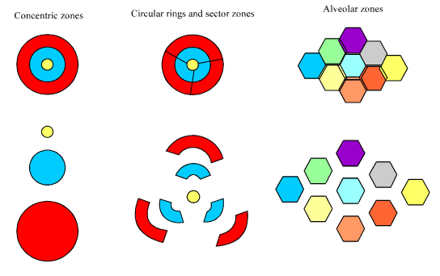

# The Network Structure of the London Underground and Alternative Zoning Approaches
Jim Leach  
`r Sys.Date()`  


<br>

<p style="border:1.5px; border-style:solid; border-color:#000000; padding: 1em;">This `HTML` report should be viewed using a modern web browser such as Mozilla Firefox or Google Chrome. Printing is possible but will not produce an optimal reading experience. The `R` code used to perform this analysis can be viewed in this report using the _Code_ buttons to toggle code viewing.</p>

<br>

# Report overview

#### Details

* Name: James Leach
* CID: 01135629
* Title: The Network Structure of the London Underground and Alternative Zoning Approaches
* GitHub Repository: [jim89/icl/final_report](https://github.com/Jim89/icl/tree/master/final_report)
* Word Count: 5437 (excluding report overview, abstract, appendices and references).


#### Document structure

This document is broken down in the several sections:

The [introduction](#introduction) presents some background, discusses the motivating issue for this work, provides a brief summary of some relevant literature, and briefly outlines the approach and how it builds on existing literature. 

The [methodology](#methodology) section describes the analytical steps, and provides the `R` code used in the analysis to make this work reproducible (the necessary data are also provided). 

The [results](#results) section contains summary statistics and visualisations for the analysis, and the conclusion provides some final remarks and recommendations. 

Additional tables and visualisations are presented in the [appendices](#appendices) and a full list of [references](#references) is provided. 

<br>

# Abstract

_Building on existing theoretical and analytical literature, this report presents the results of an analysis into developing new fare zones for the Transport for London Underground network. This analysis has been performed in order to understand if novel, data-driven methods could be used to create fare zones on the Underground._

_Transport for London will loose its government-provided, operational subsidy in 2019, and is facing a significant financial tightening as a result. New fare zones could potentially help offset some of this tightening, providing increased revenues without significantly impacting customers._

_Modelling the underground network as a graph, zones were created using node-importance metrics as well as traditional community-detection algorithms. The initial results are promising: the new approaches show good results when considered both financially and in graph-theoretical terms._

_However, work remains to be done if methods such as these are to be implemented by Transport for London. The socio-economic and political impact of changes investigated here would be required to understand all the strengths and weaknesses that methods such as these present (such an analysis was beyond the scope of this report)._

# Introduction

## Background

### Transport for London

[Transport for London](https://tfl.gov.uk/) ("TfL") is a government body responsible for almost all roads and buses; many train services; and several other forms of public transport (including taxis and boats) in the UK capital. 

Responsible for transport in a city of around 8 million people [@census_comparing_2015], TfL is also a huge financial operation. In the 2015 financial year, TfL reported total revenue of £5.289 billion, of which £2.559 billion came directly from ticket fares on the London Underground [@tfl_annual_2015]. One of the most famous aspects of the London transport system (along with the iconic "black cab" taxis), the Underground ("tube") operates across 11 train lines, 270 stations, and carried 1.34 billion passengers in 2015/16 [@tfl_facts_2016]. 

The Oyster scheme is a smart-card based pricing method used by TfL. After its public launch [@ctt_londons_2003], the scheme grew massively. Oyster card technology was soon used in all London train stations [@ctt_foundations_2006] and the majority of journeys were made using an Oyster card [@ctt_10_2007]. The data generated by this scheme has and will continue to prove valuable for gaining new insights into the public's use of TfL services.

### Fares & subsidisation

Transport fares are often set lower than the costs of running services [@montella_multimodal_2014], generating a requirement for some kind of subsidy. Transport for London is no exception to this rule. 

Low fares can be part of a capacity-management strategy [@turvey_simple_1975] (by encouraging greater use of the service). But this is likely not the case for TfL, which has seen demand increase year-on-year. Indeed, based on current figures it is likely that demand will outstrip capacity within the next twenty years [@_tube_2016]. 

However, subsidisation can lead a sequence of events that actually reduce revenue [@cervero_flat_1981] over time. Fares kept low through subsidisation result in relative fare revenue decreasing as costs increase, maintaining the requirement for subsidisation. 

Ongoing political pressures have resulted in efforts by TfL to keep fares low, and TfL is a heavily subsidised organisation. A significant portion of its yearly income comes in the form of direct from central government: an estimated 23% in 2015/16 [@tfl_how_2015].

### Motivating Issue

Transport for London will loose its operational subsidy from 2019 onwards [@tfl_annual_2015]. 

It _must_, therefore, seek actions which dramatically cut its costs, or grow its income. With demand increasing and rising pressure to maintain low prices [@_sadiq_2016], this may prove to be a difficult prospect. 

Transport for London must seek new, innovative strategies to maintain the infrastructure that is so critical to the smooth running of the capital whilst operating in an increasingly tight financial situation.

## Literature Review

### Pricing public transport

Noting that pricing required a fine balance of both demand and capacity management, @turvey_simple_1975 found that distance-based pricing was preferable to flat-fares. Longer trips should result in larger fares. This principal is part of the basis for the current TfL fare zones. 

@cervero_flat_1981 introduced the concept of 'fairness' in how customers subsidise each other. He found that, under certain models, short-distance customers could end up subsidising those on longer journeys (something not regarded as fair) whereas other models (such as peak vs. off-peak prices) were better at eliminating this effect. Again, these principals have been incorporated in to the current pricing schemes that TfL uses. Cervero also discussed how the choice of fare model was highly dependent on the policy objective of the operator. For example, 'fare comprehension' models would be greatly different to a fare model for 'deficit reduction'. 

@daskin_quadratic_1988 built on this work, and provided a list of requirements for pricing models. They should be:

> * sensitive to the many issues involved (both for the provider _and_ the user);
* based on appropriate economic, political, and analytical theory;
* easy for the end-user to understand;
* feasible to implement; and
* easy to test and analyse in the presence of alternatives.

@van_vuuren_optimal_2002 reported that customers were much less sensitive to price during peak hours than outside of these times (stating 'commuters usually do not have many alternatives'). These findings could be used by TfL to adjust their own peak-time pricing.

@sharaby_impact_2012 investigated how fare integration affected travel behaviour. Fare integration is defined as the ability to "transfer" within the transport system from one form of transport to another (e.g. from bus to train), or between multiple routes in one form of transport (e.g. changing tube lines), without incurring a cost penalty. They found that the use of fare integration, along with a zone-based pricing policy led to increased ticket purchases along with increased customer satisfaction. 
 
### Zone-based pricing

Zone-based pricing is when a transport network is divided in to zones based on some measure, either analytical, political, administrative, or socio-economic. Journey prices are based on the number of zones crossed: more zones (i.e. the greater the distance travelled) generally meaning a more expensive journey. 

@montella_multimodal_2014 provided a brief overview how fare zones are created  and provided a four step process to finalising the fare zones (this study was focussed only on the first of these):

> 1. Define initial zones
2. Optimise of fares across these zones
3. Evaluate the results
4. Use the results to find the best zone/fare combination

They noted three main types of zones: concentric rings; circular rings/sectors (similar to concentric rings, but with radial "cuts" in the rings to define new zones); and alveolar zones (zones defined across the area). 

#### Figure 1: Types of fare zone. [@montella_multimodal_2014]




Montella and D'Acierno noted that concentric ring zones are typically used in capital cities where there is a single, central district of increased importance surrounded by areas which decrease in importance with distance from the centre. Fares are then charged based on how important the zones entered/exited are (i.e. trips to the centre are more expensive). Transport for London has used such an approach since the 1980's [@_london_2016].

Highly complex arrangements of fare zones are not practical [@jansson_is_2012]. Considering the city and suburbs surrounding Oslo, Jansson and Angell [-@jansson_is_2012] showed that zone simplification was both possible and preferable: Oslo previously had eighty-eight fare zones before simplifying down to just ten. They also derived formulae for the optimal fare based on the operator's cost(s), the (social and financial) cost(s) associated with extra passengers, and the journey distance. They found that optimal prices could be approximated with a zone-based system with travel to more important zones (in their context: '[zones] closer to the city centre') incurring higher fares. 

@jansson_is_2012 also described several alternative zoning approaches which they investigated. Their results were as follows:

> * __Ring zones__ resulted in only small increases in price for travelling between zones, but generated too high a number of zones.
* __Dense, suburban, and rural zones__ suffered from a similar problem to ring zones: in order to keep "jumps" in fare for crossing zones minimal, too many zones had to be introduced in the city centre.
* __A central zone with small surrounding zones__ was found to be successful. This model simplified transit in the both the city centre (where the majority of journeys occurred) and in the suburbs. However, there were more significant jumps in fare for travelling between zones.
* __Three main zones__ spanning the entire area was _very_ simple, but found to reduce fare revenue so much that extensive subsidisation was required.
* __A single zone, with distance-based pricing__ was also simple to implement and easy for customers to understand, but resulted in high prices for short trips (typically those in the city centre) which would have been unpopular.
* __Munipal zones__ based on existing political boundaries were also easy for customers to understand, but resulted in some short journeys crossing many zones (and therefore being expensive), and long journeys remaining in just one zone (and therefore being cheap). This countered existing transport pricing theory, and so was seen as a negative result.

### Smart-cards, data & analytics

@mcdonald_multipurpose_2000 provided an overview of some key benefits of smart-card technologies (such as TfL Oyster). She found that they reduce fraud, ticket failure and fare collection expenses; and increase ease-of-use for the customer. They were also found to enable the use of flexible fare polices, something also noted by [@borndorfer_models_2012].

@chen_promises_2016 used smart-card data to investigate travel patterns and how they can be used to guide investment. Whilst recognising the need to validate assumptions and inferences in their models, they also noted that combining this data with other data sources (such as mobile device tracking data) could be critical for understanding route choice, or for inferring journey purposes. @pelletier_smart_2011 performed similar work using smart-card data to group passengers based on the similarity in their travel patterns and to investigate the differences in travel on weekdays and weekends.

@bagchi_potential_2005, however, noted that analysis of smart-card data should not be considered a 'utopian[n] replacement' for traditional approaches, and showed that smart-card data should be supplemented with other sources (e.g. customer surveys) in order to develop a holistic approach to understanding the transport system.

### Graphs and importance

@yeung_physics_2013 used graph analysis to perform route optimisation for the London Underground, finding that the "best" route was dependant not only on the network structure, but also on the routes taken by other users of the network. Although not focussed on transport, @yang_defining_2015 provided a set of useful criteria for evaluation communities/groups detected in graphs.

Station importance has also been measured. @shimamoto_evaluating_2008 sought to define importance based on the risks of overcrowding when failures occurred in the network. Modelling both passenger arrival and 'failure to board' probabilistically, they found that certain stations (namely Victoria train station) to be the most important in a number of different scenarios.

## Approach

Building on the literature summarised above, this analysis sought a new approach to designing fare zones. These approaches extend distance-based price theory and also include measures such as origin/destination importance into the zoning approach. 

Graph-analysis methods have been used to model the TfL Underground network as a graph with stations as _nodes_ [@NewmanBook:2010] and links between adjacent stations as _edges_ [@NewmanBook:2010]. The creation of fare zones (the first step in creating a pricing model @montella_multimodal_2014) using the graph properties of the network has been explored and the results evaluated. 

This was done to understand if data-driven methods could be used as one of the 'innovative strategies' TfL will require in order to meet its new financial requirements following the loss of its subsidy: re-zoning could provide the basis for changing pricing in order to increase fare revenue.

Using open-source data of the graph structure of the tube network and Oyster-card-enabled journeys through it, two main approaches were developed:

* _Designing zones based on station importance_: Using common algorithms for identifying important nodes, stations were grouped based on their importance.
* _Designing zones based on graph communities_: Using community-detection algorithms, groups of stations were found in the network.

In each case the resulting groups were used to define new fare zones and the results compared with the existing zones using a variety of methods.

Making an assumption that inter-zone (for example zone 1 to zone 2) fares remained constant between the current pricing model and the new approaches, differences in fare revenue between the new approaches and existing fares were estimated and compared. Standard techniques for measuring similarity (via Salton's cosine method [-@Salton:1986:IMI:576628]) were also used to compare the new and existing zones. 

For zones defined through community-detection algorithms, graph theoretical measures proposed by @yang_defining_2015 were also used to evaluate the new zones. 

Finally, the zones generated via these alternative approaches were rated against criteria set out by @daskin_quadratic_1988 for measuring the suitability of pricing systems.

The use of the tube network graph structure and smart-card data in this way also builds on the existing analytical literature, including efforts to use graph theory for route optimisation [@yeung_physics_2013], and the evaluation of the importance of stations in the network [@shimamoto_evaluating_2008].

# Methodology

## Data Used

The following data were obtained and used for the purposes of this analysis:

* Transport for London Underground Station adjacency, fare zone and line information available as open-source data hosted on [Wikimedia](https://commons.wikimedia.org/wiki/London_Underground_geographic_maps/CSV#Routes) [-@wikimedia_london_2009]. Referred to as the "raw graph structure data"; 
* Transport for London Underground inter-station distances [@tfl_distances_2013], made available by Transport for London under a Freedom of Information request in [2013](https://www.whatdotheyknow.com/request/distances_between_adjacent_oyste). Referred to as the "distances data"; and
* Sample journey data provided by Transport for London [-@tfl_oyster_2009]. The data cover 5% of all Oyster card journeys made in one week in November 2009. The data are available through the Transport for London [API](https://tfl.gov.uk/info-for/open-data-users/our-feeds#on-this-page-6). Referred to as the "journey data".

Examples of these data can be seen in [appendix one](#one).

## Graph creation

The `R` language [@cite_r] was used for this analysis. A list of additional `R` packages used to enhance this analysis can be found in [appendix two](#two).

### Prepare and clean data

The raw graph structure [@wikimedia_london_2009] and the distances data [@tfl_distances_2013] were loaded and some basic processing and cleaning (e.g. standardisation of station names) was performed.


```r
# Load the data
### Graph structure
# Basic linkage data from Wiki
adjacency <- read_csv("./data/geo/adjacency.csv",
                      col_types = cols(station1 = col_integer(),
                                       station2 = col_integer(),
                                       line = col_integer()))

# Line lookup values
station_lk <- read_csv("./data/geo/station_lk.csv",
                       col_types = cols(line = col_integer(),
                                        name = col_character(),
                                        colour = col_character(),
                                        stripe = col_character()))

# Station details
station_details <- read_csv("./data/geo/stations_geo.csv",
                            col_types = cols(id = col_integer(),
                                             latitude = col_double(),
                                             longitude = col_double(),
                                             name = col_character(),
                                             display_name = col_character(),
                                             zone = col_double(),
                                             total_lines = col_integer(),
                                             rail = col_integer()))

### Distances data from FOI
# DLR name lookup
dlr_abbr <- read_excel("./data/distances/formatted/FOI Request Station Abbreviations_CLN.xls")

# Distances between stations
stations_dist <- read_excel("./data/distances/formatted/Inter Station Train Times_CLN.xls")

# DLR distance matrix
dlr_dist <- read_excel("./data/distances/formatted/Distance Martix DLR 2013_CLN.xlsx")


# Clean the data
# Set up clean lower-case name, and rounded zone-number in station details
station_details <- station_details %>% mutate(name_cln = tolower(name),
                                              zone_cln = ceiling(zone))

# Set up adjacency list with names of stations, rather than ID as keys
links <- adjacency %>% left_join(station_details %>% select(id, name),
                                 by = c("station1" = "id")) %>% 
    select(-station1) %>% 
    rename(station1 = name) %>% 
    left_join(station_details %>% select(id, name),
              by = c("station2" = "id")) %>% 
    select(-station2) %>% 
    rename(station2 = name) %>% 
    mutate(station1 = tolower(station1),
           station2 = tolower(station2),
           station1 = str_trim(station1),
           station2 = str_trim(station2))

# Clean up DLR distances table
dlr_dist_long <- dlr_dist %>% gather(station, dist, -Metres) %>% 
    rename(from = Metres,
           to = station) %>% 
    left_join(dlr_abbr, by = c("from" = "abbr")) %>% 
    select(-from) %>% 
    rename(station1 = station) %>% 
    left_join(dlr_abbr, by = c("to" = "abbr")) %>% 
    select(-to) %>% 
    rename(station2 = station) %>% 
    na.omit() %>% 
    filter(dist > 0) %>% 
    mutate(dist = dist / 1000,
           line = "Docklands Light Railway") %>% 
    select(line, station1, station2, dist) %>% 
    ungroup()

# Clean up station-station distances table
station_dist_long <- stations_dist %>% 
    group_by(Line, `Station from (A)`, `Station to (B)`) %>% 
    summarise(dist = median(`Distance (Kms)`)) %>% 
    rename(line = Line,
           dist = dist,
           station1 = `Station from (A)`,
           station2 = `Station to (B)`) %>% 
    ungroup()

# Standardise station names to match graph structure data
distances <- bind_rows(dlr_dist_long, station_dist_long) %>% 
    mutate(station1 = tolower(station1),
           station2 = tolower(station2),
           station1 = str_trim(station1),
           station2 = str_trim(station2),
           station1 = gsub("edgware", "edgeware", station1),
           station2 = gsub("edgware", "edgeware", station2),
           station1 = gsub("regents park", "regent's park", station1),
           station2 = gsub("regents park", "regent's park", station2),
           station1 = gsub("piccadilly", "picadilly", station1),
           station2 = gsub("piccadilly", "picadilly", station2),
           station1 = gsub("st james park", "st. james's park", station1),
           station2 = gsub("st james park", "st. james's park", station2),
           station1 = gsub("kings cross|kings cross st pancras", "king's cross st. pancras", station1),
           station2 = gsub("kings cross|kings cross st pancras", "king's cross st. pancras", station2),
           station1 = gsub("earls court", "earl's court", station1),
           station2 = gsub("earls court", "earl's court", station2),
           station1 = gsub("highbury & islington", "highbury", station1),
           station2 = gsub("highbury & islington", "highbury", station2),
           station1 = gsub("paddington \\(.*\\)", "paddington", station1),
           station2 = gsub("paddington \\(.*\\)", "paddington", station2),
           station1 = gsub("st johns wood", "st. john's wood", station1),
           station2 = gsub("st johns wood", "st. john's wood", station2),
           station1 = gsub("queens park", "queen's park", station1),
           station2 = gsub("queens park", "queen's park", station2),
           station1 = gsub("heathrow 123", "heathrow terminals 1, 2 & 3", station1),
           station2 = gsub("heathrow 123", "heathrow terminals 1, 2 & 3", station2),
           station1 = gsub("heathrow four", "heathrow terminal 4", station1),
           station2 = gsub("heathrow four", "heathrow terminal 4", station2),
           station1 = gsub("hammersmith \\(.*\\)", "hammersmith", station1),
           station2 = gsub("hammersmith \\(.*\\)", "hammersmith", station2),
           station1 = gsub("st pauls", "st. paul's", station1),
           station2 = gsub("st pauls", "st. paul's", station2))
```

After ensuring that all station-station distances were present, the distances data were joined with the the graph structure data. The result was used to create an `igraph` object, retaining the distance between adjacent stations as an edge attribute.


```r
# Create "reversed" distances to account for possible different combos of stations
distances <- bind_rows(distances, distances %>% 
                           select(line, station2, station1, dist) %>% 
                           rename(station3 = station1,
                                  station1 = station2) %>% 
                           rename(station2 = station3))

# Add distances to station linkages data
links <- links %>% 
    left_join(distances %>% select(-line), by = c("station1" = "station1",
                                "station2" = "station2"))

# Clean up missing distances - set to average
links <- links %>%
    mutate(dist = round(ifelse(is.na(dist), 
                               mean(links$dist, na.rm = T), 
                               dist),
                        2)) %>% 
    distinct()


# Create "reversed" links to account for bi-directional travel!
links <- bind_rows(links, links %>% 
                            select(line, station2, station1, dist) %>% 
                            rename(station3 = station1,
                                   station1 = station2) %>% 
                            rename(station2 = station3))

# Clean up intermediate tables)
rm(dlr_abbr, dlr_dist, dlr_dist_long, station_dist_long, adjacency,
   stations_dist)

# Chop out line and distinct
graph_data <- links %>% 
    distinct() %>% 
    select(-line)

# Make the graph - retain distance as edge attribute but do not weight edges
tfl_graph <- graph_data %>% 
    graph_from_data_frame(directed = TRUE)

# Clean up
rm(graph_data)
```

The journey data [@tfl_oyster_2009] were also loaded and filtered. These data were filtered to include only those journeys made on the London Underground, and only those that were pay-as-you-go ("PAYG"). 


```r
# Journey data
journeys <- read_csv("./data/journeys/Nov09JnyExport.csv",
                     col_types = cols(downo = col_integer(),
                                      daytype = col_character(),
                                      SubSystem = col_character(),
                                      StartStn = col_character(),
                                      EndStation = col_character(),
                                      EntTime = col_integer(),
                                      EntTimeHHMM = col_character(),
                                      ExTime = col_integer(),
                                      EXTimeHHMM = col_character(),
                                      ZVPPT = col_character(),
                                      JNYTYP = col_character(),
                                      DailyCapping = col_character(),
                                      FFare = col_integer(),
                                      DFare = col_integer(),
                                      RouteID = col_character(),
                                      FinalProduct = col_character()))
names(journeys) <- names(journeys) %>% tolower()

# Filter to just completed tube journeys that were PAYG
journeys <- journeys %>%
     filter(subsystem == "LUL",
            startstn != "Unstarted",
            endstation != "Unfinished",
            endstation != "Not Applicable",
            finalproduct == "PAYG")
```

Further cleaning and standardisation of station names was performed to ensure that they matched those present in the graph structure data.


```r
# Clean up station names
journeys <- journeys %>% 
    # Start station names
    mutate(start_cln = startstn,
           start_cln = gsub("Earls Court", "Earl's Court", start_cln),
           start_cln = gsub("Highbury", "Highbury & Islington", start_cln),
           start_cln = gsub("St James's Park", "St. James's Park", start_cln),
           start_cln = gsub("St Pauls", "St. Paul's", start_cln),
           start_cln = gsub("Kings Cross [MT]", "King's Cross St. Pancras", start_cln),
           start_cln = gsub("Piccadilly Circus", "Picadilly Circus", start_cln),
           start_cln = gsub("Hammersmith [DM]", "Hammersmith", start_cln),
           start_cln = gsub("Bromley By Bow", "Bromley-By-Bow", start_cln),
           start_cln = gsub("Canary Wharf E2", "Canary Wharf", start_cln),
           start_cln = gsub("Edgware Road [BM]", "Edgware Road (B)", start_cln),
           start_cln = gsub("Great Portland St", "Great Portland Street", start_cln),
           start_cln = gsub("Waterloo JLE", "Waterloo", start_cln),
           start_cln = gsub("Shepherd's Bush Mkt", "Shepherd's Bush (H)", start_cln),
           start_cln = gsub("Shepherd's Bush Und", "Shepherd's Bush (C)", start_cln),
           start_cln = gsub("Harrow On The Hill", "Harrow-on-the-Hill", start_cln),
           start_cln = gsub("Harrow Wealdstone", "Harrow & Wealdston", start_cln),
           start_cln = gsub("Heathrow Term [45]", "Heathrow Terminal 4", start_cln),
           start_cln = gsub("Heathrow Terms 123", "Heathrow Terminals 1, 2 & 3", start_cln),
           start_cln = gsub("Tottenham Court Rd", "Tottenham Court Road", start_cln),
           start_cln = gsub("High Street Kens", "High Street Kensington", start_cln),
           start_cln = gsub("Regents Park", "Regent's Park", start_cln),
           start_cln = gsub("Queens Park", "Queen's Park", start_cln),
           start_cln = gsub("St Johns Wood", "St. John's Wood", start_cln),
           start_cln = gsub("Wood Lane", "White City", start_cln),
           start_cln = gsub("Totteridge", "Totteridge & Whetstone", start_cln),
           start_cln = gsub("Watford Met", "Watford", start_cln),
           start_cln = tolower(start_cln)) %>% 
    # End station names
    mutate(end_cln = endstation,
           end_cln = gsub("Earls Court", "Earl's Court", end_cln),
           end_cln = gsub("Highbury", "Highbury & Islington", end_cln),
           end_cln = gsub("St James's Park", "St. James's Park", end_cln),
           end_cln = gsub("St Pauls", "St. Paul's", end_cln),
           end_cln = gsub("Kings Cross [MT]", "King's Cross St. Pancras", end_cln),
           end_cln = gsub("Piccadilly Circus", "Picadilly Circus", end_cln),
           end_cln = gsub("Hammersmith [DM]", "Hammersmith", end_cln),
           end_cln = gsub("Bromley By Bow", "Bromley-By-Bow", end_cln),
           end_cln = gsub("Canary Wharf E2", "Canary Wharf", end_cln),
           end_cln = gsub("Edgware Road [BM]", "Edgware Road (B)", end_cln),
           end_cln = gsub("Great Portland St", "Great Portland Street", end_cln),
           end_cln = gsub("Waterloo JLE", "Waterloo", end_cln),
           end_cln = gsub("Shepherd's Bush Mkt", "Shepherd's Bush (H)", end_cln),
           end_cln = gsub("Shepherd's Bush Und", "Shepherd's Bush (C)", end_cln),
           end_cln = gsub("Harrow On The Hill", "Harrow-on-the-Hill", end_cln),
           end_cln = gsub("Harrow Wealdstone", "Harrow & Wealdston", end_cln),
           end_cln = gsub("Heathrow Term [45]", "Heathrow Terminal 4", end_cln),
           end_cln = gsub("Heathrow Terms 123", "Heathrow Terminals 1, 2 & 3", end_cln),
           end_cln = gsub("Tottenham Court Rd", "Tottenham Court Road", end_cln),
           end_cln = gsub("High Street Kens", "High Street Kensington", end_cln),
           end_cln = gsub("Regents Park", "Regent's Park", end_cln),
           end_cln = gsub("Queens Park", "Queen's Park", end_cln),
           end_cln = gsub("St Johns Wood", "St. John's Wood", end_cln),
           end_cln = gsub("Wood Lane", "White City", end_cln),
           end_cln = gsub("Totteridge", "Totteridge & Whetstone", end_cln),
           end_cln = gsub("Watford Met", "Watford", end_cln),
           end_cln = tolower(end_cln))

# Add on ID-information and zone
journeys <- journeys %>% 
    left_join(station_details %>% select(name_cln, id, zone_cln), 
              by = c("start_cln" = "name_cln")) %>% 
    rename(start_id = id,
           start_zone = zone_cln) %>% 
    left_join(station_details %>% select(name_cln, id, zone_cln),
              by = c("end_cln" = "name_cln")) %>% 
    rename(end_id = id,
           end_zone = zone_cln)
```

### Estimate journey routes

In order to model the graph structure with edges weighted by trips between adjacent stations, it was necessary to estimate routes taken through the network based on sample journey data. These routes could then be used to correctly weight edges in the graph based on the number of journeys utilising each edge (e.g. a journey from A-D might use edges A-B, B-C, and C-D and each of these edges required weighting). 

As the journey data only provided the start and end station it was necessary to determine the route taken on each journey. This was done by applying Dijkstra's [-@dijkstra_note_1959] algorithm to the initial graph object, weighting edges by the distance between adjacent stations as listed in the distances data. Whilst this method did not necessarily return the _exact_ route taken by the customer on each journey, it provided a useful approximation in the absence of such data.

Journeys in the journey data were de-duplicated, ensuring that a route for a particular journey was only calculated once. A simple function was defined to apply Dijkstra's algorithm and return the route path in an ordered list (with the first element corresponding to the starting station, the second element the second station, and so on up to the end station). 


```r
# Dedupe journeys
distinct_journeys <- journeys %>% select(start_cln, end_cln) %>% distinct()

# Define a function that will calcualte the path and return it as an ordered list
get_shortest_path <- function(node1, node2, graph = tfl_graph) {
    path <- shortest_paths(graph, node1, node2, weights = E(graph)$dist)$vpath
    path <- path[[1]]
    path <- path %>% as.list() %>% names()
    return(path)
}

# Apply the function to get the routes, then unnest routes into long data
routes <- distinct_journeys %>% 
    mutate(path = map2(start_cln, end_cln, get_shortest_path)) %>% 
    unnest(path)
```

### Aggregate routes

The routes were then used to determine the number of daily trips between all adjacent stations in the graph. These daily trips were then to be used to weight the edges of the graph. 

For example, the route for a journey from Earl's Court to Pimlico was found to go from Earl's Court through Gloucester Road, South Kensington, Sloane Square, and Victoria to Pimlico. Therefore a single journey from Earl's Court to Pimlico needed to be used to add weight to several edges in the graph. 

It was therefore necessary to summarise and aggregate _journeys_ at a _route_ level to correctly weight the graph to be used for the analysis. Per journey, all pairs of adjacent stations in the path between the start and the end were determined.


```r
# Set up routes per journey   
routes <- routes %>% 
    group_by(start_cln, end_cln) %>% 
    mutate(to = lead(path, 1)) %>% 
    na.omit() %>% 
    rename(from = path)
```
   
The number of occurrences for all pairs of adjacent stations was then calculated. As the sample data covered 5% of journeys for a week long period, it was necessary to adjust the total counts to arrive at an approximate value for total daily trips between each pair of adjacent stations.


```r
# Total up all the routes and summarise trips between stations
routes <- journeys %>% 
    select(start_cln, end_cln) %>% 
    left_join(routes) %>% 
    group_by(from, to) %>% 
    summarise(daily_trips = n(),
              daily_trips = daily_trips / 7,
              daily_trips = ceiling(daily_trips * 20))
```

This summary was then joined with the graph structure data to add the daily trips between each pair of adjacent stations. Some pairs of adjacent stations in the graph structure were missing an estimation of the daily trips. This is because they were infrequently visited, outlying stations and no journeys were found to go through them. Such pairs of stations were set to have a number of trips equal to 25% of the average daily trips on their joining tube line.


```r
# Join in with links data
links <- links %>% 
    left_join(routes, by = c("station1" = "from",
                                   "station2" = "to"))
## Fill in the blanks
# Find average trips per line
avg_per_line <- links %>% 
    group_by(line) %>% 
    summarise(avg_trips = mean(daily_trips, na.rm = T)*0.25)

# Fill in the blanks with a coalesce
links <- links %>% left_join(avg_per_line) %>% 
    mutate(daily_trips = coalesce(daily_trips, avg_trips)) %>% 
    select(-avg_trips)
```

### Create final graph structure

The graph object was then re-created, this time using the daily trips between adjacent stations as the edge weight attribute. A visualisation of the resulting graph structure is presented in figure 1.


```r
# Chop out line and distinct, weight by daily trips
graph_data <- links %>% 
    distinct() %>% 
    rename(weight = daily_trips) %>% 
    select(-line)

# Make the graph - retain distance as edge attribute but do not weight edges
tfl_graph <- graph_data %>% 
    graph_from_data_frame(directed = TRUE)

# Clean up
rm(graph_data)
```

#### Figure 1: TfL Underground graph structure

_The graph structure of the TfL Underground in a force directed [@kobourov_spring_2012] layout. Nodes are sized based on the number of visits per day and coloured based on the fare zone which they are assigned to. Link widths are proportional to the number of route/journeys passing between the two adjoining stations each day. (Note: this figure is interactive)._


```r
# Get the data in the right form
d3_data <- igraph_to_networkD3(tfl_graph, group = rep(1, length(V(tfl_graph))))

# Convert to tibble and separate objects
d3_links <- as_data_frame(d3_data$links)
d3_nodes <- as_data_frame(d3_data$nodes)

# Add node id and convert name to character
d3_nodes <- d3_nodes %>% mutate(node_id = row_number()-1,
                                name = as.character(name))

# Join on the zone info to the nodes (stations)
d3_nodes <- d3_nodes %>% 
    left_join(station_details %>% select(name, name_cln, zone_cln),
              by = c("name" = "name_cln")) %>% 
    select(name, name.y, zone_cln, node_id) %>% 
    rename(name = name.y,
           name_cln = name,
           zone = zone_cln) %>% 
    mutate(name = paste(name, "- Zone", zone))

# Get estimated visits
daily_visits <- journeys %>% 
    select(start_cln, end_cln) %>% 
    gather(x, name_cln) %>% 
    count(name_cln) %>% 
    mutate(n = n/7,
           n = n*20) %>% 
    ungroup() %>% 
    mutate(n = (n - mean(n))/sd(n))

# Tag stations with daily visits
d3_nodes <- d3_nodes %>% left_join(daily_visits, by = "name_cln")

## Add daily_trips from links
# First need to add names to d3_links
d3_links <- d3_links %>% 
    left_join(d3_nodes %>% select(node_id, name_cln), 
              by = c("source" = "node_id")) %>% 
    rename(station1 = name_cln)

d3_links <- d3_links %>% 
    left_join(d3_nodes %>% select(node_id, name_cln), 
              by = c("target" = "node_id")) %>% 
    rename(station2 = name_cln)

# Add daily trips from links
d3_links <- d3_links %>% 
    left_join(links, by = c("station1", "station2")) %>% 
    select(source, target, daily_trips, dist)

# Set up custom colour scale
ColourScale <- 'd3.scale.ordinal()
            .domain(["1", "2", "3", "4", "5", "6", "7", "8", "9", "10"])
           .range(["#1B9E77", 
                    "#D95F02", 
                    "#7570B3",
                    "#E7298A",
                    "#66A61E", 
                    "#E6AB02", 
                    "#A6761D", 
                    "#666666", 
                    "#6a3d9a", 
                    "#c51b7d"]);'

# Make the plot
forceNetwork(Links = d3_links, Nodes = d3_nodes, Nodesize = "n",
             Value = "daily_trips", 
             linkWidth = JS("function(d){return Math.log(d.value)-5;}"),
             Source = 'source', Target = 'target', NodeID = 'name', charge = -75,
             radiusCalculation = JS("d.nodesize+5"),
             Group = 'zone', colourScale = JS(ColourScale),
             zoom = T, opacity = .9, legend = F, width = 800)
```

<!--html_preserve--><div id="htmlwidget-a0e738de0b92b5ddfdec" style="width:800px;height:480px;" class="forceNetwork html-widget"></div>
<script type="application/json" data-for="htmlwidget-a0e738de0b92b5ddfdec">{"x":{"links":{"source":[68,70,70,282,242,70,70,57,57,229,57,57,236,236,57,229,236,236,295,202,283,284,115,172,268,269,270,285,163,286,183,52,52,230,230,230,19,207,104,230,230,230,52,52,230,230,230,112,206,271,155,57,152,92,108,214,113,152,152,152,152,152,152,152,152,152,152,152,152,152,152,152,152,152,152,54,54,54,152,152,152,152,152,152,54,54,54,152,152,152,152,152,152,54,54,54,152,152,152,152,152,152,72,72,72,72,237,27,215,71,77,77,77,77,238,40,40,14,14,40,40,14,14,296,196,297,239,237,272,273,88,108,37,57,232,232,231,231,232,232,231,231,292,293,202,298,13,216,105,0,3,108,287,175,160,288,204,295,67,67,37,37,37,37,67,67,146,274,187,241,241,241,241,65,65,65,65,218,217,141,275,286,172,272,276,144,150,150,150,150,91,250,99,100,199,254,299,88,298,254,241,241,300,119,241,241,231,231,58,58,231,231,58,58,255,256,116,261,114,138,134,32,214,208,4,4,4,4,4,4,4,4,4,4,4,4,151,4,4,4,4,115,42,29,158,242,115,262,140,271,139,187,133,139,177,137,274,277,278,32,151,301,302,263,123,300,203,303,200,190,296,74,239,69,64,217,219,198,303,192,188,257,109,70,220,158,158,176,158,158,24,55,55,55,55,55,55,55,55,243,238,244,63,56,55,55,55,55,55,55,55,55,221,39,264,264,264,264,129,129,129,129,145,269,245,245,62,62,245,245,62,62,101,191,246,83,137,206,14,14,14,14,14,14,14,14,14,14,0,0,0,0,135,149,10,69,78,304,197,113,113,233,233,113,113,233,233,1,1,1,1,232,232,1,1,1,1,1,1,1,1,1,1,1,1,232,232,219,138,279,279,172,172,276,172,172,279,279,172,172,172,230,230,230,172,172,172,230,230,230,172,172,172,230,230,230,17,222,172,172,172,172,172,172,172,172,172,48,48,48,48,48,48,48,48,48,280,280,157,280,280,143,258,260,0,259,161,184,186,174,244,80,189,196,41,215,71,71,71,71,71,71,71,71,56,234,234,234,234,234,234,234,234,234,234,234,234,71,71,71,71,234,234,234,234,234,234,234,234,234,234,234,234,71,71,71,71,234,234,234,234,234,234,234,234,234,234,234,234,136,273,252,77,224,279,22,222,53,53,53,0,0,0,0,0,0,0,0,0,53,53,53,53,53,53,38,223,13,233,171,208,235,19,195,197,242,79,27,29,82,95,242,63,63,63,63,146,134,39,223,209,15,265,124,127,8,290,289,168,168,167,289,167,141,136,302,100,156,172,183,143,132,55,71,40,40,40,40,266,266,122,122,122,122,266,266,21,166,291,224,44,40,161,164,247,74,170,290,169,287,167,169,173,105,121,121,121,121,130,130,130,130,301,195,154,113,3,210,209,71,138,138,138,138,270,211,6,76,248,257,259,11,210,66,260,255,144,144,54,54,54,53,53,53,54,54,54,291,144,144,164,184,131,53,53,53,53,53,53,54,54,54,171,234,97,253,3,113,225,216,96,252,1,166,224,208,198,111,36,226,35,45,92,205,152,152,152,61,152,152,152,152,152,152,18,16,47,47,47,47,135,99,110,16,94,240,23,20,212,9,180,183,51,51,50,50,51,51,50,50,19,34,0,2,18,85,85,85,85,65,65,65,65,111,145,145,145,145,229,229,229,229,51,51,51,51,48,48,48,48,48,48,48,48,48,48,48,48,57,57,57,48,48,48,48,48,48,48,48,48,48,48,48,57,57,57,57,57,57,48,48,48,48,48,48,16,268,48,48,48,48,48,48,125,262,117,277,144,138,193,200,103,260,28,17,250,250,31,220,25,283,70,282,162,100,101,267,120,227,30,213,211,120,128,123,126,267,125,33,49,49,49,49,56,56,225,56,56,285,165,152,131,162,170,187,149,19,207,279,105,208,224,98,2,49,49,52,52,52,212,52,52,52,52,52,52,49,49,159,176,75,246,31,30,13,105,1,151,235,294,126,127,241,241,245,245,241,241,245,245,66,119,205,188,191,299,260,124,194,297,111,192,73,80,102,107,7,9,34,40,84,77,118,118,265,118,118,178,226,28,13,0,79,116,123,22,218,88,251,190,203,14,253,194,101,122,122,264,264,122,122,264,264,228,227,118,118,118,118,130,130,130,130,172,32,292,183,305,251,16,201,236,33,221,97,95,236,234,234,235,235,235,235,234,234,46,36,175,158,249,73,160,177,179,129,59,59,55,55,55,55,55,55,173,55,55,55,55,55,55,55,55,55,55,55,55,55,55,55,55,55,55,55,55,55,55,55,55,55,55,55,55,55,55,59,59,8,12,199,193,43,38,113,108,142,153,218,45,82,242,102,236,236,37,37,37,37,236,236,235,235,233,233,233,233,235,235,0,258,140,182,154,294,5,213,21,16,241,241,241,241,204,35,37,178,284,179,159,90,89,88,104,112,50,50,4,4,50,50,4,4,26,23,133,278,155,142,13,32,151,147,186,181,281,148,92,58,58,58,58,61,47,150,132,84,68,76,77,158,174,288,247,78,86,64,62,72,72,81,81,81,81,72,72,121,121,121,121,187,185,185,60,60,59,59,60,60,59,59,105,181,41,36,92,91,144,144,147,144,144,13,11,14,10,4,4,233,4,4,149,110,16,117,15,12,128,109,107,104,39,24,96,98,75,71,299,202,201,281,145,101,101,67,67,101,101,111,111,67,67,81,81,81,81,111,111,104,106,129,120,100,205,202,63,71,4,4,4,4,113,60,60,105,60,60,43,101,94,61,61,85,85,61,61,85,85,92,93,44,25,103,106,7,5,249,87,83,42,46,20,180,163,157,156],"target":[158,158,158,158,158,158,158,47,47,47,47,47,61,61,61,61,61,61,188,188,159,159,114,131,131,132,132,160,160,161,161,0,0,0,0,0,0,0,0,0,0,0,0,0,0,0,0,0,0,133,133,16,16,16,16,16,16,48,48,48,48,48,48,48,48,48,48,48,48,48,48,48,48,48,48,48,48,48,48,48,48,48,48,48,48,48,48,48,48,48,48,48,48,48,48,48,48,48,48,48,48,48,62,62,62,62,62,17,17,63,63,63,63,63,63,49,49,49,49,49,49,49,49,189,190,190,64,64,134,134,99,99,18,18,50,50,50,50,50,50,50,50,181,181,191,191,19,19,19,19,135,135,162,162,163,163,192,192,65,65,65,65,65,65,65,65,136,136,182,67,67,67,67,67,67,67,67,20,20,137,137,164,164,138,138,138,138,138,138,138,88,88,88,88,100,100,100,100,101,101,101,101,101,101,101,101,51,51,51,51,51,51,51,51,102,102,115,115,115,272,272,21,21,1,1,1,1,1,1,1,1,1,1,1,1,1,1,1,1,1,1,261,22,22,68,68,116,116,139,139,140,140,271,271,165,141,141,142,142,166,166,193,193,117,117,194,194,195,195,196,196,69,69,239,239,23,23,197,197,295,295,103,103,24,24,70,70,70,70,70,70,71,71,71,71,71,71,71,71,71,71,71,71,71,71,71,71,71,71,71,71,71,25,25,118,118,118,118,118,118,118,118,143,143,72,72,72,72,72,72,72,72,298,298,73,73,275,2,2,52,52,52,52,52,52,52,52,52,52,52,52,52,3,3,3,74,74,198,198,4,4,4,4,4,4,4,4,4,4,4,4,4,4,4,4,4,4,4,4,4,4,4,4,4,4,4,4,26,144,144,144,144,144,144,144,144,144,144,53,53,53,53,53,53,53,53,53,53,53,53,53,53,53,53,53,53,27,27,54,54,54,54,54,54,54,54,54,54,54,54,54,54,54,54,54,54,145,145,145,145,145,145,104,104,104,104,183,183,183,183,75,75,296,296,28,28,55,55,55,55,55,55,55,55,55,55,55,55,55,55,55,55,55,55,55,55,55,55,55,55,55,55,55,55,55,55,55,55,55,55,55,55,55,55,55,55,55,55,55,55,55,55,55,55,55,55,55,55,55,146,146,95,95,147,147,29,29,230,230,230,230,230,230,230,230,230,230,230,230,230,230,230,230,230,230,30,30,105,105,105,105,105,105,303,303,76,76,222,222,77,77,77,77,77,77,77,273,273,31,31,5,5,120,120,120,6,167,167,167,289,289,168,168,274,274,199,199,148,184,184,269,269,56,56,56,56,56,56,121,121,121,121,121,121,121,121,32,32,32,32,33,33,286,286,78,78,169,169,170,170,290,290,171,171,122,122,122,122,122,122,122,122,200,200,149,149,149,7,7,243,150,150,150,150,150,8,8,79,79,106,106,9,9,240,107,107,172,172,172,172,172,172,172,172,172,172,172,172,172,172,172,172,172,172,172,172,172,172,172,172,172,172,173,173,96,96,10,10,34,34,97,97,151,151,151,151,304,35,35,36,36,36,201,201,57,57,57,57,57,57,57,57,57,57,57,57,57,57,57,57,108,108,108,108,66,66,217,217,11,11,174,174,231,231,231,231,231,231,231,231,216,216,206,206,37,37,37,37,37,37,37,37,37,37,280,280,280,280,58,58,58,58,58,58,58,58,152,152,152,152,152,152,152,152,152,152,152,152,152,152,152,152,152,152,152,152,152,152,152,152,152,152,152,152,152,152,152,152,152,152,152,152,152,152,152,152,152,152,152,152,152,152,152,123,123,123,153,276,276,301,301,109,109,215,215,89,90,39,39,39,176,176,175,175,254,254,127,127,38,38,12,12,124,124,125,125,126,126,40,40,40,40,40,40,40,40,40,40,177,177,268,268,287,287,154,154,13,13,13,13,13,13,14,14,14,14,14,14,14,14,14,14,14,14,14,14,14,14,283,283,80,80,223,223,208,208,208,208,185,185,267,267,81,81,81,81,81,81,81,81,94,94,202,202,202,202,128,128,203,203,204,204,246,246,255,255,210,210,225,225,82,82,129,129,129,129,129,129,41,41,207,207,248,262,262,42,42,91,91,297,297,98,98,300,300,130,130,130,130,130,130,130,130,43,43,264,264,264,264,264,264,264,264,291,291,186,186,92,92,92,92,92,44,44,252,252,93,59,59,59,59,59,59,59,59,45,45,282,282,83,83,285,285,178,178,234,234,234,234,234,234,234,234,234,234,234,234,234,234,234,234,234,234,234,234,234,234,234,234,234,234,234,234,234,234,234,234,234,234,234,234,234,234,234,234,234,211,211,302,302,227,227,110,110,277,277,46,46,84,84,256,85,85,85,85,85,85,85,85,60,60,60,60,60,60,60,60,112,112,187,187,187,187,15,15,214,214,111,111,111,111,111,111,111,179,179,284,284,250,250,250,258,258,232,232,232,232,232,232,232,232,219,219,155,155,278,278,224,224,224,224,292,292,156,156,305,229,229,229,229,229,229,270,270,242,242,242,242,242,180,180,86,247,247,237,237,245,245,245,245,245,245,245,245,266,266,266,266,294,294,235,235,235,235,235,235,235,235,235,235,293,226,226,251,251,279,279,279,279,279,279,212,212,113,113,113,113,113,113,113,113,113,263,213,213,260,260,260,260,220,220,253,253,244,244,205,205,205,157,157,241,241,241,241,241,241,241,241,241,241,241,241,241,241,241,241,259,259,265,265,299,299,299,238,238,233,233,233,233,233,233,233,233,233,233,228,119,119,236,236,236,236,236,236,236,236,236,236,221,221,257,257,209,209,87,249,249,218,218,218,288,288,281,281],"value":[518,13186,13186,15992,25203,13186,13186,3940,3940,1880,3940,3940,48755,48755,36686,12109,48755,48755,1512,1300,6832,6092,1069,8729,7298,13240,14898,4763,6906,1180,3489,25886,25886,25435,25435,25435,2795,32083,32663,25435,25435,25435,25886,25886,25435,25435,25435,2149,5300,13752,12038,38238,17300,8520,18018,40712,5420,32318,32318,32318,32318,32318,32318,32318,32318,32318,32318,32318,32318,32318,32318,32318,32318,32318,32318,33355,33355,33355,32318,32318,32318,32318,32318,32318,33355,33355,33355,32318,32318,32318,32318,32318,32318,33355,33355,33355,32318,32318,32318,32318,32318,32318,9543,9543,9543,9543,7492,1926,2463,4021.29009433962,36949,36949,36949,36949,35766,6560,6560,6195,6195,6560,6560,6195,6195,922.534722222222,922.534722222222,922.534722222222,5712,6372,15715,13663,10392,11443,1749,4980,21740,21740,21726,21726,21740,21740,21726,21726,5478,3640,3106,3315,34406,30843,1903,2700,12680,12329,12660,11495,6840,9029,1512,1300,14843,14843,15695,15695,15695,15695,14843,14843,9075,8598,7035,14426,14426,14426,14426,14420,14420,14420,14420,6618,5352,4175,2355,3583,4623,19083,500,39232,20995,20995,20995,20995,432,124.34375,10535,7943,922.534722222222,4612,9983,8366,3106,1049,2352,2352,922.534722222222,732,2352,2352,19132,19132,18400,18400,19132,19132,18400,18400,2378,1360,1898,346,1132,17878,16160,45732,46026,17158,61738,61738,61738,61738,61738,61738,61738,61738,61738,61738,61738,61738,46886,61738,61738,61738,61738,338,578,509,603,658,1952,2446,20400,17306,20198,22743,14438,16603,923,4378,6278,4386,5778,28143,28780,922.534722222222,922.534722222222,1300,1766,922.534722222222,922.534722222222,922.534722222222,922.534722222222,922.534722222222,922.534722222222,2832,3660,3778,5403,3589,2498,922.534722222222,922.534722222222,1512,1300,24575,24778,5780,2272,13058,13058,7383,13058,13058,5763,45240,45240,45240,45240,45240,45240,45240,45240,4101.65131578947,39386,14152,4021.29009433962,5552,45240,45240,45240,45240,45240,45240,45240,45240,11449,11289,6309,6309,6309,6309,6783,6783,6783,6783,8152,10563,12086,12086,9875,9875,12086,12086,9875,9875,3315,3106,4875,2780,2295,3060,1769,25886,25886,25886,25886,25886,25886,25886,25886,25886,23803,23803,23803,23803,12320,11020,5620,2786,1586,922.534722222222,922.534722222222,42803,42803,11346,11346,42803,42803,11346,11346,60978,60978,60978,60978,23918,23918,60978,60978,60978,60978,60978,60978,60978,60978,60978,60978,60978,60978,23918,23918,1969,41260,51189,51189,47883,47883,1500,47883,47883,51189,51189,25358,25358,25358,26129,26129,26129,25358,25358,25358,26129,26129,26129,25358,25358,25358,26129,26129,26129,1892,1386,36106,36106,36106,36106,36106,36106,36106,36106,36106,32635,32635,32635,32635,32635,32635,32635,32635,32635,495,495,5032,495,495,7823,3100,3149.21212121212,31498,30220,3172,33398,11466,19566,12903,9978,922.534722222222,922.534722222222,6460,4463,48526,48526,48526,48526,48526,48526,48526,48526,5540,53466,53466,53466,53466,53466,53466,53466,53466,53466,53466,53466,53466,48526,48526,48526,48526,53466,53466,53466,53466,53466,53466,53466,53466,53466,53466,53466,53466,48526,48526,48526,48526,53466,53466,53466,53466,53466,53466,53466,53466,53466,53466,53466,53466,9298,11309,3655,3880,16009,16649,423,178,25340,25340,25340,26003,26003,26003,26003,26003,26003,26003,26003,26003,25340,25340,25340,25340,25340,25340,5029,6272,34575,529,48335,33675,19266,2000,922.534722222222,922.534722222222,2506,1358,1403,160,1160,3423,32498,34426,34426,34426,34426,11849,13446,8066,7435,3169,2755,7492,15466,8655,695,5358,2515,4066,3,718,40,3660,6572,8378,922.534722222222,922.534722222222,1672,37178,35429,11115,12720,5380,5589,10520,10520,10520,10520,4346,4346,4869,4869,4869,4869,4346,4346,47806,26949,23192,34649,19606,19435,1409,3275,552,1566,8286,8666,10355,9778,7558,6518,47855,46303,5126,5126,5126,5126,5312,5312,5312,5312,922.534722222222,922.534722222222,28155,18172,10823,4009,3195,4101.65131578947,19432,19432,19432,19432,18109,695,738,1260,4101.65131578947,26538,27655,7529,6618,922.534722222222,5075,3632,46509,46509,35583,35583,35583,25920,25920,25920,35583,35583,35583,20583,46509,46509,5018,39660,8960,25920,25920,25920,25920,25920,25920,35583,35583,35583,45546,44889,4709,4958,6063,6849,25746,26620,4249,4575,46915,28320,42080,19192,922.534722222222,26252,24429,9032,23863,12798,8875,8835,22703,22703,22703,38840,22703,22703,22703,22703,22703,22703,5598,36018,3746,3746,3746,3746,12615,11686,14846,18115,712,922.534722222222,3572,5352,8995,8058,16383,18092,19375,19375,21740,21740,19375,19375,21740,21740,29606,27712,5246,3295,1943,45935,45935,45935,45935,16255,16255,16255,16255,30055,535,535,535,535,16795,16795,16795,16795,18252,18252,18252,18252,32963,32963,32963,32963,32963,32963,32963,32963,32963,32963,32963,32963,22618,22618,22618,32963,32963,32963,32963,32963,32963,32963,32963,32963,32963,32963,32963,22618,22618,22618,22618,22618,22618,32963,32963,32963,32963,32963,32963,17338,8252,32963,32963,32963,32963,32963,32963,5352,3523,1675,3106,1138,509,922.534722222222,922.534722222222,24212,24198,4338,2475,124.34375,124.34375,8398,2675,10832,7320,7232,12963,13129,5006,1000,7995,8386,2892,4926,1298,1018,15963,16543,5460,6358,6992,6480,20832,6612,6612,6612,6612,10246,10246,22698,10246,10246,2526,940,8523,6792,10952,11569,25978,27195,35355,35549,38969,33332,3769,57440,6243,1669,6243,6243,23803,23803,23803,11560,23803,23803,23803,23803,23803,23803,6243,6243,6915,7229,9420,7392,7172,6498,4238,34460,17949,18323,13206,11132,7169,7855,15280,15280,14718,14718,15280,15280,14718,14718,732,712,1758,1512,3315,2649,17515,17043,922.534722222222,922.534722222222,1512,1300,5106,7120,2223,3835,4118,6260,24809,23706,506,1089,7086,7086,6812,7086,7086,3366,7706,6792,32692,35123,4101.65131578947,2578,3332,746,675,395,432,922.534722222222,922.534722222222,5703,5846,922.534722222222,922.534722222222,5526,5526,5715,5715,5526,5526,5715,5715,1060,1843,6186,6186,6186,6186,5878,5878,5878,5878,21560,22152,7863,10986,922.534722222222,395,8518,8835,789,18392,14060,4046,4049,124.34375,17955,17955,19792,19792,19792,19792,17955,17955,11780,12700,14629,14429,863,2563,4938,2560,4069,3498,16806,16806,57115,57115,57115,57115,57115,57115,42363,57115,57115,57115,57115,57115,57115,57115,57115,57115,57115,57115,57115,57115,57115,57115,57115,57115,57115,57115,57115,57115,57115,57115,57115,57115,57115,57115,57115,57115,57115,16806,16806,738,949,922.534722222222,922.534722222222,1855,2852,15889,15792,4303,3215,9989,11752,446,1672,1478,46500,46500,48252,48252,48252,48252,46500,46500,17826,17826,18546,18546,18546,18546,17826,17826,1978,478,22495,7858,25355,6292,2723,2152,43258,43695,1812,1812,1812,1812,1300,26986,29018,4249,4960,5143,5826,124.34375,124.34375,124.34375,2975,420,21726,21726,24069,24069,21726,21726,24069,24069,1889,2546,11143,9689,9378,6049,56800,35358,41792,17560,7695,5612,2663,1652,922.534722222222,16072,16072,16072,16072,12529,2123,16835,16018,1720,686,2683,30840,26855,15806,12875,4101.65131578947,478,4101.65131578947,6746,6940,12572,12572,14383,14383,14383,14383,12572,12572,4189,4189,4189,4189,6818,10263,13920,17732,17732,21046,21046,17732,17732,21046,21046,19763,3558,8098,8675,432,395,54849,54849,15186,54849,54849,36672,9635,10692,7506,41389,41389,10532,41389,41389,18940,16778,5486,1358,2178,1332,18049,23798,4903,3149.21212121212,2663,2195,5352,5389,13292,13743,6875,1960,8875,4175,4698,2392,2392,14175,14175,2392,2392,1732,1732,14175,14175,15689,15689,15689,15689,1732,1732,29306,28518,7000,7175,9523,7118,2866,38258,36732,11500,11500,11500,11500,10475,18415,18415,512,18415,18415,1126,712,732,46289,46289,49158,49158,46289,46289,49158,49158,709,124.34375,13463,12132,25149,25946,3169,3195,4101.65131578947,4101.65131578947,798,923,9780,6549,12669,9355,3923,2652],"colour":["#666","#666","#666","#666","#666","#666","#666","#666","#666","#666","#666","#666","#666","#666","#666","#666","#666","#666","#666","#666","#666","#666","#666","#666","#666","#666","#666","#666","#666","#666","#666","#666","#666","#666","#666","#666","#666","#666","#666","#666","#666","#666","#666","#666","#666","#666","#666","#666","#666","#666","#666","#666","#666","#666","#666","#666","#666","#666","#666","#666","#666","#666","#666","#666","#666","#666","#666","#666","#666","#666","#666","#666","#666","#666","#666","#666","#666","#666","#666","#666","#666","#666","#666","#666","#666","#666","#666","#666","#666","#666","#666","#666","#666","#666","#666","#666","#666","#666","#666","#666","#666","#666","#666","#666","#666","#666","#666","#666","#666","#666","#666","#666","#666","#666","#666","#666","#666","#666","#666","#666","#666","#666","#666","#666","#666","#666","#666","#666","#666","#666","#666","#666","#666","#666","#666","#666","#666","#666","#666","#666","#666","#666","#666","#666","#666","#666","#666","#666","#666","#666","#666","#666","#666","#666","#666","#666","#666","#666","#666","#666","#666","#666","#666","#666","#666","#666","#666","#666","#666","#666","#666","#666","#666","#666","#666","#666","#666","#666","#666","#666","#666","#666","#666","#666","#666","#666","#666","#666","#666","#666","#666","#666","#666","#666","#666","#666","#666","#666","#666","#666","#666","#666","#666","#666","#666","#666","#666","#666","#666","#666","#666","#666","#666","#666","#666","#666","#666","#666","#666","#666","#666","#666","#666","#666","#666","#666","#666","#666","#666","#666","#666","#666","#666","#666","#666","#666","#666","#666","#666","#666","#666","#666","#666","#666","#666","#666","#666","#666","#666","#666","#666","#666","#666","#666","#666","#666","#666","#666","#666","#666","#666","#666","#666","#666","#666","#666","#666","#666","#666","#666","#666","#666","#666","#666","#666","#666","#666","#666","#666","#666","#666","#666","#666","#666","#666","#666","#666","#666","#666","#666","#666","#666","#666","#666","#666","#666","#666","#666","#666","#666","#666","#666","#666","#666","#666","#666","#666","#666","#666","#666","#666","#666","#666","#666","#666","#666","#666","#666","#666","#666","#666","#666","#666","#666","#666","#666","#666","#666","#666","#666","#666","#666","#666","#666","#666","#666","#666","#666","#666","#666","#666","#666","#666","#666","#666","#666","#666","#666","#666","#666","#666","#666","#666","#666","#666","#666","#666","#666","#666","#666","#666","#666","#666","#666","#666","#666","#666","#666","#666","#666","#666","#666","#666","#666","#666","#666","#666","#666","#666","#666","#666","#666","#666","#666","#666","#666","#666","#666","#666","#666","#666","#666","#666","#666","#666","#666","#666","#666","#666","#666","#666","#666","#666","#666","#666","#666","#666","#666","#666","#666","#666","#666","#666","#666","#666","#666","#666","#666","#666","#666","#666","#666","#666","#666","#666","#666","#666","#666","#666","#666","#666","#666","#666","#666","#666","#666","#666","#666","#666","#666","#666","#666","#666","#666","#666","#666","#666","#666","#666","#666","#666","#666","#666","#666","#666","#666","#666","#666","#666","#666","#666","#666","#666","#666","#666","#666","#666","#666","#666","#666","#666","#666","#666","#666","#666","#666","#666","#666","#666","#666","#666","#666","#666","#666","#666","#666","#666","#666","#666","#666","#666","#666","#666","#666","#666","#666","#666","#666","#666","#666","#666","#666","#666","#666","#666","#666","#666","#666","#666","#666","#666","#666","#666","#666","#666","#666","#666","#666","#666","#666","#666","#666","#666","#666","#666","#666","#666","#666","#666","#666","#666","#666","#666","#666","#666","#666","#666","#666","#666","#666","#666","#666","#666","#666","#666","#666","#666","#666","#666","#666","#666","#666","#666","#666","#666","#666","#666","#666","#666","#666","#666","#666","#666","#666","#666","#666","#666","#666","#666","#666","#666","#666","#666","#666","#666","#666","#666","#666","#666","#666","#666","#666","#666","#666","#666","#666","#666","#666","#666","#666","#666","#666","#666","#666","#666","#666","#666","#666","#666","#666","#666","#666","#666","#666","#666","#666","#666","#666","#666","#666","#666","#666","#666","#666","#666","#666","#666","#666","#666","#666","#666","#666","#666","#666","#666","#666","#666","#666","#666","#666","#666","#666","#666","#666","#666","#666","#666","#666","#666","#666","#666","#666","#666","#666","#666","#666","#666","#666","#666","#666","#666","#666","#666","#666","#666","#666","#666","#666","#666","#666","#666","#666","#666","#666","#666","#666","#666","#666","#666","#666","#666","#666","#666","#666","#666","#666","#666","#666","#666","#666","#666","#666","#666","#666","#666","#666","#666","#666","#666","#666","#666","#666","#666","#666","#666","#666","#666","#666","#666","#666","#666","#666","#666","#666","#666","#666","#666","#666","#666","#666","#666","#666","#666","#666","#666","#666","#666","#666","#666","#666","#666","#666","#666","#666","#666","#666","#666","#666","#666","#666","#666","#666","#666","#666","#666","#666","#666","#666","#666","#666","#666","#666","#666","#666","#666","#666","#666","#666","#666","#666","#666","#666","#666","#666","#666","#666","#666","#666","#666","#666","#666","#666","#666","#666","#666","#666","#666","#666","#666","#666","#666","#666","#666","#666","#666","#666","#666","#666","#666","#666","#666","#666","#666","#666","#666","#666","#666","#666","#666","#666","#666","#666","#666","#666","#666","#666","#666","#666","#666","#666","#666","#666","#666","#666","#666","#666","#666","#666","#666","#666","#666","#666","#666","#666","#666","#666","#666","#666","#666","#666","#666","#666","#666","#666","#666","#666","#666","#666","#666","#666","#666","#666","#666","#666","#666","#666","#666","#666","#666","#666","#666","#666","#666","#666","#666","#666","#666","#666","#666","#666","#666","#666","#666","#666","#666","#666","#666","#666","#666","#666","#666","#666","#666","#666","#666","#666","#666","#666","#666","#666","#666","#666","#666","#666","#666","#666","#666","#666","#666","#666","#666","#666","#666","#666","#666","#666","#666","#666","#666","#666","#666","#666","#666","#666","#666","#666","#666","#666","#666","#666","#666","#666","#666","#666","#666","#666","#666","#666","#666","#666","#666","#666","#666","#666","#666","#666","#666","#666","#666","#666","#666","#666","#666","#666","#666","#666","#666","#666","#666","#666","#666","#666","#666","#666","#666","#666","#666","#666","#666","#666","#666","#666","#666","#666","#666","#666","#666","#666","#666","#666","#666","#666","#666","#666","#666","#666","#666","#666","#666","#666","#666","#666","#666","#666","#666","#666","#666","#666","#666","#666","#666","#666","#666","#666","#666","#666","#666","#666","#666","#666","#666","#666","#666","#666","#666","#666","#666","#666","#666","#666","#666","#666","#666","#666","#666","#666","#666","#666","#666","#666","#666","#666","#666","#666","#666","#666","#666","#666","#666","#666","#666","#666","#666","#666","#666","#666","#666","#666","#666","#666","#666","#666","#666","#666","#666","#666","#666","#666","#666","#666","#666","#666","#666","#666","#666","#666","#666","#666","#666","#666","#666","#666","#666","#666","#666","#666","#666","#666","#666","#666","#666","#666","#666","#666","#666","#666","#666","#666","#666","#666","#666","#666","#666","#666","#666","#666","#666","#666","#666","#666","#666","#666","#666","#666","#666","#666","#666","#666","#666","#666","#666","#666","#666","#666","#666","#666","#666","#666","#666","#666","#666","#666","#666","#666","#666","#666","#666","#666","#666","#666","#666","#666","#666","#666","#666","#666","#666","#666","#666","#666","#666","#666","#666","#666","#666","#666","#666","#666","#666","#666","#666","#666","#666","#666","#666","#666","#666","#666","#666","#666","#666","#666","#666","#666","#666","#666","#666","#666","#666","#666","#666","#666","#666","#666","#666","#666","#666","#666","#666","#666","#666","#666","#666","#666","#666","#666","#666","#666","#666","#666","#666","#666","#666","#666","#666","#666","#666","#666","#666","#666","#666","#666","#666","#666","#666","#666","#666","#666","#666","#666","#666","#666","#666","#666","#666","#666","#666","#666","#666","#666","#666","#666","#666","#666","#666","#666","#666","#666","#666","#666","#666","#666","#666","#666","#666","#666","#666","#666","#666","#666","#666","#666","#666","#666","#666","#666","#666","#666","#666","#666","#666","#666","#666","#666","#666","#666","#666","#666","#666","#666","#666","#666","#666","#666","#666","#666","#666","#666","#666","#666","#666","#666","#666","#666","#666","#666","#666","#666","#666","#666","#666","#666","#666","#666","#666","#666","#666","#666","#666","#666","#666","#666","#666","#666"]},"nodes":{"name":["Baker Street - Zone 1","Charing Cross - Zone 1","Edgware Road (B) - Zone 1","Elephant & Castle - Zone 2","Embankment - Zone 1","Harlesden - Zone 3","Harrow & Wealdston - Zone 5","Kensal Green - Zone 2","Kenton - Zone 4","Kilburn Park - Zone 2","Lambeth North - Zone 1","Maida Vale - Zone 2","North Wembley - Zone 4","Oxford Circus - Zone 1","Paddington - Zone 1","Stonebridge Park - Zone 3","Bank - Zone 1","Barkingside - Zone 5","Bethnal Green - Zone 2","Bond Street - Zone 1","Buckhurst Hill - Zone 5","Chancery Lane - Zone 1","Chigwell - Zone 5","Debden - Zone 6","Ealing Broadway - Zone 3","East Acton - Zone 2","Epping - Zone 6","Fairlop - Zone 5","Gants Hill - Zone 4","Grange Hill - Zone 5","Greenford - Zone 4","Hanger Lane - Zone 3","Holborn - Zone 1","Holland Park - Zone 2","Lancaster Gate - Zone 1","Leyton - Zone 3","Leytonstone - Zone 4","Mile End - Zone 2","Northolt - Zone 5","North Acton - Zone 3","Notting Hill Gate - Zone 2","Redbridge - Zone 4","Roding Valley - Zone 5","Ruislip Gardens - Zone 5","Shepherd's Bush (C) - Zone 2","Snaresbrook - Zone 4","South Woodford - Zone 4","Aldgate - Zone 1","Barbican - Zone 1","Bayswater - Zone 1","Blackfriars - Zone 1","Cannon Street - Zone 1","Edgware Road (C) - Zone 1","Euston Square - Zone 1","Farringdon - Zone 1","Gloucester Road - Zone 1","High Street Kensington - Zone 1","Liverpool Street - Zone 1","Monument - Zone 1","Sloane Square - Zone 1","St. James's Park - Zone 1","Aldgate East - Zone 1","Barking - Zone 4","Barons Court - Zone 2","Becontree - Zone 5","Bow Road - Zone 2","London City Airport - Zone 3","Bromley-By-Bow - Zone 3","Chiswick Park - Zone 3","Dagenham East - Zone 5","Ealing Common - Zone 3","Earl's Court - Zone 2","East Ham - Zone 4","East Putney - Zone 3","Elm Park - Zone 6","Fulham Broadway - Zone 2","Gunnersbury - Zone 3","Hammersmith - Zone 2","Hornchurch - Zone 6","Kew Gardens - Zone 4","Parsons Green - Zone 2","Plaistow - Zone 3","Ravenscourt Park - Zone 2","Southfields - Zone 3","Stamford Brook - Zone 2","Stepney Green - Zone 2","Upminster - Zone 6","Wimbledon - Zone 3","Canada Water - Zone 2","New Cross - Zone 2","New Cross Gate - Zone 2","Rotherhithe - Zone 2","Shadwell - Zone 2","Shoreditch - Zone 2","Pontoon Dock - Zone 3","Goldhawk Road - Zone 2","Ladbroke Grove - Zone 2","Latimer Road - Zone 2","Royal Oak - Zone 2","Bermondsey - Zone 2","Canary Wharf - Zone 2","Canning Town - Zone 3","Canons Park - Zone 5","Dollis Hill - Zone 3","Finchley Road - Zone 2","Green Park - Zone 1","Kilburn - Zone 2","Kingsbury - Zone 4","London Bridge - Zone 1","Neasden - Zone 3","Southwark - Zone 1","Stratford - Zone 3","St. John's Wood - Zone 2","Waterloo - Zone 1","Amersham - Zone 10","Chalfont & Latimer - Zone 9","Chorleywood - Zone 8","Croxley - Zone 7","Eastcote - Zone 5","West Silvertown - Zone 3","Harrow-on-the-Hill - Zone 5","Hillingdon - Zone 6","Ickenham - Zone 6","Moor Park - Zone 7","Northwick Park - Zone 4","Northwood - Zone 6","Northwood Hills - Zone 6","North Harrow - Zone 5","Preston Road - Zone 4","Rayners Lane - Zone 5","Ruislip - Zone 6","Angel - Zone 1","Archway - Zone 3","Balham - Zone 3","Belsize Park - Zone 2","Borough - Zone 1","Brent Cross - Zone 3","Burnt Oak - Zone 4","Camden Town - Zone 2","Clapham Common - Zone 2","Clapham North - Zone 2","Colindale - Zone 4","Colliers Wood - Zone 3","East Finchley - Zone 3","Euston - Zone 1","Finchley Central - Zone 4","Golders Green - Zone 3","Goodge Street - Zone 1","High Barnet - Zone 5","Kennington - Zone 2","Kentish Town - Zone 2","Leicester Square - Zone 1","Moorgate - Zone 1","Morden - Zone 4","Oval - Zone 2","Tooting Bec - Zone 3","Totteridge & Whetstone - Zone 4","West Finchley - Zone 4","Acton Town - Zone 3","Alperton - Zone 4","Arnos Grove - Zone 4","Arsenal - Zone 2","Boston Manor - Zone 4","Bounds Green - Zone 4","Caledonian Road - Zone 2","Cockfosters - Zone 5","Covent Garden - Zone 1","Hatton Cross - Zone 6","Heathrow Terminals 1, 2 & 3 - Zone 6","Hounslow Central - Zone 4","Hounslow East - Zone 4","Hyde Park Corner - Zone 1","King's Cross St. Pancras - Zone 1","Knightsbridge - Zone 1","Manor House - Zone 3","Northfields - Zone 3","North Ealing - Zone 3","Oakwood - Zone 5","South Harrow - Zone 5","Sudbury Hill - Zone 4","Turnpike Lane - Zone 3","Blackhorse Road - Zone 3","Brixton - Zone 2","Finsbury Park - Zone 2","Highbury & Islington - Zone 2","Pimlico - Zone 1","Seven Sisters - Zone 3","Stockwell - Zone 2","All Saints - Zone 2","Beckton - Zone 3","Beckton Park - Zone 3","Blackwall - Zone 2","Bow Church - Zone 2","Crossharbour & London Arena - Zone 2","Custom House - Zone 3","Cutty Sark - Zone 3","Cyprus - Zone 3","Deptford Bridge - Zone 3","Elverson Road - Zone 3","Heron Quays - Zone 2","Island Gardens - Zone 2","Limehouse - Zone 2","Poplar - Zone 2","Prince Regent - Zone 3","Pudding Mill Lane - Zone 3","Westferry - Zone 2","Marylebone - Zone 1","Regent's Park - Zone 1","Picadilly Circus - Zone 1","Willesden Junction - Zone 3","Queen's Park - Zone 2","South Kenton - Zone 4","Warwick Avenue - Zone 2","Wembley Central - Zone 4","St. Paul's - Zone 1","Newbury Park - Zone 4","Marble Arch - Zone 1","Loughton - Zone 6","Woodford - Zone 4","Theydon Bois - Zone 6","West Acton - Zone 3","White City - Zone 2","Hainault - Zone 5","Perivale - Zone 4","Tottenham Court Road - Zone 1","Queensway - Zone 1","Wanstead - Zone 4","South Ruislip - Zone 5","West Ruislip - Zone 6","Tower Hill - Zone 1","Great Portland Street - Zone 1","Mansion House - Zone 1","Temple - Zone 1","Westminster - Zone 1","South Kensington - Zone 1","Victoria - Zone 1","Whitechapel - Zone 2","Upney - Zone 4","West Kensington - Zone 2","Dagenham Heathway - Zone 5","King George V - Zone 3","West Ham - Zone 3","Turnham Green - Zone 3","Kensington (Olympia) - Zone 2","West Brompton - Zone 2","Upton Park - Zone 3","Putney Bridge - Zone 2","Upminster Bridge - Zone 6","Richmond - Zone 4","Wimbledon Park - Zone 3","Surrey Quays - Zone 2","Wapping - Zone 2","Shepherd's Bush (H) - Zone 2","Westbourne Park - Zone 2","North Greenwich - Zone 3","Queensbury - Zone 4","Stanmore - Zone 5","Willesden Green - Zone 3","Swiss Cottage - Zone 2","West Hampstead - Zone 2","Wembley Park - Zone 4","Chesham - Zone 10","Rickmansworth - Zone 7","Watford - Zone 8","Ruislip Manor - Zone 6","West Harrow - Zone 5","Uxbridge - Zone 6","Pinner - Zone 5","Old Street - Zone 1","Highgate - Zone 3","Tufnell Park - Zone 2","Clapham South - Zone 3","Chalk Farm - Zone 2","Hampstead - Zone 3","Hendon Central - Zone 4","Edgware - Zone 5","Mornington Crescent - Zone 2","South Wimbledon - Zone 4","Tooting Broadway - Zone 3","Warren Street - Zone 1","Mill Hill East - Zone 4","Woodside Park - Zone 4","South Ealing - Zone 3","Park Royal - Zone 3","Sudbury Town - Zone 4","Southgate - Zone 4","Holloway Road - Zone 2","Osterley - Zone 4","Wood Green - Zone 3","Heathrow Terminal 4 - Zone 6","Hounslow West - Zone 5","Russell Square - Zone 1","Tottenham Hale - Zone 3","Walthamstow Central - Zone 3","Vauxhall - Zone 2","Devons Road - Zone 2","Gallions Reach - Zone 3","Royal Albert - Zone 3","East India - Zone 3","West India Quay - Zone 2","Royal Victoria - Zone 3","Mudchute - Zone 2","South Quay - Zone 2","Greenwich - Zone 3","Lewisham - Zone 3","Tower Gateway - Zone 1"],"group":[1,1,1,2,1,3,5,2,4,2,1,2,4,1,1,3,1,5,2,1,5,1,5,6,3,2,6,5,4,5,4,3,1,2,1,3,4,2,5,3,2,4,5,5,2,4,4,1,1,1,1,1,1,1,1,1,1,1,1,1,1,1,4,2,5,2,3,3,3,5,3,2,4,3,6,2,3,2,6,4,2,3,2,3,2,2,6,3,2,2,2,2,2,2,3,2,2,2,2,2,2,3,5,3,2,1,2,4,1,3,1,3,2,1,10,9,8,7,5,3,5,6,6,7,4,6,6,5,4,5,6,1,3,3,2,1,3,4,2,2,2,4,3,3,1,4,3,1,5,2,2,1,1,4,2,3,4,4,3,4,4,2,4,4,2,5,1,6,6,4,4,1,1,1,3,3,3,5,5,4,3,3,2,2,2,1,3,2,2,3,3,2,2,2,3,3,3,3,3,2,2,2,2,3,3,2,1,1,1,3,2,4,2,4,1,4,1,6,4,6,3,2,5,4,1,1,4,5,6,1,1,1,1,1,1,1,2,4,2,5,3,3,3,2,2,3,2,6,4,3,2,2,2,2,3,4,5,3,2,2,4,10,7,8,6,5,6,5,1,3,2,3,2,3,4,5,2,4,3,1,4,4,3,3,4,4,2,4,3,6,5,1,3,3,2,2,3,3,3,2,3,2,2,3,3,1],"nodesize":[1.72370865717161,0.649891709252418,0.0863582173723298,0.930247858216542,0.820221294094773,-0.797028138797646,-0.72967213319746,-0.688764820895777,null,-0.466948446432338,-0.565337585502766,-0.465185200212437,-0.824534779828088,5.88884887781975,1.92612932321615,-0.764584408351483,1.42748329222838,-0.755415528008002,0.863244501860336,2.61026885653741,-0.534657101276503,0.692914917017982,-0.850983473126591,-0.573801167358287,0.843848793441435,-0.458837513820797,-0.428862328082494,-0.765289706839443,-0.308256286641324,-0.821713585876248,-0.465185200212437,-0.568511428698586,2.19625864410485,-0.445084193305576,-0.306140391177444,0.0108912791606032,0.0948217992278504,0.768029205985728,-0.339994718599527,-0.406998074955733,0.902035918698139,-0.547705123303765,-0.861210301202011,-0.712744969486419,1.26808583394941,-0.536772996740384,-0.293092369150183,-0.324125502620425,0.0613201210497476,-0.485638856363279,null,-0.512440198905762,null,0.167467543487737,0.822689838802633,0.640722828908937,0.173815229879377,4.41830153042302,-0.0525855847558022,0.79588849626015,0.331096792694471,0.0761313892969089,0.108927768987052,-0.016615361869839,-0.50045012461044,-0.425335835642694,-0.72826153622154,-0.557226652891225,-0.599544562168829,-0.630930344883052,-0.519140534541382,1.3389683319894,0.066962508953428,-0.237373788601338,-0.569569376430526,0.182984110222858,-0.588965084849428,2.41772236932431,-0.642920419178373,-0.583322696945748,-0.232789348429598,-0.399239791588172,-0.510676952685861,-0.436973260694035,-0.603071054608629,-0.402413634783992,null,null,0.166762244999777,null,null,null,null,null,null,-0.720855902097959,-0.386897068048871,-0.665137321549115,-0.708513178558658,-0.254300952312379,2.60356852090179,-0.396771246880312,-0.679595940552296,-0.581559450725847,-0.0515276370238621,1.80446533404304,-0.250069161384619,-0.528662064128843,3.62871987315173,-0.625640606223351,-0.128405172211509,1.4253673967645,-0.283570839562722,3.45521644511356,-0.631988292614992,-0.698286350483237,-0.738135715052981,-0.754004931032082,-0.532188556568643,null,0.331096792694471,-0.673953552648615,-0.745188699932581,-0.745893998420541,-0.429214977326474,-0.539946839936204,-0.673248254160655,-0.660552881377374,-0.481759714679499,-0.325888748840326,-0.657379038181554,1.16652285168316,-0.0712759946867438,-0.015204764893919,-0.0889084568857452,-0.26593837736372,-0.637983329762652,-0.385133821828971,0.950701514367384,0.264798734826225,-0.175660170904833,-0.306140391177444,-0.450021282721296,-0.111478008500467,1.6126241453179,-0.14885882836235,-0.0321319286049604,0.0214707564800042,-0.4941024382188,-0.309666883617244,-0.0695127484668436,2.48966281509624,0.957754499246984,-0.123468082795788,-0.172838976952992,-0.26311718341188,-0.652794598009814,-0.687354223919857,-0.214451587742636,-0.512792848149742,-0.333647032207886,-0.394655351416431,-0.655263142717674,-0.237373788601338,-0.351279494406888,-0.675716798868516,0.697852006433702,-0.618940270587731,0.053914486926167,-0.311077480593164,-0.407350724199713,-0.412287813615433,4.94798069488102,0.661529134303759,0.0563830316340272,-0.384075874097031,-0.744483401444621,-0.49304449048686,-0.532188556568643,-0.549115720279685,0.121975791014313,-0.395008000660411,0.939416738560023,0.958459797734944,0.594525777947553,-0.0226103990174996,0.0891794113241699,-0.0525855847558022,null,null,null,null,null,null,null,null,null,null,null,null,null,null,null,null,null,null,-0.159085656437771,-0.559342548355106,2.5679509472598,null,-0.319893711692665,-0.840403995807189,-0.404882179491852,-0.696523104263337,0.67457715633102,-0.38019673241325,0.595583725679493,-0.38090203090121,-0.122762784307828,-0.748009893884422,-0.73108273017338,0.216485788400961,-0.564279637770826,-0.579443555261967,2.58487811097084,-0.14850617911837,-0.622114113783551,-0.622114113783551,-0.635162135810812,0.55256051791393,-0.0815028227621646,-0.0748024871265441,0.0895320605681501,0.6784562980148,1.90673361479725,4.59921059258478,0.216133139156981,-0.653852545741754,-0.386897068048871,-0.344579158771267,null,-0.605539599316489,-0.105482971352807,null,-0.597781315948929,-0.0201418543096394,-0.292739719906203,-0.778690378110684,null,-0.700754895191098,null,null,-0.61470847965997,-0.557931951379185,0.537043951178808,-0.535009750520483,-0.556168705159285,-0.268759571315561,-0.249011213652679,-0.357627180798528,0.00807008520876313,-0.822066235120228,-0.580854152237887,-0.578385607530027,-0.61294523344007,-0.719797954366019,0.149129782800775,-0.519493183785362,1.39080777085446,-0.281807593342822,-0.354100688358728,0.0204128087480642,-0.0874978599098251,-0.26417513114382,-0.160143604169711,-0.328357293548186,-0.454253073649057,-0.554758108183365,0.258098399190604,0.360014030700833,-0.779395676598644,-0.526898817908943,-0.438736506913935,-0.669721761720855,-0.593549525021169,-0.284628787294662,0.0711942998811884,-0.541357436912124,0.264446085582245,-0.4993921768785,-0.486696804095219,0.389989216439136,-0.275107257707201,-0.0180259588457592,0.44288660303614,null,null,null,null,null,null,null,null,null,null,null]},"options":{"NodeID":"name","Group":"zone","colourScale":"d3.scale.ordinal()\n            .domain([\"1\", \"2\", \"3\", \"4\", \"5\", \"6\", \"7\", \"8\", \"9\", \"10\"])\n           .range([\"#1B9E77\", \n                    \"#D95F02\", \n                    \"#7570B3\",\n                    \"#E7298A\",\n                    \"#66A61E\", \n                    \"#E6AB02\", \n                    \"#A6761D\", \n                    \"#666666\", \n                    \"#6a3d9a\", \n                    \"#c51b7d\"]);","fontSize":7,"fontFamily":"serif","clickTextSize":17.5,"linkDistance":50,"linkWidth":"function(d){return Math.log(d.value)-5;}","charge":-75,"opacity":0.9,"zoom":true,"legend":false,"nodesize":true,"radiusCalculation":"d.nodesize+5","bounded":false,"opacityNoHover":0,"clickAction":null}},"evals":[],"jsHooks":[]}</script><!--/html_preserve-->


## Alternative zoning approaches

Building on the statements of @montella_multimodal_2014 that zones are created based on station importance, or administrative arguments [@jansson_is_2012], and seeking to avoid seemingly-arbitrary decisions about the creation of fare zones [@_this_2016], the use of graph-based approaches extended existing analytical approaches to understanding transport systems [@yeung_physics_2013].

### Importance-based zones

#### Station importance

The first approach was to to determine the importance of a station and use this information to group stations in to zones. Adopting a different approach to that used by @shimamoto_evaluating_2008, common graph-theoretical measures of node importance were calculated for each station:

* __Degree__ [@opsahl_node_2010] measures the number of edges incident on a node. In this context it was thought of as, for each station, how many direct links it has to other stations.
* __Betweenness__ [@freeman_centrality_1979; @brandes_faster_2001] measures, for each node, how many other nodes are connected on their shortest path through that node. In this context it was thought of as how likely it is that travellers will visit or pass through a station on other journeys, or how much "connectivity" it provides to the network.
* __Closeness__ [@freeman_centrality_1979; @newman_scientific_2001] measures how many steps exist between each node and all other nodes in the network. In this context, it can be thought of as how central the station is in the overall network (i.e. does it lie at the end of a long branch, or close to the middle of London).
* __Eigenvector centrality__ [@bonacich_power_1987] measures the importance of a node based on its own _and_ its neighbours importance. In this context it was thought of as a combination of how busy/connected a station is, and how busy/connected its adjacent stations are.

Each of these measures in some way captured existing theory for the creation of fare zones.


```r
# Degree centrality
deg_cent <- degree(tfl_graph, loops = TRUE)
V(tfl_graph)$deg <- deg_cent

# Betweenness centrality
bet_cent <- betweenness(tfl_graph, directed = T)
V(tfl_graph)$bet <- bet_cent

# Closeness centrality
clo_cent <- closeness(tfl_graph)
V(tfl_graph)$close <- clo_cent

# Eigenvector centrality
eig_cent <- eigen_centrality(tfl_graph, directed = T, scale = T)
V(tfl_graph)$eig <- eig_cent$vector
```

#### Define zones

In order to define fare zones based on station importance, it was necessary to group stations together. To make these zones comparable to their real-life equivalents a simple decile rank was applied to each measure of importance to form ten zones. The real life zones were not equally distributed (i.e. there were more zone 1 stations than zone 10). This was not the case for the decile-ranked zones, a weakness of this approach.


```r
# Convert graph object to data frame of centrality stats
station_centrality_stats <- data_frame(
                            station = names(V(tfl_graph)),
                            deg = V(tfl_graph)$deg,
                            eig = V(tfl_graph)$eig,
                            bet = V(tfl_graph)$bet,
                            clo = V(tfl_graph)$close
                            )

# Use decile-ranks to form 10 fare zones
station_importance_zones <- station_centrality_stats %>% 
    gather(method, value, -station) %>% 
    group_by(method) %>% 
    mutate(zone = ntile(desc(value), 10)) %>% 
    select(-value) %>% 
    spread(method, zone)
```

### Graph-community zones

#### Discovering communities

The second approach to creating fare zones, was to directly use the structure of graph to find _communities_ of related stations. There are a range of community detection algorithms, each with varying performance characteristics [@lancichinetti_community_2009]. 

Three alternative algorithms were used in this analysis:

* __Walktrap__ [@pons_computing_2005]. This algorithm detects communities by performing random walks on the graph. The algorithm records the nodes visited in each walk and uses the results to partition the graph in to communities of nodes that frequently occurred in the same walk. In this context, such communities can be imagined to be groups of stations located in close proximity, perhaps on the same tube line.
* __Edge betweenness__ [@newman_finding_2004]. This algorithm detects communities based on the _betweeness_ metric of the edges in the graph (similar to node betweenness mentioned above). The algorithm iteratively removes the edge with the largest betweenness value, dividing the graph into groups and ultimately into individual nodes. Recording this process, it uses the results to construct communities. In this context, such communities are defined by stations which serve as "hubs" connecting outlying branches of the graph to the more highly connected centre.
* __Spinglass__ [@reichardt_statistical_2006]. This algorithm uses a more abstract approach to community detection. Using ideas from statistical physics/mechanics it identifies groups of nodes which are in some way "similar". In this context "similarity" was defined as a combination of a station's connections to other stations and how frequently it was travelled to or through in the journey data. 

For each algorithm, ten station communities were created in order to draw comparisons with the existing ten fare zones. Both the _walktrap_ and _edge betweenness_ algorithms are hierarchical (i.e. some communities may be super/sub-sets of one another), meaning that is possible by combining smaller communities to form ten overall communities. The _spinglass_ algorithm has a parameter which was used to pre-specify the number of communities.


```r
# Hierarchical methods - use cut_at to chop up
# Use distances to help create clusters
clust_w <- cluster_walktrap(tfl_graph, steps = 10,)
clust_eb <- cluster_edge_betweenness(tfl_graph, directed = T)
# n.b. spins sets number of clusters
clust_sg <- cluster_spinglass(tfl_graph, spins = 10)

# Create dataframe of results
station_cluster_stats <- data_frame(station = names(V(tfl_graph)),
                                   eb = cut_at(clust_eb, no = 10),
                                   walk = cut_at(clust_w, no = 10),
                                   sg = membership(clust_sg))
```

## Comparisons with reality

### Basic similarity measures

Salton's cosine similarity [-@Salton:1986:IMI:576628] measure was used to compare the differences in importance-based and existing fare zones (as zone 1 was the most - and zone 10 the least - important in both cases). 

Given that zone labels for the the community-based zones were created in an arbitrary manner (i.e. the zones were purely categorical, not ordinal), this was not done for the community-based approach.


```r
cosines <- station_importance_zones %>% 
         left_join(station_details %>% select(name_cln, zone_cln),
                    by = c("station" = "name_cln")) %>% 
         rename(Betweenness = bet,
                Closeness = clo,
                Degree = deg,
                Eigenvector = eig,
                Zone = zone_cln) %>% 
         select(-station) %>% 
         as.matrix() %>% 
         lsa::cosine() %>% 
         round(3)
```

### Financial approach

Using the journeys data, it was possible to calculate the total zone-zone fares charged to Oyster PAYG customers on each day of the week.


```r
# Group and total
journey_summaries <- journeys %>% 
    group_by(downo,
             daytype,
             start_zone,
             end_zone) %>% 
    summarise(journeys = n(),
              total_rev = sum(dfare, na.rm = TRUE) / 100) %>% 
    ungroup() %>% 
    mutate(journeys_scaled = 20 * journeys,
           total_rev_scaled = 20 * total_rev,
           rough_cpj = total_rev_scaled / journeys_scaled)
```

Using a similar approach, it was also possible to estimate the cost of a single trip from any one zone to any other single zone.


```r
# Get rough zone-zone costs
zone_costs <- journeys %>% 
    group_by(start_zone,
             end_zone) %>% 
    summarise(journeys = n(),
              total_rev = sum(dfare, na.rm = TRUE) / 100) %>% 
    ungroup() %>% 
    mutate(journeys_scaled = 20 * journeys,
           total_rev_scaled = 20 * total_rev,
           cpj = total_rev_scaled / journeys_scaled) %>% 
    select(start_zone, end_zone, cpj)
```

These zone-zone costs were then used (along with the sample journeys data) to estimate the total daily fare received under each alternative zoning approach. This was done by: 

* assuming the cost of each zone-zone ticket (based on the sample journey data) remained constant under each model; 
* iteratively changing the zone of each station based on the alternative approach being considered; and
* calculating the total fares charged per day based on the fixed zone-zone costs and alternative zoning approach being considered.


```r
# Create function to ease iteration over approaches
calculate_daily_fares <- function(how) {
    # the `how` argument will be one of the methods
    # either "current", "bet", "deg", "eig", or "clo"

    # Return "current" fares if requested
if ( how == "current" ) {
    ans <- journey_summaries %>%
            group_by(downo, daytype) %>% 
            summarise(total_fare_rev = sum(total_rev),
                      total_fare_rev_scale = sum(total_rev_scaled)) %>% 
            mutate(how = "current") %>% 
            ungroup()
} else {
    # Calculate temporary zones for the desired metric
    temp_zones <- station_centrality_stats %>% 
        gather(measure, value, -station) %>% 
        group_by(measure) %>% 
        mutate(zone = ntile(desc(value), 10)) %>% 
        filter(measure == how) %>% 
        ungroup() %>% 
        select(station, zone)

    # Get journies data
    temp_journeys <- journeys %>% 
        select(start_cln, end_cln, ffare, dfare, downo, daytype)

    # Join on new zones based on importance metric
    temp_journeys_to_zones <- temp_journeys %>% 
        left_join(temp_zones, by = c("start_cln" = "station")) %>% 
        rename(start_zone = zone) %>% 
        left_join(temp_zones, by = c("end_cln" = "station")) %>% 
        rename(end_zone = zone)     
        
    # Join on pricing info from current zone-zone costs
    temp_journeys_to_zones_to_prices <- temp_journeys_to_zones %>% 
        left_join(zone_costs, by = c("start_zone", "end_zone"))
    
    # Create daily summary
    ans <- temp_journeys_to_zones_to_prices %>% 
        group_by(downo, daytype) %>% 
        summarise(total_fare_rev = sum(cpj)) %>% 
        mutate(total_fare_rev_scale = 20 * total_fare_rev) %>% 
        ungroup() %>% 
        mutate(how = how)
}    

# Push back the summary as the result
return(ans)
}

# Set up list of methods
methods <- c("current", "deg", "eig", "bet", "clo")

# Loop over each method/zoning approach
fare_estimations <- lapply(methods, calculate_daily_fares) %>% bind_rows()
```

The differences in estimated fares were also compared statistically using Tukey's [-@tukey_comparing_1949] "Honest Significant Difference" method.


```r
fit <- aov(total_fare_rev_scale ~ how, data = fare_estimations)
tukey <- TukeyHSD(fit, conf.level = 0.95)
tukey <- broom::tidy(tukey) %>% 
            select(-term, -conf.low, -conf.high) %>% 
            mutate(comparison = gsub("clo", "Closeness", comparison),
                   comparison = gsub("bet", "Betweenness", comparison),
                   comparison = gsub("eig", "Eigenvector", comparison),
                   comparison = gsub("deg", "Degree", comparison),
                   comparison = gsub("current", "Existing Zones", comparison),
                   estimate = round(estimate, 0),
                   adj.p.value = round(adj.p.value, 3))
```

Again, as the zone labels for the community-based zones were entirely categorical (unlike the ordinal labels for the existing and importance-based zones) this approach was taken only for the importance based zones. The results of this analysis are presented in the results section.

### Graph theoretical approach

Metrics suggested by @yang_defining_2015 were used to measure the "goodness" of the detected communities for the community-based approach. The same metrics were calculated for the existing fare zones and the results compared.

Yang and Leskovec state that "good" communities are small, with many links between nodes _within_ the community and a small number of links connected to other communities.

Amongst other metrics, they defined the _density_ and _separability_ of a community:

> \begin{equation}
Density = \dfrac{m_S}{n_s(n_s-1)/2}
\end{equation}

> \begin{equation}
Separability = \dfrac{m_S}{c_S}
\end{equation}

Where $n_S$ is the number of nodes in the community, $m_S$ the number of edges entirely within the community and $c_S$ the number of edges link the community to another community.

These metrics were calculated for each of the communities detected, as well as for the existing fare zones.


```r
get_cluster_stats <- function(how, data) {
# Function argument 'how' defines which community detection method (inc. current zone)
# should be used 
    
# Take created "zones" (clusters) and join in actual zones, gather into long table
    tmp_zones <- data %>% 
        left_join(station_details %>% select(name_cln, zone_cln),
                  by = c("station" = "name_cln")) %>% 
        gather(method, value, -station) %>% 
        filter(method == how) %>% 
        select(station, value) %>% 
        rename(zone = value)
    
    # Get stations per zone (n_s)
    stations_per_zone <- tmp_zones %>% count(zone)
    
    # Join in "zones" to links (edges)
    tmp_links <- links %>% 
        left_join(tmp_zones, by = c("station1" = "station")) %>% 
        rename(zone1 = zone) %>% 
        left_join(tmp_zones, by = c("station2" = "station")) %>% 
        rename(zone2 = zone)
    
    # Add zone-zone comparisons to get m_s and c_s
    tmp_links <- tmp_links %>% 
        mutate(ms = ifelse(zone1 == zone2, 1, 0),
               cs = ifelse(zone1 != zone2, 1, 0))
    
    # Aggregate across zone
    zone_summary <- tmp_links %>% 
        group_by(zone1) %>% 
        summarise(ms = sum(ms),
                  cs = sum(cs)) %>% 
        left_join(stations_per_zone, by = c("zone1" = "zone"))
    
    # Perform summaries
    zone_summary <- zone_summary %>% 
        mutate(Separability = ms / cs,
               Density = ms / (n*(n - 1) / 2),
               method = how)
    
    return(zone_summary)
}

methods <- c("zone_cln", "eb", "walk", "sg")
community_metrics <- lapply(methods, get_cluster_stats, 
                            data = station_cluster_stats) %>% bind_rows()
```

The statistical differences in these metrics were calculated for each of the community detection algorithms, again using Tukey's Honest Significant Differences [@tukey_comparing_1949].


```r
fit_sep <- aov(Separability ~ method, community_metrics)
tukey_sep <- TukeyHSD(fit_sep, conf.level = .95) %>% 
             broom::tidy() %>% 
             select(-term, -conf.low, -conf.high) %>% 
             mutate(comparison = gsub("eb", "Edge betweenness", comparison),
                    comparison = gsub("walk", "Walktrap", comparison),
                    comparison = gsub("sg", "Spinglass", comparison),
                    comparison = gsub("zone_cln", "Existing Zones", comparison),
                    estimate = round(estimate, 3),
                    adj.p.value = round(adj.p.value, 4))

fit_den <- aov(Density ~ method, community_metrics)
tukey_den <- TukeyHSD(fit_den, conf.level = .95) %>% 
             broom::tidy() %>% 
             select(-term, -conf.low, -conf.high) %>% 
             mutate(comparison = gsub("eb", "Edge betweenness", comparison),
                    comparison = gsub("walk", "Walktrap", comparison),
                    comparison = gsub("sg", "Spinglass", comparison),
                    comparison = gsub("zone_cln", "Existing Zones", comparison),
                    estimate = round(estimate, 3),
                    adj.p.value = round(adj.p.value, 4))
```

### Zone Rankings

Each of the zones created under the two approaches were qualitatively compared with the current fare zones, using the criteria set out by @daskin_quadratic_1988. Given the ease with which these zoning approaches can be implemented, Daskin's criteria of 'feasibility of implementation' was not considered. The following scale was used to perform this ranking:

* +2 - significantly better than existing zones;
* +1 - marginally better;
* 0 - no change;
* -1 - marginally worse than existing zones; and
* -2 - significantly worse than existing zones


```r
# Set up daskin issues

daskin <- c("Sensitivity to issues",
            "Theoretical basis",
            "Ease of understanding",
            "Ease of evaluation")

# Set up importance-zone rankings
importance_daskin_rankings <- tibble(Method = c("Betweenness", "Closeness", "Degree", "Eigenvector"),
                                     `Sensitivity to issues` = c(1, 0, -2, 2),
                                     `Theoretical basis` = c(0, 2, -1, 0),
                                     `Ease of understanding` = c(-1, -1, 0, -2),
                                     `Ease of evaluation` = c(-2, -1, -2, 0),
                                     Comment = str_wrap(c("Sensitive to pressures at key stations, but zones too geographically spread",
                                                 "Captures distance-based pricing, but may be hard to comprehend",
                                                 "Too inensitive to many transport and pricing issues",
                                                 "Captures both distance and importance issues, but too complex to understand")))

# Set up graph community-zone rankings
community_daskin_rankings <- tibble(Method = c("Edge Betweenness", "Spinglass", "Walktrap"),
                                     `Sensitivity to issues` = c(1, 0, -2),
                                     `Theoretical basis` = c(0, 1, -2),
                                     `Ease of understanding` = c(1, 1, -1),
                                     `Ease of evaluation` = c(0, 0, -2),
                                     Comment = str_wrap(c("Captures notion of 'hubs' defining central zone, with radiating branches",
                                                 "Shows promise if other measures of similarity (e.g. economic) could be included",
                                                 "Performs poorly on all criteria")))
```

# Results

## Importance-based zones

Station importance was found to vary substantially based on the metric used to calculate it. Figure 2 shows the distribution of (normalised) station importance for each line in the TfL Underground for each of the importance metrics used. 

For example, eigenvector centrality measures were clearly dominated by a few stand-out stations, with only small variations otherwise. Some lines did "better" on some measures than others, e.g. the Docklands Light Railway generally had a high closeness score, but a very low betweenness. The impact of such differences is explored below.

#### Figure 2: Normalised station importance metrics


```r
links %>% 
    select(line, station1, station2) %>% 
    gather(key, station, -line) %>% 
    select(-key) %>% 
    distinct() %>% 
    left_join(station_lk) %>% 
    left_join(station_centrality_stats) %>% 
    select(name, station, deg, eig, bet, clo) %>% 
    rename(Betweenness = bet,
           `Eigenvector Centrality` = eig,
           Closeness = clo,
           `Degree Centrality` = deg) %>% 
    gather(method, value, -name, -station) %>% 
    group_by(method) %>% 
    mutate(value_norm = (value - mean(value)) / sd(value),
           name = gsub(" Line", "", name),
           name = gsub("East London", "Overground", name)) %>% 
    ggplot(aes(y = name, x = value_norm, colour = name)) +
    geom_quasirandom(alpha = .75) +
    scale_colour_manual(values = c(bakerloo, central, circle, district, dlr, hc,
                                 jubilee, metropolitan, northern, overground,
                                 picadilly, victoria, wc)) +
    facet_wrap(~method) +
    xlab("") +
    ylab("") +
    guides(fill = FALSE,
           colour = FALSE) +
    theme_minimal() +
    theme(panel.border = element_rect(colour = "grey", fill = NA))
```


### Basic similarity

The importance-based zones did not appear to be geographically distinct from one another ([appendix three](#three)) in the same way as the existing fare zones. However, when measured with Salton's [-@Salton:1986:IMI:576628] cosine measure, the zones defined using station importance metrics generally showed a high similarity with the existing fare zones (table 1), i.e. they generally contained the same stations. 


```r
cosines %>% kable(caption = paste0("Table ", table, ": Cosine similarity measures between zones defined using importance-based metrics and the existing TfL payment zones."))
```


Table: Table 1: Cosine similarity measures between zones defined using importance-based metrics and the existing TfL payment zones.

               Betweenness   Closeness   Degree   Eigenvector    Zone
------------  ------------  ----------  -------  ------------  ------
Betweenness          1.000       0.843    0.846         0.827   0.803
Closeness            0.843       1.000    0.832         0.856   0.898
Degree               0.846       0.832    1.000         0.874   0.838
Eigenvector          0.827       0.856    0.874         1.000   0.940
Zone                 0.803       0.898    0.838         0.940   1.000


Eigenvector centrality-based zones produced the most similar results to the existing zones, and closeness-based zones also showed a high similarity with the existing zones. This was intuitive: the current fare zones are defined in some way based on a station's proximity to central London (similar to closeness) and it's importance in daily London life (similar to eigenvector centrality). It therefore made sense that these two measures showed the most similarity with the existing model.

### Financial differences

Daily fares were estimated using each of the three importance-based zoning approaches and compared with the daily fares using the current fare-zoning method, calculated from the journey data. The results of this comparison are presented in figure 3.

#### Figure 3: Estimated daily Tfl Underground Oyster-PAYG-only fares under each fare-zoning approach


```r
fare_estimations %>% 
    mutate(how = gsub("current", "Current", how),
           how = gsub("bet", "Betweenness", how),
           how = gsub("clo", "Closeness", how),
           how = gsub("deg", "Degree", how),
           how = gsub("eig", "Eigenvector", how)) %>% 
    ggplot(aes(x = daytype, y = total_fare_rev_scale)) +
    geom_bar(aes(fill = how), stat = "identity", position = "dodge",
             colour = "white") +
    scale_x_discrete(limits = c("Mon", "Tue", "Wed", "Thu", "Fri", "Sat", "Sun")) +
    scale_y_continuous(labels = scales::dollar_format(prefix = "£")) + 
    scale_fill_brewer(palette = "Dark2") +
    guides(fill = guide_legend(title = "", nrow = 1)) +
    xlab("") + 
    ylab("") +
    theme_minimal() +
    theme(panel.border = element_rect(colour = "grey", fill = NA),
          axis.text.x = element_text(size = 14),
          axis.text.y = element_text(size = 14),
          legend.position = "bottom")
```


The alternative approaches consistently out-performed the current zoning approach when considering approximate daily Oyster-PAYG fares. 

Zones created through closeness most closely matched the figures for the current zones, which was to be expected given the similarities in how they are defined. The increase in fares based on closeness zones relative to the current zone model was probably due to the equal distribution of stations to zones enforced by the decile-rank grouping approach creating a greater number of (more expensive) intra-zone journeys. 

Betweenness and degree centrality-based zones were found to perform "best", i.e. generated the highest fares. This is due to the fact that many of the stations had large differences in zone when moving from the importance-based to the current fare zone models ([appendix four](#four)). For example, Regent's Park station is currently in fare zone 1 (due to it's proximity to central London). However, as it is not a well-visited station on one of the less-busy lines (the Bakerloo), it is placed in to zone 10 by betweenness-based zoning. 

Eigenvector centrality-based zoning also out-performed the current fare zones which, when coupled with the finding that it produced results most similar to the existing zones table 1, suggests it could be the most promising of the four approaches.

However, none of the differences in estimated fare were found to be statistically significant as measured by Tukey's Honest Significant Differences [-@tukey_comparing_1949] (table 2).


```r
tukey %>% kable(col.names = c("Comparison", "Fare difference (£)", "p-Value"),
                caption = paste0("Table ", table, ": Tukey HSDs for financial differences in zoning approach"))
```


Table: Table 2: Tukey HSDs for financial differences in zoning approach

Comparison                    Fare difference (£)   p-Value
---------------------------  --------------------  --------
Closeness-Betweenness                     -349153     0.818
Existing Zones-Betweenness                -470691     0.602
Degree-Betweenness                          -8809     1.000
Eigenvector-Betweenness                   -240174     0.945
Existing Zones-Closeness                  -121538     0.996
Degree-Closeness                           340344     0.831
Eigenvector-Closeness                      108979     0.997
Degree-Existing Zones                      461882     0.619
Eigenvector-Existing Zones                 230518     0.953
Eigenvector-Degree                        -231365     0.952


### Daskin's Rankings

The rankings against the criteria set out by @daskin_quadratic_1988 are listed in table 3.


```r
kable(importance_daskin_rankings, 
      caption = paste0("Table ", table, ": Rankings of importance-based zones against the existing fare zones using Daskin's proposed criteria."))
```


Table: Table 3: Rankings of importance-based zones against the existing fare zones using Daskin's proposed criteria.

Method         Sensitivity to issues   Theoretical basis   Ease of understanding   Ease of evaluation  Comment                                                                     
------------  ----------------------  ------------------  ----------------------  -------------------  ----------------------------------------------------------------------------
Betweenness                        1                   0                      -1                   -2  Sensitive to pressures at key stations, but zones too geographically spread 
Closeness                          0                   2                      -1                   -1  Captures distance-based pricing, but may be hard to comprehend              
Degree                            -2                  -1                       0                   -2  Too inensitive to many transport and pricing issues                         
Eigenvector                        2                   0                      -2                    0  Captures both distance and importance issues, but too complex to understand 


Whilst eigenvector-based methods performed the best in the other comparisons, they are likely too complicated for customers to understand, a significant negative mark against them using Daskin's criteria.

## Graph-community zones

### Geographical distribution

The graph communities discovered by the three algorithms employed generally showed distinct geographical separation from one another (figure 4) (a factor found to be useful by @jansson_is_2012).

#### Figure 4: The geographic distribution of existing and graph-community based zones. 

_The figure is interactive, select a community detection algorithm and toggle area names on/off with the buttons provided._


```r
# Create plotting data
clusters <- station_cluster_stats %>% 
    left_join(station_details %>% 
                  select(name_cln, 
                         latitude, 
                         longitude,
                         zone_cln,
                         name),
              by = c("station" = "name_cln")) %>% 
    select(name, latitude, longitude, eb, walk, sg, zone_cln) %>% 
    gather(method, value, -name, -latitude, -longitude) %>% 
    rename(lat = latitude,
           lon = longitude) %>% 
    mutate(value = as.factor(value),
           popup = paste(name, "- Zone/Cluster", value))

# Set up colours
pal <- colorFactor(c(RColorBrewer::brewer.pal(8, "Dark2"), "#6a3d9a", "#c51b7d"), 
                   domain = levels(clusters$value))

# Make the map
leaflet(width = 800) %>% 
    # Add map tiles
    addProviderTiles("CartoDB.PositronNoLabels", group = "No area labels") %>% 
    addProviderTiles("CartoDB.Positron", group = "Show/hide area labels") %>% 
    # Add zones
    addCircles(data = clusters %>% filter(method == "zone_cln"), radius = 250, 
               stroke = F, fillColor = ~pal(value), fillOpacity = 1, 
               group = "Zones (default)", popup = ~popup) %>% 
    # Add edge-bet clusters
    addCircles(data = clusters %>% filter(method == "eb"), radius = 250,
               stroke = F, fillColor = ~pal(value), fillOpacity = 1,
               group = "Edge Betweenness", popup = ~popup) %>%
    # Add walktrap clusters
    addCircles(data = clusters %>% filter(method == "walk"), radius = 250,
               stroke = F, fillColor = ~pal(value), fillOpacity = 1,
               group = "Walktrap", popup = ~popup) %>%
    # Add spinglass clusters
    addCircles(data = clusters %>% filter(method == "sg"), radius = 250,
               stroke = F, fillColor = ~pal(value), fillOpacity = 1,
               group = "Spinglass", popup = ~popup) %>%
    # Add a zone legend
    addLegend("bottomright", pal = pal, values = as.factor(1:10), opacity = 1, 
              title = "Zone/Cluster") %>% 
    # Add layers control box
    addLayersControl(baseGroups = c("Zones (default)", "Edge Betweenness", 
                                    "Walktrap", "Spinglass"),
                     overlayGroups = c("Show/hide area labels"),
                     options = layersControlOptions(collapsed = F))
```

<!--html_preserve--><div id="htmlwidget-9ca4bf7c4a4c95285cfe" style="width:800px;height:480px;" class="leaflet html-widget"></div>
<script type="application/json" data-for="htmlwidget-9ca4bf7c4a4c95285cfe">{"x":{"calls":[{"method":"addProviderTiles","args":["CartoDB.PositronNoLabels",null,"No area labels",{"errorTileUrl":"","noWrap":false,"zIndex":null,"unloadInvisibleTiles":null,"updateWhenIdle":null,"detectRetina":false,"reuseTiles":false}]},{"method":"addProviderTiles","args":["CartoDB.Positron",null,"Show/hide area labels",{"errorTileUrl":"","noWrap":false,"zIndex":null,"unloadInvisibleTiles":null,"updateWhenIdle":null,"detectRetina":false,"reuseTiles":false}]},{"method":"addCircles","args":[[51.5226,51.508,51.5199,51.4943,51.5074,51.5362,51.5925,51.5304,51.5816,51.5351,51.4991,51.53,51.5621,51.515,51.5154,51.5439,51.5133,51.5856,51.527,51.5142,51.6266,51.5185,51.6177,51.6455,51.5152,51.5168,51.6937,51.596,51.5765,51.6132,51.5423,51.5302,51.5174,51.5075,51.5119,51.5566,51.5683,51.5249,51.5483,51.5237,51.5094,51.5763,51.6171,51.5606,51.5046,51.5808,51.5917,51.5143,51.5204,51.5121,51.512,51.5113,51.5203,51.526,51.5203,51.4945,51.5009,51.5178,51.5108,51.4924,51.4994,51.5154,51.5396,51.4905,51.5403,51.5269,51.5037,51.5248,51.4946,51.5443,51.5101,51.492,51.5394,51.4586,51.5496,51.4804,51.4915,51.4936,51.5539,51.477,51.4753,51.5313,51.4942,51.4454,51.495,51.5221,51.559,51.4214,51.4982,51.4767,51.4757,51.501,51.5117,51.5227,51.5021,51.5018,51.5172,51.5139,51.519,51.4979,51.5051,51.5147,51.6078,51.552,51.5472,51.5067,51.5471,51.5846,51.5052,51.5542,51.504,51.5416,51.5347,51.5036,51.6736,51.6679,51.6543,51.647,51.5765,51.5027,51.5793,51.5538,51.5619,51.6294,51.5784,51.6111,51.6004,51.5846,51.572,51.5753,51.5715,51.5322,51.5653,51.4431,51.5504,51.5011,51.5766,51.6028,51.5392,51.4618,51.4649,51.5955,51.418,51.5874,51.5282,51.6012,51.5724,51.5205,51.6503,51.4884,51.5507,51.5113,51.5186,51.4022,51.4819,51.4361,51.6302,51.6095,51.5028,51.5407,51.6164,51.5586,51.4956,51.6071,51.5481,51.6517,51.5129,51.4669,51.4713,51.4713,51.4733,51.5027,51.5308,51.5015,51.5712,51.4995,51.5175,51.6476,51.5646,51.5569,51.5904,51.5867,51.4627,51.5642,51.546,51.4893,51.5822,51.4723,51.5107,51.5148,51.5087,51.5079,51.5273,51.4957,51.5095,51.4827,51.5085,51.474,51.4693,51.5033,51.4871,51.5123,51.5077,51.5093,51.5343,51.5097,51.5225,51.5234,51.5098,51.5326,51.5341,51.5701,51.5235,51.5519,51.5146,51.5756,51.5136,51.6412,51.607,51.6717,51.518,51.512,51.603,51.5366,51.5165,51.5107,51.5775,51.5569,51.5696,51.5098,51.5238,51.5122,51.5111,51.501,51.4941,51.4965,51.5194,51.5385,51.4907,51.5417,51.502,51.5287,51.4951,51.4983,51.4872,51.5352,51.4682,51.5582,51.4633,51.4343,51.4933,51.5043,51.5058,51.521,51.5005,51.5942,51.6194,51.5492,51.5432,51.5469,51.5635,51.7052,51.6404,51.6573,51.5732,51.5795,51.5463,51.5926,51.5263,51.5777,51.5567,51.4527,51.5441,51.5568,51.5829,51.6137,51.5342,51.4154,51.4275,51.5247,51.6082,51.6179,51.5011,51.527,51.5507,51.6322,51.5526,51.4813,51.5975,51.4598,51.4734,51.523,51.5882,51.583,51.4861,51.5223,51.5096,51.5084,51.5093,51.507,51.5091,51.4902,51.5007,51.4781,51.4657,51.5106],[-0.1571,-0.1247,-0.1679,-0.1001,-0.1223,-0.2575,-0.3351,-0.225,-0.3162,-0.1939,-0.1115,-0.1854,-0.3034,-0.1415,-0.1755,-0.2759,-0.0886,0.0887,-0.0549,-0.1494,0.0471,-0.1111,0.0755,0.0838,-0.3017,-0.2474,0.1139,0.0912,0.0663,0.0923,-0.3456,-0.2933,-0.12,-0.206,-0.1756,-0.0053,0.0083,-0.0332,-0.3687,-0.2597,-0.1967,0.0454,0.0439,-0.4103,-0.2187,0.0216,0.0275,-0.0755,-0.0979,-0.1879,-0.1031,-0.0904,-0.17,-0.1359,-0.1053,-0.1829,-0.1925,-0.0823,-0.0863,-0.1565,-0.1335,-0.0726,0.081,-0.2139,0.127,-0.0247,0.0488,-0.0119,-0.2678,0.1655,-0.2882,-0.1973,0.0518,-0.2112,0.1977,-0.195,-0.2754,-0.2251,0.2184,-0.285,-0.2011,0.0172,-0.2359,-0.2066,-0.2459,-0.047,0.251,-0.2064,-0.0502,-0.0327,-0.0402,-0.0525,-0.056,-0.0708,0.0319,-0.2267,-0.2107,-0.2172,-0.188,-0.0637,-0.0209,0.0082,-0.2947,-0.2387,-0.1803,-0.1428,-0.2047,-0.2786,-0.0864,-0.2503,-0.1052,-0.0042,-0.174,-0.1143,-0.607,-0.561,-0.5183,-0.4412,-0.397,0.0226,-0.3366,-0.4499,-0.4421,-0.432,-0.3184,-0.424,-0.4092,-0.3626,-0.2954,-0.3714,-0.4213,-0.1058,-0.1353,-0.1525,-0.1642,-0.0943,-0.2136,-0.2641,-0.1426,-0.1384,-0.1299,-0.2502,-0.1778,-0.165,-0.1337,-0.1932,-0.1941,-0.1347,-0.1943,-0.1053,-0.1402,-0.1281,-0.0886,-0.1948,-0.113,-0.1598,-0.1791,-0.1883,-0.2801,-0.2997,-0.1331,-0.1059,-0.325,-0.1243,-0.1188,-0.1496,-0.1243,-0.4227,-0.4524,-0.3665,-0.3564,-0.1527,-0.1238,-0.1607,-0.0958,-0.3142,-0.2887,-0.1318,-0.3521,-0.3366,-0.1028,-0.0417,-0.1145,-0.1065,-0.104,-0.1334,-0.0749,-0.123,-0.013,0.0613,0.055,-0.0066,-0.0208,-0.0144,0.0276,-0.0096,0.064,-0.0216,-0.0174,-0.0215,-0.0101,-0.0396,-0.0173,0.0336,-0.0139,-0.0265,-0.1631,-0.1466,-0.1342,-0.2478,-0.2047,-0.3081,-0.1835,-0.2963,-0.0973,0.0899,-0.1586,0.0558,0.0341,0.1033,-0.2809,-0.2239,0.0933,-0.3232,-0.131,-0.1877,0.0288,-0.3988,-0.4376,-0.0766,-0.1439,-0.094,-0.1141,-0.1254,-0.1738,-0.1447,-0.0612,0.1014,-0.2065,0.1469,0.0627,0.0056,-0.2547,-0.2106,-0.1953,0.0343,-0.2089,0.2343,-0.3013,-0.1992,-0.0478,-0.0558,-0.2265,-0.2011,0.0039,-0.2861,-0.3028,-0.2215,-0.1738,-0.1906,-0.2795,-0.611,-0.4733,-0.4177,-0.4125,-0.3533,-0.4786,-0.3805,-0.0873,-0.1458,-0.1374,-0.148,-0.1538,-0.178,-0.2259,-0.275,-0.1387,-0.1919,-0.168,-0.1384,-0.2103,-0.1856,-0.3072,-0.2841,-0.3156,-0.128,-0.1132,-0.3522,-0.1097,-0.4476,-0.3855,-0.1244,-0.0594,-0.0195,-0.1253,-0.0173,0.0716,0.0465,-0.0021,-0.0203,0.0181,-0.0145,-0.0191,-0.0149,-0.0142,-0.0743],250,null,"Zones (default)",{"lineCap":null,"lineJoin":null,"clickable":true,"pointerEvents":null,"className":"","stroke":false,"color":"#03F","weight":5,"opacity":0.5,"fill":true,"fillColor":["#1B9E77","#1B9E77","#1B9E77","#D95F02","#1B9E77","#7570B3","#66A61E","#D95F02","#E7298A","#D95F02","#1B9E77","#D95F02","#E7298A","#1B9E77","#1B9E77","#7570B3","#1B9E77","#66A61E","#D95F02","#1B9E77","#66A61E","#1B9E77","#66A61E","#E6AB02","#7570B3","#D95F02","#E6AB02","#66A61E","#E7298A","#66A61E","#E7298A","#7570B3","#1B9E77","#D95F02","#1B9E77","#7570B3","#E7298A","#D95F02","#66A61E","#7570B3","#D95F02","#E7298A","#66A61E","#66A61E","#D95F02","#E7298A","#E7298A","#1B9E77","#1B9E77","#1B9E77","#1B9E77","#1B9E77","#1B9E77","#1B9E77","#1B9E77","#1B9E77","#1B9E77","#1B9E77","#1B9E77","#1B9E77","#1B9E77","#1B9E77","#E7298A","#D95F02","#66A61E","#D95F02","#7570B3","#7570B3","#7570B3","#66A61E","#7570B3","#D95F02","#E7298A","#7570B3","#E6AB02","#D95F02","#7570B3","#D95F02","#E6AB02","#E7298A","#D95F02","#7570B3","#D95F02","#7570B3","#D95F02","#D95F02","#E6AB02","#7570B3","#D95F02","#D95F02","#D95F02","#D95F02","#D95F02","#D95F02","#7570B3","#D95F02","#D95F02","#D95F02","#D95F02","#D95F02","#D95F02","#7570B3","#66A61E","#7570B3","#D95F02","#1B9E77","#D95F02","#E7298A","#1B9E77","#7570B3","#1B9E77","#7570B3","#D95F02","#1B9E77","#C51B7D","#6A3D9A","#666666","#A6761D","#66A61E","#7570B3","#66A61E","#E6AB02","#E6AB02","#A6761D","#E7298A","#E6AB02","#E6AB02","#66A61E","#E7298A","#66A61E","#E6AB02","#1B9E77","#7570B3","#7570B3","#D95F02","#1B9E77","#7570B3","#E7298A","#D95F02","#D95F02","#D95F02","#E7298A","#7570B3","#7570B3","#1B9E77","#E7298A","#7570B3","#1B9E77","#66A61E","#D95F02","#D95F02","#1B9E77","#1B9E77","#E7298A","#D95F02","#7570B3","#E7298A","#E7298A","#7570B3","#E7298A","#E7298A","#D95F02","#E7298A","#E7298A","#D95F02","#66A61E","#1B9E77","#E6AB02","#E6AB02","#E7298A","#E7298A","#1B9E77","#1B9E77","#1B9E77","#7570B3","#7570B3","#7570B3","#66A61E","#66A61E","#E7298A","#7570B3","#7570B3","#D95F02","#D95F02","#D95F02","#1B9E77","#7570B3","#D95F02","#D95F02","#7570B3","#7570B3","#D95F02","#D95F02","#D95F02","#7570B3","#7570B3","#7570B3","#7570B3","#7570B3","#D95F02","#D95F02","#D95F02","#D95F02","#7570B3","#7570B3","#D95F02","#1B9E77","#1B9E77","#1B9E77","#7570B3","#D95F02","#E7298A","#D95F02","#E7298A","#1B9E77","#E7298A","#1B9E77","#E6AB02","#E7298A","#E6AB02","#7570B3","#D95F02","#66A61E","#E7298A","#1B9E77","#1B9E77","#E7298A","#66A61E","#E6AB02","#1B9E77","#1B9E77","#1B9E77","#1B9E77","#1B9E77","#1B9E77","#1B9E77","#D95F02","#E7298A","#D95F02","#66A61E","#7570B3","#7570B3","#7570B3","#D95F02","#D95F02","#7570B3","#D95F02","#E6AB02","#E7298A","#7570B3","#D95F02","#D95F02","#D95F02","#D95F02","#7570B3","#E7298A","#66A61E","#7570B3","#D95F02","#D95F02","#E7298A","#C51B7D","#A6761D","#666666","#E6AB02","#66A61E","#E6AB02","#66A61E","#1B9E77","#7570B3","#D95F02","#7570B3","#D95F02","#7570B3","#E7298A","#66A61E","#D95F02","#E7298A","#7570B3","#1B9E77","#E7298A","#E7298A","#7570B3","#7570B3","#E7298A","#E7298A","#D95F02","#E7298A","#7570B3","#E6AB02","#66A61E","#1B9E77","#7570B3","#7570B3","#D95F02","#D95F02","#7570B3","#7570B3","#7570B3","#D95F02","#7570B3","#D95F02","#D95F02","#7570B3","#7570B3","#1B9E77"],"fillOpacity":1,"dashArray":null},["Baker Street - Zone/Cluster 1","Charing Cross - Zone/Cluster 1","Edgware Road (B) - Zone/Cluster 1","Elephant & Castle - Zone/Cluster 2","Embankment - Zone/Cluster 1","Harlesden - Zone/Cluster 3","Harrow & Wealdston - Zone/Cluster 5","Kensal Green - Zone/Cluster 2","Kenton - Zone/Cluster 4","Kilburn Park - Zone/Cluster 2","Lambeth North - Zone/Cluster 1","Maida Vale - Zone/Cluster 2","North Wembley - Zone/Cluster 4","Oxford Circus - Zone/Cluster 1","Paddington - Zone/Cluster 1","Stonebridge Park - Zone/Cluster 3","Bank - Zone/Cluster 1","Barkingside - Zone/Cluster 5","Bethnal Green - Zone/Cluster 2","Bond Street - Zone/Cluster 1","Buckhurst Hill - Zone/Cluster 5","Chancery Lane - Zone/Cluster 1","Chigwell - Zone/Cluster 5","Debden - Zone/Cluster 6","Ealing Broadway - Zone/Cluster 3","East Acton - Zone/Cluster 2","Epping - Zone/Cluster 6","Fairlop - Zone/Cluster 5","Gants Hill - Zone/Cluster 4","Grange Hill - Zone/Cluster 5","Greenford - Zone/Cluster 4","Hanger Lane - Zone/Cluster 3","Holborn - Zone/Cluster 1","Holland Park - Zone/Cluster 2","Lancaster Gate - Zone/Cluster 1","Leyton - Zone/Cluster 3","Leytonstone - Zone/Cluster 4","Mile End - Zone/Cluster 2","Northolt - Zone/Cluster 5","North Acton - Zone/Cluster 3","Notting Hill Gate - Zone/Cluster 2","Redbridge - Zone/Cluster 4","Roding Valley - Zone/Cluster 5","Ruislip Gardens - Zone/Cluster 5","Shepherd's Bush (C) - Zone/Cluster 2","Snaresbrook - Zone/Cluster 4","South Woodford - Zone/Cluster 4","Aldgate - Zone/Cluster 1","Barbican - Zone/Cluster 1","Bayswater - Zone/Cluster 1","Blackfriars - Zone/Cluster 1","Cannon Street - Zone/Cluster 1","Edgware Road (C) - Zone/Cluster 1","Euston Square - Zone/Cluster 1","Farringdon - Zone/Cluster 1","Gloucester Road - Zone/Cluster 1","High Street Kensington - Zone/Cluster 1","Liverpool Street - Zone/Cluster 1","Monument - Zone/Cluster 1","Sloane Square - Zone/Cluster 1","St. James's Park - Zone/Cluster 1","Aldgate East - Zone/Cluster 1","Barking - Zone/Cluster 4","Barons Court - Zone/Cluster 2","Becontree - Zone/Cluster 5","Bow Road - Zone/Cluster 2","London City Airport - Zone/Cluster 3","Bromley-By-Bow - Zone/Cluster 3","Chiswick Park - Zone/Cluster 3","Dagenham East - Zone/Cluster 5","Ealing Common - Zone/Cluster 3","Earl's Court - Zone/Cluster 2","East Ham - Zone/Cluster 4","East Putney - Zone/Cluster 3","Elm Park - Zone/Cluster 6","Fulham Broadway - Zone/Cluster 2","Gunnersbury - Zone/Cluster 3","Hammersmith - Zone/Cluster 2","Hornchurch - Zone/Cluster 6","Kew Gardens - Zone/Cluster 4","Parsons Green - Zone/Cluster 2","Plaistow - Zone/Cluster 3","Ravenscourt Park - Zone/Cluster 2","Southfields - Zone/Cluster 3","Stamford Brook - Zone/Cluster 2","Stepney Green - Zone/Cluster 2","Upminster - Zone/Cluster 6","Wimbledon - Zone/Cluster 3","Canada Water - Zone/Cluster 2","New Cross - Zone/Cluster 2","New Cross Gate - Zone/Cluster 2","Rotherhithe - Zone/Cluster 2","Shadwell - Zone/Cluster 2","Shoreditch - Zone/Cluster 2","Pontoon Dock - Zone/Cluster 3","Goldhawk Road - Zone/Cluster 2","Ladbroke Grove - Zone/Cluster 2","Latimer Road - Zone/Cluster 2","Royal Oak - Zone/Cluster 2","Bermondsey - Zone/Cluster 2","Canary Wharf - Zone/Cluster 2","Canning Town - Zone/Cluster 3","Canons Park - Zone/Cluster 5","Dollis Hill - Zone/Cluster 3","Finchley Road - Zone/Cluster 2","Green Park - Zone/Cluster 1","Kilburn - Zone/Cluster 2","Kingsbury - Zone/Cluster 4","London Bridge - Zone/Cluster 1","Neasden - Zone/Cluster 3","Southwark - Zone/Cluster 1","Stratford - Zone/Cluster 3","St. John's Wood - Zone/Cluster 2","Waterloo - Zone/Cluster 1","Amersham - Zone/Cluster 10","Chalfont & Latimer - Zone/Cluster 9","Chorleywood - Zone/Cluster 8","Croxley - Zone/Cluster 7","Eastcote - Zone/Cluster 5","West Silvertown - Zone/Cluster 3","Harrow-on-the-Hill - Zone/Cluster 5","Hillingdon - Zone/Cluster 6","Ickenham - Zone/Cluster 6","Moor Park - Zone/Cluster 7","Northwick Park - Zone/Cluster 4","Northwood - Zone/Cluster 6","Northwood Hills - Zone/Cluster 6","North Harrow - Zone/Cluster 5","Preston Road - Zone/Cluster 4","Rayners Lane - Zone/Cluster 5","Ruislip - Zone/Cluster 6","Angel - Zone/Cluster 1","Archway - Zone/Cluster 3","Balham - Zone/Cluster 3","Belsize Park - Zone/Cluster 2","Borough - Zone/Cluster 1","Brent Cross - Zone/Cluster 3","Burnt Oak - Zone/Cluster 4","Camden Town - Zone/Cluster 2","Clapham Common - Zone/Cluster 2","Clapham North - Zone/Cluster 2","Colindale - Zone/Cluster 4","Colliers Wood - Zone/Cluster 3","East Finchley - Zone/Cluster 3","Euston - Zone/Cluster 1","Finchley Central - Zone/Cluster 4","Golders Green - Zone/Cluster 3","Goodge Street - Zone/Cluster 1","High Barnet - Zone/Cluster 5","Kennington - Zone/Cluster 2","Kentish Town - Zone/Cluster 2","Leicester Square - Zone/Cluster 1","Moorgate - Zone/Cluster 1","Morden - Zone/Cluster 4","Oval - Zone/Cluster 2","Tooting Bec - Zone/Cluster 3","Totteridge & Whetstone - Zone/Cluster 4","West Finchley - Zone/Cluster 4","Acton Town - Zone/Cluster 3","Alperton - Zone/Cluster 4","Arnos Grove - Zone/Cluster 4","Arsenal - Zone/Cluster 2","Boston Manor - Zone/Cluster 4","Bounds Green - Zone/Cluster 4","Caledonian Road - Zone/Cluster 2","Cockfosters - Zone/Cluster 5","Covent Garden - Zone/Cluster 1","Hatton Cross - Zone/Cluster 6","Heathrow Terminals 1, 2 & 3 - Zone/Cluster 6","Hounslow Central - Zone/Cluster 4","Hounslow East - Zone/Cluster 4","Hyde Park Corner - Zone/Cluster 1","King's Cross St. Pancras - Zone/Cluster 1","Knightsbridge - Zone/Cluster 1","Manor House - Zone/Cluster 3","Northfields - Zone/Cluster 3","North Ealing - Zone/Cluster 3","Oakwood - Zone/Cluster 5","South Harrow - Zone/Cluster 5","Sudbury Hill - Zone/Cluster 4","Turnpike Lane - Zone/Cluster 3","Blackhorse Road - Zone/Cluster 3","Brixton - Zone/Cluster 2","Finsbury Park - Zone/Cluster 2","Highbury & Islington - Zone/Cluster 2","Pimlico - Zone/Cluster 1","Seven Sisters - Zone/Cluster 3","Stockwell - Zone/Cluster 2","All Saints - Zone/Cluster 2","Beckton - Zone/Cluster 3","Beckton Park - Zone/Cluster 3","Blackwall - Zone/Cluster 2","Bow Church - Zone/Cluster 2","Crossharbour & London Arena - Zone/Cluster 2","Custom House - Zone/Cluster 3","Cutty Sark - Zone/Cluster 3","Cyprus - Zone/Cluster 3","Deptford Bridge - Zone/Cluster 3","Elverson Road - Zone/Cluster 3","Heron Quays - Zone/Cluster 2","Island Gardens - Zone/Cluster 2","Limehouse - Zone/Cluster 2","Poplar - Zone/Cluster 2","Prince Regent - Zone/Cluster 3","Pudding Mill Lane - Zone/Cluster 3","Westferry - Zone/Cluster 2","Marylebone - Zone/Cluster 1","Regent's Park - Zone/Cluster 1","Picadilly Circus - Zone/Cluster 1","Willesden Junction - Zone/Cluster 3","Queen's Park - Zone/Cluster 2","South Kenton - Zone/Cluster 4","Warwick Avenue - Zone/Cluster 2","Wembley Central - Zone/Cluster 4","St. Paul's - Zone/Cluster 1","Newbury Park - Zone/Cluster 4","Marble Arch - Zone/Cluster 1","Loughton - Zone/Cluster 6","Woodford - Zone/Cluster 4","Theydon Bois - Zone/Cluster 6","West Acton - Zone/Cluster 3","White City - Zone/Cluster 2","Hainault - Zone/Cluster 5","Perivale - Zone/Cluster 4","Tottenham Court Road - Zone/Cluster 1","Queensway - Zone/Cluster 1","Wanstead - Zone/Cluster 4","South Ruislip - Zone/Cluster 5","West Ruislip - Zone/Cluster 6","Tower Hill - Zone/Cluster 1","Great Portland Street - Zone/Cluster 1","Mansion House - Zone/Cluster 1","Temple - Zone/Cluster 1","Westminster - Zone/Cluster 1","South Kensington - Zone/Cluster 1","Victoria - Zone/Cluster 1","Whitechapel - Zone/Cluster 2","Upney - Zone/Cluster 4","West Kensington - Zone/Cluster 2","Dagenham Heathway - Zone/Cluster 5","King George V - Zone/Cluster 3","West Ham - Zone/Cluster 3","Turnham Green - Zone/Cluster 3","Kensington (Olympia) - Zone/Cluster 2","West Brompton - Zone/Cluster 2","Upton Park - Zone/Cluster 3","Putney Bridge - Zone/Cluster 2","Upminster Bridge - Zone/Cluster 6","Richmond - Zone/Cluster 4","Wimbledon Park - Zone/Cluster 3","Surrey Quays - Zone/Cluster 2","Wapping - Zone/Cluster 2","Shepherd's Bush (H) - Zone/Cluster 2","Westbourne Park - Zone/Cluster 2","North Greenwich - Zone/Cluster 3","Queensbury - Zone/Cluster 4","Stanmore - Zone/Cluster 5","Willesden Green - Zone/Cluster 3","Swiss Cottage - Zone/Cluster 2","West Hampstead - Zone/Cluster 2","Wembley Park - Zone/Cluster 4","Chesham - Zone/Cluster 10","Rickmansworth - Zone/Cluster 7","Watford - Zone/Cluster 8","Ruislip Manor - Zone/Cluster 6","West Harrow - Zone/Cluster 5","Uxbridge - Zone/Cluster 6","Pinner - Zone/Cluster 5","Old Street - Zone/Cluster 1","Highgate - Zone/Cluster 3","Tufnell Park - Zone/Cluster 2","Clapham South - Zone/Cluster 3","Chalk Farm - Zone/Cluster 2","Hampstead - Zone/Cluster 3","Hendon Central - Zone/Cluster 4","Edgware - Zone/Cluster 5","Mornington Crescent - Zone/Cluster 2","South Wimbledon - Zone/Cluster 4","Tooting Broadway - Zone/Cluster 3","Warren Street - Zone/Cluster 1","Mill Hill East - Zone/Cluster 4","Woodside Park - Zone/Cluster 4","South Ealing - Zone/Cluster 3","Park Royal - Zone/Cluster 3","Sudbury Town - Zone/Cluster 4","Southgate - Zone/Cluster 4","Holloway Road - Zone/Cluster 2","Osterley - Zone/Cluster 4","Wood Green - Zone/Cluster 3","Heathrow Terminal 4 - Zone/Cluster 6","Hounslow West - Zone/Cluster 5","Russell Square - Zone/Cluster 1","Tottenham Hale - Zone/Cluster 3","Walthamstow Central - Zone/Cluster 3","Vauxhall - Zone/Cluster 2","Devons Road - Zone/Cluster 2","Gallions Reach - Zone/Cluster 3","Royal Albert - Zone/Cluster 3","East India - Zone/Cluster 3","West India Quay - Zone/Cluster 2","Royal Victoria - Zone/Cluster 3","Mudchute - Zone/Cluster 2","South Quay - Zone/Cluster 2","Greenwich - Zone/Cluster 3","Lewisham - Zone/Cluster 3","Tower Gateway - Zone/Cluster 1"]]},{"method":"addCircles","args":[[51.5226,51.508,51.5199,51.4943,51.5074,51.5362,51.5925,51.5304,51.5816,51.5351,51.4991,51.53,51.5621,51.515,51.5154,51.5439,51.5133,51.5856,51.527,51.5142,51.6266,51.5185,51.6177,51.6455,51.5152,51.5168,51.6937,51.596,51.5765,51.6132,51.5423,51.5302,51.5174,51.5075,51.5119,51.5566,51.5683,51.5249,51.5483,51.5237,51.5094,51.5763,51.6171,51.5606,51.5046,51.5808,51.5917,51.5143,51.5204,51.5121,51.512,51.5113,51.5203,51.526,51.5203,51.4945,51.5009,51.5178,51.5108,51.4924,51.4994,51.5154,51.5396,51.4905,51.5403,51.5269,51.5037,51.5248,51.4946,51.5443,51.5101,51.492,51.5394,51.4586,51.5496,51.4804,51.4915,51.4936,51.5539,51.477,51.4753,51.5313,51.4942,51.4454,51.495,51.5221,51.559,51.4214,51.4982,51.4767,51.4757,51.501,51.5117,51.5227,51.5021,51.5018,51.5172,51.5139,51.519,51.4979,51.5051,51.5147,51.6078,51.552,51.5472,51.5067,51.5471,51.5846,51.5052,51.5542,51.504,51.5416,51.5347,51.5036,51.6736,51.6679,51.6543,51.647,51.5765,51.5027,51.5793,51.5538,51.5619,51.6294,51.5784,51.6111,51.6004,51.5846,51.572,51.5753,51.5715,51.5322,51.5653,51.4431,51.5504,51.5011,51.5766,51.6028,51.5392,51.4618,51.4649,51.5955,51.418,51.5874,51.5282,51.6012,51.5724,51.5205,51.6503,51.4884,51.5507,51.5113,51.5186,51.4022,51.4819,51.4361,51.6302,51.6095,51.5028,51.5407,51.6164,51.5586,51.4956,51.6071,51.5481,51.6517,51.5129,51.4669,51.4713,51.4713,51.4733,51.5027,51.5308,51.5015,51.5712,51.4995,51.5175,51.6476,51.5646,51.5569,51.5904,51.5867,51.4627,51.5642,51.546,51.4893,51.5822,51.4723,51.5107,51.5148,51.5087,51.5079,51.5273,51.4957,51.5095,51.4827,51.5085,51.474,51.4693,51.5033,51.4871,51.5123,51.5077,51.5093,51.5343,51.5097,51.5225,51.5234,51.5098,51.5326,51.5341,51.5701,51.5235,51.5519,51.5146,51.5756,51.5136,51.6412,51.607,51.6717,51.518,51.512,51.603,51.5366,51.5165,51.5107,51.5775,51.5569,51.5696,51.5098,51.5238,51.5122,51.5111,51.501,51.4941,51.4965,51.5194,51.5385,51.4907,51.5417,51.502,51.5287,51.4951,51.4983,51.4872,51.5352,51.4682,51.5582,51.4633,51.4343,51.4933,51.5043,51.5058,51.521,51.5005,51.5942,51.6194,51.5492,51.5432,51.5469,51.5635,51.7052,51.6404,51.6573,51.5732,51.5795,51.5463,51.5926,51.5263,51.5777,51.5567,51.4527,51.5441,51.5568,51.5829,51.6137,51.5342,51.4154,51.4275,51.5247,51.6082,51.6179,51.5011,51.527,51.5507,51.6322,51.5526,51.4813,51.5975,51.4598,51.4734,51.523,51.5882,51.583,51.4861,51.5223,51.5096,51.5084,51.5093,51.507,51.5091,51.4902,51.5007,51.4781,51.4657,51.5106],[-0.1571,-0.1247,-0.1679,-0.1001,-0.1223,-0.2575,-0.3351,-0.225,-0.3162,-0.1939,-0.1115,-0.1854,-0.3034,-0.1415,-0.1755,-0.2759,-0.0886,0.0887,-0.0549,-0.1494,0.0471,-0.1111,0.0755,0.0838,-0.3017,-0.2474,0.1139,0.0912,0.0663,0.0923,-0.3456,-0.2933,-0.12,-0.206,-0.1756,-0.0053,0.0083,-0.0332,-0.3687,-0.2597,-0.1967,0.0454,0.0439,-0.4103,-0.2187,0.0216,0.0275,-0.0755,-0.0979,-0.1879,-0.1031,-0.0904,-0.17,-0.1359,-0.1053,-0.1829,-0.1925,-0.0823,-0.0863,-0.1565,-0.1335,-0.0726,0.081,-0.2139,0.127,-0.0247,0.0488,-0.0119,-0.2678,0.1655,-0.2882,-0.1973,0.0518,-0.2112,0.1977,-0.195,-0.2754,-0.2251,0.2184,-0.285,-0.2011,0.0172,-0.2359,-0.2066,-0.2459,-0.047,0.251,-0.2064,-0.0502,-0.0327,-0.0402,-0.0525,-0.056,-0.0708,0.0319,-0.2267,-0.2107,-0.2172,-0.188,-0.0637,-0.0209,0.0082,-0.2947,-0.2387,-0.1803,-0.1428,-0.2047,-0.2786,-0.0864,-0.2503,-0.1052,-0.0042,-0.174,-0.1143,-0.607,-0.561,-0.5183,-0.4412,-0.397,0.0226,-0.3366,-0.4499,-0.4421,-0.432,-0.3184,-0.424,-0.4092,-0.3626,-0.2954,-0.3714,-0.4213,-0.1058,-0.1353,-0.1525,-0.1642,-0.0943,-0.2136,-0.2641,-0.1426,-0.1384,-0.1299,-0.2502,-0.1778,-0.165,-0.1337,-0.1932,-0.1941,-0.1347,-0.1943,-0.1053,-0.1402,-0.1281,-0.0886,-0.1948,-0.113,-0.1598,-0.1791,-0.1883,-0.2801,-0.2997,-0.1331,-0.1059,-0.325,-0.1243,-0.1188,-0.1496,-0.1243,-0.4227,-0.4524,-0.3665,-0.3564,-0.1527,-0.1238,-0.1607,-0.0958,-0.3142,-0.2887,-0.1318,-0.3521,-0.3366,-0.1028,-0.0417,-0.1145,-0.1065,-0.104,-0.1334,-0.0749,-0.123,-0.013,0.0613,0.055,-0.0066,-0.0208,-0.0144,0.0276,-0.0096,0.064,-0.0216,-0.0174,-0.0215,-0.0101,-0.0396,-0.0173,0.0336,-0.0139,-0.0265,-0.1631,-0.1466,-0.1342,-0.2478,-0.2047,-0.3081,-0.1835,-0.2963,-0.0973,0.0899,-0.1586,0.0558,0.0341,0.1033,-0.2809,-0.2239,0.0933,-0.3232,-0.131,-0.1877,0.0288,-0.3988,-0.4376,-0.0766,-0.1439,-0.094,-0.1141,-0.1254,-0.1738,-0.1447,-0.0612,0.1014,-0.2065,0.1469,0.0627,0.0056,-0.2547,-0.2106,-0.1953,0.0343,-0.2089,0.2343,-0.3013,-0.1992,-0.0478,-0.0558,-0.2265,-0.2011,0.0039,-0.2861,-0.3028,-0.2215,-0.1738,-0.1906,-0.2795,-0.611,-0.4733,-0.4177,-0.4125,-0.3533,-0.4786,-0.3805,-0.0873,-0.1458,-0.1374,-0.148,-0.1538,-0.178,-0.2259,-0.275,-0.1387,-0.1919,-0.168,-0.1384,-0.2103,-0.1856,-0.3072,-0.2841,-0.3156,-0.128,-0.1132,-0.3522,-0.1097,-0.4476,-0.3855,-0.1244,-0.0594,-0.0195,-0.1253,-0.0173,0.0716,0.0465,-0.0021,-0.0203,0.0181,-0.0145,-0.0191,-0.0149,-0.0142,-0.0743],250,null,"Edge Betweenness",{"lineCap":null,"lineJoin":null,"clickable":true,"pointerEvents":null,"className":"","stroke":false,"color":"#03F","weight":5,"opacity":0.5,"fill":true,"fillColor":["#D95F02","#D95F02","#D95F02","#D95F02","#D95F02","#D95F02","#D95F02","#D95F02","#D95F02","#D95F02","#D95F02","#D95F02","#D95F02","#D95F02","#D95F02","#D95F02","#D95F02","#C51B7D","#6A3D9A","#D95F02","#C51B7D","#D95F02","#C51B7D","#C51B7D","#D95F02","#D95F02","#C51B7D","#C51B7D","#C51B7D","#C51B7D","#666666","#666666","#D95F02","#D95F02","#D95F02","#C51B7D","#C51B7D","#6A3D9A","#666666","#D95F02","#D95F02","#C51B7D","#C51B7D","#666666","#D95F02","#C51B7D","#C51B7D","#D95F02","#D95F02","#D95F02","#D95F02","#D95F02","#D95F02","#D95F02","#D95F02","#D95F02","#D95F02","#D95F02","#D95F02","#D95F02","#D95F02","#6A3D9A","#6A3D9A","#D95F02","#6A3D9A","#6A3D9A","#6A3D9A","#6A3D9A","#D95F02","#6A3D9A","#D95F02","#D95F02","#6A3D9A","#E6AB02","#6A3D9A","#E6AB02","#D95F02","#D95F02","#6A3D9A","#D95F02","#E6AB02","#6A3D9A","#D95F02","#E6AB02","#D95F02","#6A3D9A","#6A3D9A","#E6AB02","#6A3D9A","#6A3D9A","#6A3D9A","#6A3D9A","#6A3D9A","#6A3D9A","#6A3D9A","#D95F02","#D95F02","#D95F02","#D95F02","#6A3D9A","#6A3D9A","#6A3D9A","#D95F02","#D95F02","#D95F02","#D95F02","#D95F02","#D95F02","#D95F02","#D95F02","#D95F02","#6A3D9A","#D95F02","#D95F02","#D95F02","#D95F02","#D95F02","#D95F02","#D95F02","#6A3D9A","#D95F02","#D95F02","#D95F02","#D95F02","#D95F02","#D95F02","#D95F02","#D95F02","#D95F02","#D95F02","#D95F02","#D95F02","#7570B3","#E7298A","#1B9E77","#D95F02","#1B9E77","#1B9E77","#1B9E77","#E7298A","#E7298A","#1B9E77","#E7298A","#7570B3","#D95F02","#7570B3","#1B9E77","#D95F02","#7570B3","#D95F02","#1B9E77","#D95F02","#D95F02","#E7298A","#D95F02","#E7298A","#7570B3","#7570B3","#D95F02","#D95F02","#A6761D","#66A61E","#D95F02","#A6761D","#66A61E","#A6761D","#D95F02","#D95F02","#D95F02","#D95F02","#D95F02","#D95F02","#D95F02","#D95F02","#A6761D","#D95F02","#D95F02","#A6761D","#D95F02","#D95F02","#A6761D","#66A61E","#D95F02","#66A61E","#66A61E","#D95F02","#66A61E","#D95F02","#6A3D9A","#6A3D9A","#6A3D9A","#6A3D9A","#6A3D9A","#6A3D9A","#6A3D9A","#6A3D9A","#6A3D9A","#6A3D9A","#6A3D9A","#6A3D9A","#6A3D9A","#6A3D9A","#6A3D9A","#6A3D9A","#6A3D9A","#6A3D9A","#D95F02","#D95F02","#D95F02","#D95F02","#D95F02","#D95F02","#D95F02","#D95F02","#D95F02","#C51B7D","#D95F02","#C51B7D","#C51B7D","#C51B7D","#D95F02","#D95F02","#C51B7D","#666666","#D95F02","#D95F02","#C51B7D","#666666","#666666","#D95F02","#D95F02","#D95F02","#D95F02","#D95F02","#D95F02","#D95F02","#6A3D9A","#6A3D9A","#D95F02","#6A3D9A","#6A3D9A","#6A3D9A","#D95F02","#D95F02","#E6AB02","#6A3D9A","#E6AB02","#6A3D9A","#D95F02","#E6AB02","#6A3D9A","#6A3D9A","#D95F02","#D95F02","#6A3D9A","#D95F02","#D95F02","#D95F02","#D95F02","#D95F02","#D95F02","#D95F02","#D95F02","#D95F02","#D95F02","#D95F02","#D95F02","#D95F02","#D95F02","#7570B3","#7570B3","#E7298A","#1B9E77","#1B9E77","#1B9E77","#1B9E77","#1B9E77","#E7298A","#E7298A","#D95F02","#7570B3","#7570B3","#D95F02","#D95F02","#D95F02","#A6761D","#66A61E","#D95F02","#A6761D","#D95F02","#D95F02","#D95F02","#66A61E","#66A61E","#D95F02","#6A3D9A","#6A3D9A","#6A3D9A","#6A3D9A","#6A3D9A","#6A3D9A","#6A3D9A","#6A3D9A","#6A3D9A","#6A3D9A","#6A3D9A"],"fillOpacity":1,"dashArray":null},["Baker Street - Zone/Cluster 2","Charing Cross - Zone/Cluster 2","Edgware Road (B) - Zone/Cluster 2","Elephant & Castle - Zone/Cluster 2","Embankment - Zone/Cluster 2","Harlesden - Zone/Cluster 2","Harrow & Wealdston - Zone/Cluster 2","Kensal Green - Zone/Cluster 2","Kenton - Zone/Cluster 2","Kilburn Park - Zone/Cluster 2","Lambeth North - Zone/Cluster 2","Maida Vale - Zone/Cluster 2","North Wembley - Zone/Cluster 2","Oxford Circus - Zone/Cluster 2","Paddington - Zone/Cluster 2","Stonebridge Park - Zone/Cluster 2","Bank - Zone/Cluster 2","Barkingside - Zone/Cluster 10","Bethnal Green - Zone/Cluster 9","Bond Street - Zone/Cluster 2","Buckhurst Hill - Zone/Cluster 10","Chancery Lane - Zone/Cluster 2","Chigwell - Zone/Cluster 10","Debden - Zone/Cluster 10","Ealing Broadway - Zone/Cluster 2","East Acton - Zone/Cluster 2","Epping - Zone/Cluster 10","Fairlop - Zone/Cluster 10","Gants Hill - Zone/Cluster 10","Grange Hill - Zone/Cluster 10","Greenford - Zone/Cluster 8","Hanger Lane - Zone/Cluster 8","Holborn - Zone/Cluster 2","Holland Park - Zone/Cluster 2","Lancaster Gate - Zone/Cluster 2","Leyton - Zone/Cluster 10","Leytonstone - Zone/Cluster 10","Mile End - Zone/Cluster 9","Northolt - Zone/Cluster 8","North Acton - Zone/Cluster 2","Notting Hill Gate - Zone/Cluster 2","Redbridge - Zone/Cluster 10","Roding Valley - Zone/Cluster 10","Ruislip Gardens - Zone/Cluster 8","Shepherd's Bush (C) - Zone/Cluster 2","Snaresbrook - Zone/Cluster 10","South Woodford - Zone/Cluster 10","Aldgate - Zone/Cluster 2","Barbican - Zone/Cluster 2","Bayswater - Zone/Cluster 2","Blackfriars - Zone/Cluster 2","Cannon Street - Zone/Cluster 2","Edgware Road (C) - Zone/Cluster 2","Euston Square - Zone/Cluster 2","Farringdon - Zone/Cluster 2","Gloucester Road - Zone/Cluster 2","High Street Kensington - Zone/Cluster 2","Liverpool Street - Zone/Cluster 2","Monument - Zone/Cluster 2","Sloane Square - Zone/Cluster 2","St. James's Park - Zone/Cluster 2","Aldgate East - Zone/Cluster 9","Barking - Zone/Cluster 9","Barons Court - Zone/Cluster 2","Becontree - Zone/Cluster 9","Bow Road - Zone/Cluster 9","London City Airport - Zone/Cluster 9","Bromley-By-Bow - Zone/Cluster 9","Chiswick Park - Zone/Cluster 2","Dagenham East - Zone/Cluster 9","Ealing Common - Zone/Cluster 2","Earl's Court - Zone/Cluster 2","East Ham - Zone/Cluster 9","East Putney - Zone/Cluster 6","Elm Park - Zone/Cluster 9","Fulham Broadway - Zone/Cluster 6","Gunnersbury - Zone/Cluster 2","Hammersmith - Zone/Cluster 2","Hornchurch - Zone/Cluster 9","Kew Gardens - Zone/Cluster 2","Parsons Green - Zone/Cluster 6","Plaistow - Zone/Cluster 9","Ravenscourt Park - Zone/Cluster 2","Southfields - Zone/Cluster 6","Stamford Brook - Zone/Cluster 2","Stepney Green - Zone/Cluster 9","Upminster - Zone/Cluster 9","Wimbledon - Zone/Cluster 6","Canada Water - Zone/Cluster 9","New Cross - Zone/Cluster 9","New Cross Gate - Zone/Cluster 9","Rotherhithe - Zone/Cluster 9","Shadwell - Zone/Cluster 9","Shoreditch - Zone/Cluster 9","Pontoon Dock - Zone/Cluster 9","Goldhawk Road - Zone/Cluster 2","Ladbroke Grove - Zone/Cluster 2","Latimer Road - Zone/Cluster 2","Royal Oak - Zone/Cluster 2","Bermondsey - Zone/Cluster 9","Canary Wharf - Zone/Cluster 9","Canning Town - Zone/Cluster 9","Canons Park - Zone/Cluster 2","Dollis Hill - Zone/Cluster 2","Finchley Road - Zone/Cluster 2","Green Park - Zone/Cluster 2","Kilburn - Zone/Cluster 2","Kingsbury - Zone/Cluster 2","London Bridge - Zone/Cluster 2","Neasden - Zone/Cluster 2","Southwark - Zone/Cluster 2","Stratford - Zone/Cluster 9","St. John's Wood - Zone/Cluster 2","Waterloo - Zone/Cluster 2","Amersham - Zone/Cluster 2","Chalfont & Latimer - Zone/Cluster 2","Chorleywood - Zone/Cluster 2","Croxley - Zone/Cluster 2","Eastcote - Zone/Cluster 2","West Silvertown - Zone/Cluster 9","Harrow-on-the-Hill - Zone/Cluster 2","Hillingdon - Zone/Cluster 2","Ickenham - Zone/Cluster 2","Moor Park - Zone/Cluster 2","Northwick Park - Zone/Cluster 2","Northwood - Zone/Cluster 2","Northwood Hills - Zone/Cluster 2","North Harrow - Zone/Cluster 2","Preston Road - Zone/Cluster 2","Rayners Lane - Zone/Cluster 2","Ruislip - Zone/Cluster 2","Angel - Zone/Cluster 2","Archway - Zone/Cluster 3","Balham - Zone/Cluster 4","Belsize Park - Zone/Cluster 1","Borough - Zone/Cluster 2","Brent Cross - Zone/Cluster 1","Burnt Oak - Zone/Cluster 1","Camden Town - Zone/Cluster 1","Clapham Common - Zone/Cluster 4","Clapham North - Zone/Cluster 4","Colindale - Zone/Cluster 1","Colliers Wood - Zone/Cluster 4","East Finchley - Zone/Cluster 3","Euston - Zone/Cluster 2","Finchley Central - Zone/Cluster 3","Golders Green - Zone/Cluster 1","Goodge Street - Zone/Cluster 2","High Barnet - Zone/Cluster 3","Kennington - Zone/Cluster 2","Kentish Town - Zone/Cluster 1","Leicester Square - Zone/Cluster 2","Moorgate - Zone/Cluster 2","Morden - Zone/Cluster 4","Oval - Zone/Cluster 2","Tooting Bec - Zone/Cluster 4","Totteridge & Whetstone - Zone/Cluster 3","West Finchley - Zone/Cluster 3","Acton Town - Zone/Cluster 2","Alperton - Zone/Cluster 2","Arnos Grove - Zone/Cluster 7","Arsenal - Zone/Cluster 5","Boston Manor - Zone/Cluster 2","Bounds Green - Zone/Cluster 7","Caledonian Road - Zone/Cluster 5","Cockfosters - Zone/Cluster 7","Covent Garden - Zone/Cluster 2","Hatton Cross - Zone/Cluster 2","Heathrow Terminals 1, 2 & 3 - Zone/Cluster 2","Hounslow Central - Zone/Cluster 2","Hounslow East - Zone/Cluster 2","Hyde Park Corner - Zone/Cluster 2","King's Cross St. Pancras - Zone/Cluster 2","Knightsbridge - Zone/Cluster 2","Manor House - Zone/Cluster 7","Northfields - Zone/Cluster 2","North Ealing - Zone/Cluster 2","Oakwood - Zone/Cluster 7","South Harrow - Zone/Cluster 2","Sudbury Hill - Zone/Cluster 2","Turnpike Lane - Zone/Cluster 7","Blackhorse Road - Zone/Cluster 5","Brixton - Zone/Cluster 2","Finsbury Park - Zone/Cluster 5","Highbury & Islington - Zone/Cluster 5","Pimlico - Zone/Cluster 2","Seven Sisters - Zone/Cluster 5","Stockwell - Zone/Cluster 2","All Saints - Zone/Cluster 9","Beckton - Zone/Cluster 9","Beckton Park - Zone/Cluster 9","Blackwall - Zone/Cluster 9","Bow Church - Zone/Cluster 9","Crossharbour & London Arena - Zone/Cluster 9","Custom House - Zone/Cluster 9","Cutty Sark - Zone/Cluster 9","Cyprus - Zone/Cluster 9","Deptford Bridge - Zone/Cluster 9","Elverson Road - Zone/Cluster 9","Heron Quays - Zone/Cluster 9","Island Gardens - Zone/Cluster 9","Limehouse - Zone/Cluster 9","Poplar - Zone/Cluster 9","Prince Regent - Zone/Cluster 9","Pudding Mill Lane - Zone/Cluster 9","Westferry - Zone/Cluster 9","Marylebone - Zone/Cluster 2","Regent's Park - Zone/Cluster 2","Picadilly Circus - Zone/Cluster 2","Willesden Junction - Zone/Cluster 2","Queen's Park - Zone/Cluster 2","South Kenton - Zone/Cluster 2","Warwick Avenue - Zone/Cluster 2","Wembley Central - Zone/Cluster 2","St. Paul's - Zone/Cluster 2","Newbury Park - Zone/Cluster 10","Marble Arch - Zone/Cluster 2","Loughton - Zone/Cluster 10","Woodford - Zone/Cluster 10","Theydon Bois - Zone/Cluster 10","West Acton - Zone/Cluster 2","White City - Zone/Cluster 2","Hainault - Zone/Cluster 10","Perivale - Zone/Cluster 8","Tottenham Court Road - Zone/Cluster 2","Queensway - Zone/Cluster 2","Wanstead - Zone/Cluster 10","South Ruislip - Zone/Cluster 8","West Ruislip - Zone/Cluster 8","Tower Hill - Zone/Cluster 2","Great Portland Street - Zone/Cluster 2","Mansion House - Zone/Cluster 2","Temple - Zone/Cluster 2","Westminster - Zone/Cluster 2","South Kensington - Zone/Cluster 2","Victoria - Zone/Cluster 2","Whitechapel - Zone/Cluster 9","Upney - Zone/Cluster 9","West Kensington - Zone/Cluster 2","Dagenham Heathway - Zone/Cluster 9","King George V - Zone/Cluster 9","West Ham - Zone/Cluster 9","Turnham Green - Zone/Cluster 2","Kensington (Olympia) - Zone/Cluster 2","West Brompton - Zone/Cluster 6","Upton Park - Zone/Cluster 9","Putney Bridge - Zone/Cluster 6","Upminster Bridge - Zone/Cluster 9","Richmond - Zone/Cluster 2","Wimbledon Park - Zone/Cluster 6","Surrey Quays - Zone/Cluster 9","Wapping - Zone/Cluster 9","Shepherd's Bush (H) - Zone/Cluster 2","Westbourne Park - Zone/Cluster 2","North Greenwich - Zone/Cluster 9","Queensbury - Zone/Cluster 2","Stanmore - Zone/Cluster 2","Willesden Green - Zone/Cluster 2","Swiss Cottage - Zone/Cluster 2","West Hampstead - Zone/Cluster 2","Wembley Park - Zone/Cluster 2","Chesham - Zone/Cluster 2","Rickmansworth - Zone/Cluster 2","Watford - Zone/Cluster 2","Ruislip Manor - Zone/Cluster 2","West Harrow - Zone/Cluster 2","Uxbridge - Zone/Cluster 2","Pinner - Zone/Cluster 2","Old Street - Zone/Cluster 2","Highgate - Zone/Cluster 3","Tufnell Park - Zone/Cluster 3","Clapham South - Zone/Cluster 4","Chalk Farm - Zone/Cluster 1","Hampstead - Zone/Cluster 1","Hendon Central - Zone/Cluster 1","Edgware - Zone/Cluster 1","Mornington Crescent - Zone/Cluster 1","South Wimbledon - Zone/Cluster 4","Tooting Broadway - Zone/Cluster 4","Warren Street - Zone/Cluster 2","Mill Hill East - Zone/Cluster 3","Woodside Park - Zone/Cluster 3","South Ealing - Zone/Cluster 2","Park Royal - Zone/Cluster 2","Sudbury Town - Zone/Cluster 2","Southgate - Zone/Cluster 7","Holloway Road - Zone/Cluster 5","Osterley - Zone/Cluster 2","Wood Green - Zone/Cluster 7","Heathrow Terminal 4 - Zone/Cluster 2","Hounslow West - Zone/Cluster 2","Russell Square - Zone/Cluster 2","Tottenham Hale - Zone/Cluster 5","Walthamstow Central - Zone/Cluster 5","Vauxhall - Zone/Cluster 2","Devons Road - Zone/Cluster 9","Gallions Reach - Zone/Cluster 9","Royal Albert - Zone/Cluster 9","East India - Zone/Cluster 9","West India Quay - Zone/Cluster 9","Royal Victoria - Zone/Cluster 9","Mudchute - Zone/Cluster 9","South Quay - Zone/Cluster 9","Greenwich - Zone/Cluster 9","Lewisham - Zone/Cluster 9","Tower Gateway - Zone/Cluster 9"]]},{"method":"addCircles","args":[[51.5226,51.508,51.5199,51.4943,51.5074,51.5362,51.5925,51.5304,51.5816,51.5351,51.4991,51.53,51.5621,51.515,51.5154,51.5439,51.5133,51.5856,51.527,51.5142,51.6266,51.5185,51.6177,51.6455,51.5152,51.5168,51.6937,51.596,51.5765,51.6132,51.5423,51.5302,51.5174,51.5075,51.5119,51.5566,51.5683,51.5249,51.5483,51.5237,51.5094,51.5763,51.6171,51.5606,51.5046,51.5808,51.5917,51.5143,51.5204,51.5121,51.512,51.5113,51.5203,51.526,51.5203,51.4945,51.5009,51.5178,51.5108,51.4924,51.4994,51.5154,51.5396,51.4905,51.5403,51.5269,51.5037,51.5248,51.4946,51.5443,51.5101,51.492,51.5394,51.4586,51.5496,51.4804,51.4915,51.4936,51.5539,51.477,51.4753,51.5313,51.4942,51.4454,51.495,51.5221,51.559,51.4214,51.4982,51.4767,51.4757,51.501,51.5117,51.5227,51.5021,51.5018,51.5172,51.5139,51.519,51.4979,51.5051,51.5147,51.6078,51.552,51.5472,51.5067,51.5471,51.5846,51.5052,51.5542,51.504,51.5416,51.5347,51.5036,51.6736,51.6679,51.6543,51.647,51.5765,51.5027,51.5793,51.5538,51.5619,51.6294,51.5784,51.6111,51.6004,51.5846,51.572,51.5753,51.5715,51.5322,51.5653,51.4431,51.5504,51.5011,51.5766,51.6028,51.5392,51.4618,51.4649,51.5955,51.418,51.5874,51.5282,51.6012,51.5724,51.5205,51.6503,51.4884,51.5507,51.5113,51.5186,51.4022,51.4819,51.4361,51.6302,51.6095,51.5028,51.5407,51.6164,51.5586,51.4956,51.6071,51.5481,51.6517,51.5129,51.4669,51.4713,51.4713,51.4733,51.5027,51.5308,51.5015,51.5712,51.4995,51.5175,51.6476,51.5646,51.5569,51.5904,51.5867,51.4627,51.5642,51.546,51.4893,51.5822,51.4723,51.5107,51.5148,51.5087,51.5079,51.5273,51.4957,51.5095,51.4827,51.5085,51.474,51.4693,51.5033,51.4871,51.5123,51.5077,51.5093,51.5343,51.5097,51.5225,51.5234,51.5098,51.5326,51.5341,51.5701,51.5235,51.5519,51.5146,51.5756,51.5136,51.6412,51.607,51.6717,51.518,51.512,51.603,51.5366,51.5165,51.5107,51.5775,51.5569,51.5696,51.5098,51.5238,51.5122,51.5111,51.501,51.4941,51.4965,51.5194,51.5385,51.4907,51.5417,51.502,51.5287,51.4951,51.4983,51.4872,51.5352,51.4682,51.5582,51.4633,51.4343,51.4933,51.5043,51.5058,51.521,51.5005,51.5942,51.6194,51.5492,51.5432,51.5469,51.5635,51.7052,51.6404,51.6573,51.5732,51.5795,51.5463,51.5926,51.5263,51.5777,51.5567,51.4527,51.5441,51.5568,51.5829,51.6137,51.5342,51.4154,51.4275,51.5247,51.6082,51.6179,51.5011,51.527,51.5507,51.6322,51.5526,51.4813,51.5975,51.4598,51.4734,51.523,51.5882,51.583,51.4861,51.5223,51.5096,51.5084,51.5093,51.507,51.5091,51.4902,51.5007,51.4781,51.4657,51.5106],[-0.1571,-0.1247,-0.1679,-0.1001,-0.1223,-0.2575,-0.3351,-0.225,-0.3162,-0.1939,-0.1115,-0.1854,-0.3034,-0.1415,-0.1755,-0.2759,-0.0886,0.0887,-0.0549,-0.1494,0.0471,-0.1111,0.0755,0.0838,-0.3017,-0.2474,0.1139,0.0912,0.0663,0.0923,-0.3456,-0.2933,-0.12,-0.206,-0.1756,-0.0053,0.0083,-0.0332,-0.3687,-0.2597,-0.1967,0.0454,0.0439,-0.4103,-0.2187,0.0216,0.0275,-0.0755,-0.0979,-0.1879,-0.1031,-0.0904,-0.17,-0.1359,-0.1053,-0.1829,-0.1925,-0.0823,-0.0863,-0.1565,-0.1335,-0.0726,0.081,-0.2139,0.127,-0.0247,0.0488,-0.0119,-0.2678,0.1655,-0.2882,-0.1973,0.0518,-0.2112,0.1977,-0.195,-0.2754,-0.2251,0.2184,-0.285,-0.2011,0.0172,-0.2359,-0.2066,-0.2459,-0.047,0.251,-0.2064,-0.0502,-0.0327,-0.0402,-0.0525,-0.056,-0.0708,0.0319,-0.2267,-0.2107,-0.2172,-0.188,-0.0637,-0.0209,0.0082,-0.2947,-0.2387,-0.1803,-0.1428,-0.2047,-0.2786,-0.0864,-0.2503,-0.1052,-0.0042,-0.174,-0.1143,-0.607,-0.561,-0.5183,-0.4412,-0.397,0.0226,-0.3366,-0.4499,-0.4421,-0.432,-0.3184,-0.424,-0.4092,-0.3626,-0.2954,-0.3714,-0.4213,-0.1058,-0.1353,-0.1525,-0.1642,-0.0943,-0.2136,-0.2641,-0.1426,-0.1384,-0.1299,-0.2502,-0.1778,-0.165,-0.1337,-0.1932,-0.1941,-0.1347,-0.1943,-0.1053,-0.1402,-0.1281,-0.0886,-0.1948,-0.113,-0.1598,-0.1791,-0.1883,-0.2801,-0.2997,-0.1331,-0.1059,-0.325,-0.1243,-0.1188,-0.1496,-0.1243,-0.4227,-0.4524,-0.3665,-0.3564,-0.1527,-0.1238,-0.1607,-0.0958,-0.3142,-0.2887,-0.1318,-0.3521,-0.3366,-0.1028,-0.0417,-0.1145,-0.1065,-0.104,-0.1334,-0.0749,-0.123,-0.013,0.0613,0.055,-0.0066,-0.0208,-0.0144,0.0276,-0.0096,0.064,-0.0216,-0.0174,-0.0215,-0.0101,-0.0396,-0.0173,0.0336,-0.0139,-0.0265,-0.1631,-0.1466,-0.1342,-0.2478,-0.2047,-0.3081,-0.1835,-0.2963,-0.0973,0.0899,-0.1586,0.0558,0.0341,0.1033,-0.2809,-0.2239,0.0933,-0.3232,-0.131,-0.1877,0.0288,-0.3988,-0.4376,-0.0766,-0.1439,-0.094,-0.1141,-0.1254,-0.1738,-0.1447,-0.0612,0.1014,-0.2065,0.1469,0.0627,0.0056,-0.2547,-0.2106,-0.1953,0.0343,-0.2089,0.2343,-0.3013,-0.1992,-0.0478,-0.0558,-0.2265,-0.2011,0.0039,-0.2861,-0.3028,-0.2215,-0.1738,-0.1906,-0.2795,-0.611,-0.4733,-0.4177,-0.4125,-0.3533,-0.4786,-0.3805,-0.0873,-0.1458,-0.1374,-0.148,-0.1538,-0.178,-0.2259,-0.275,-0.1387,-0.1919,-0.168,-0.1384,-0.2103,-0.1856,-0.3072,-0.2841,-0.3156,-0.128,-0.1132,-0.3522,-0.1097,-0.4476,-0.3855,-0.1244,-0.0594,-0.0195,-0.1253,-0.0173,0.0716,0.0465,-0.0021,-0.0203,0.0181,-0.0145,-0.0191,-0.0149,-0.0142,-0.0743],250,null,"Walktrap",{"lineCap":null,"lineJoin":null,"clickable":true,"pointerEvents":null,"className":"","stroke":false,"color":"#03F","weight":5,"opacity":0.5,"fill":true,"fillColor":["#1B9E77","#1B9E77","#1B9E77","#1B9E77","#1B9E77","#D95F02","#D95F02","#1B9E77","#D95F02","#1B9E77","#1B9E77","#1B9E77","#D95F02","#1B9E77","#1B9E77","#D95F02","#1B9E77","#7570B3","#1B9E77","#1B9E77","#7570B3","#1B9E77","#7570B3","#7570B3","#1B9E77","#1B9E77","#7570B3","#7570B3","#7570B3","#7570B3","#1B9E77","#1B9E77","#1B9E77","#1B9E77","#1B9E77","#7570B3","#7570B3","#1B9E77","#1B9E77","#1B9E77","#1B9E77","#7570B3","#7570B3","#1B9E77","#1B9E77","#7570B3","#7570B3","#1B9E77","#1B9E77","#1B9E77","#1B9E77","#1B9E77","#1B9E77","#1B9E77","#1B9E77","#1B9E77","#1B9E77","#1B9E77","#1B9E77","#1B9E77","#1B9E77","#1B9E77","#1B9E77","#1B9E77","#1B9E77","#1B9E77","#666666","#1B9E77","#1B9E77","#1B9E77","#1B9E77","#1B9E77","#1B9E77","#1B9E77","#1B9E77","#1B9E77","#1B9E77","#1B9E77","#1B9E77","#1B9E77","#1B9E77","#1B9E77","#1B9E77","#1B9E77","#1B9E77","#1B9E77","#C51B7D","#1B9E77","#1B9E77","#6A3D9A","#6A3D9A","#1B9E77","#1B9E77","#1B9E77","#666666","#1B9E77","#1B9E77","#1B9E77","#1B9E77","#1B9E77","#1B9E77","#1B9E77","#1B9E77","#1B9E77","#1B9E77","#1B9E77","#1B9E77","#1B9E77","#1B9E77","#1B9E77","#1B9E77","#1B9E77","#1B9E77","#1B9E77","#66A61E","#66A61E","#66A61E","#66A61E","#1B9E77","#1B9E77","#1B9E77","#1B9E77","#1B9E77","#66A61E","#1B9E77","#66A61E","#66A61E","#1B9E77","#1B9E77","#1B9E77","#1B9E77","#1B9E77","#1B9E77","#1B9E77","#1B9E77","#1B9E77","#1B9E77","#1B9E77","#1B9E77","#1B9E77","#1B9E77","#1B9E77","#1B9E77","#1B9E77","#1B9E77","#1B9E77","#1B9E77","#1B9E77","#1B9E77","#1B9E77","#1B9E77","#1B9E77","#1B9E77","#1B9E77","#1B9E77","#1B9E77","#1B9E77","#1B9E77","#1B9E77","#1B9E77","#1B9E77","#1B9E77","#1B9E77","#1B9E77","#1B9E77","#1B9E77","#1B9E77","#1B9E77","#1B9E77","#1B9E77","#1B9E77","#1B9E77","#1B9E77","#1B9E77","#1B9E77","#1B9E77","#1B9E77","#1B9E77","#1B9E77","#1B9E77","#1B9E77","#1B9E77","#1B9E77","#1B9E77","#1B9E77","#1B9E77","#1B9E77","#1B9E77","#1B9E77","#E7298A","#E7298A","#1B9E77","#1B9E77","#E6AB02","#E7298A","#E6AB02","#E7298A","#A6761D","#A6761D","#E6AB02","#E6AB02","#1B9E77","#1B9E77","#E7298A","#1B9E77","#1B9E77","#1B9E77","#1B9E77","#1B9E77","#D95F02","#1B9E77","#D95F02","#1B9E77","#D95F02","#1B9E77","#7570B3","#1B9E77","#7570B3","#7570B3","#7570B3","#1B9E77","#1B9E77","#7570B3","#1B9E77","#1B9E77","#1B9E77","#7570B3","#1B9E77","#1B9E77","#1B9E77","#1B9E77","#1B9E77","#1B9E77","#1B9E77","#1B9E77","#1B9E77","#1B9E77","#1B9E77","#1B9E77","#1B9E77","#666666","#1B9E77","#1B9E77","#1B9E77","#1B9E77","#1B9E77","#1B9E77","#C51B7D","#1B9E77","#1B9E77","#6A3D9A","#1B9E77","#1B9E77","#1B9E77","#1B9E77","#1B9E77","#1B9E77","#1B9E77","#1B9E77","#1B9E77","#1B9E77","#66A61E","#66A61E","#66A61E","#1B9E77","#1B9E77","#1B9E77","#1B9E77","#1B9E77","#1B9E77","#1B9E77","#1B9E77","#1B9E77","#1B9E77","#1B9E77","#1B9E77","#1B9E77","#1B9E77","#1B9E77","#1B9E77","#1B9E77","#1B9E77","#1B9E77","#1B9E77","#1B9E77","#1B9E77","#1B9E77","#1B9E77","#1B9E77","#1B9E77","#1B9E77","#1B9E77","#1B9E77","#1B9E77","#1B9E77","#1B9E77","#E7298A","#E7298A","#1B9E77","#1B9E77","#1B9E77","#E6AB02","#E6AB02","#A6761D","#A6761D","#1B9E77"],"fillOpacity":1,"dashArray":null},["Baker Street - Zone/Cluster 1","Charing Cross - Zone/Cluster 1","Edgware Road (B) - Zone/Cluster 1","Elephant & Castle - Zone/Cluster 1","Embankment - Zone/Cluster 1","Harlesden - Zone/Cluster 2","Harrow & Wealdston - Zone/Cluster 2","Kensal Green - Zone/Cluster 1","Kenton - Zone/Cluster 2","Kilburn Park - Zone/Cluster 1","Lambeth North - Zone/Cluster 1","Maida Vale - Zone/Cluster 1","North Wembley - Zone/Cluster 2","Oxford Circus - Zone/Cluster 1","Paddington - Zone/Cluster 1","Stonebridge Park - Zone/Cluster 2","Bank - Zone/Cluster 1","Barkingside - Zone/Cluster 3","Bethnal Green - Zone/Cluster 1","Bond Street - Zone/Cluster 1","Buckhurst Hill - Zone/Cluster 3","Chancery Lane - Zone/Cluster 1","Chigwell - Zone/Cluster 3","Debden - Zone/Cluster 3","Ealing Broadway - Zone/Cluster 1","East Acton - Zone/Cluster 1","Epping - Zone/Cluster 3","Fairlop - Zone/Cluster 3","Gants Hill - Zone/Cluster 3","Grange Hill - Zone/Cluster 3","Greenford - Zone/Cluster 1","Hanger Lane - Zone/Cluster 1","Holborn - Zone/Cluster 1","Holland Park - Zone/Cluster 1","Lancaster Gate - Zone/Cluster 1","Leyton - Zone/Cluster 3","Leytonstone - Zone/Cluster 3","Mile End - Zone/Cluster 1","Northolt - Zone/Cluster 1","North Acton - Zone/Cluster 1","Notting Hill Gate - Zone/Cluster 1","Redbridge - Zone/Cluster 3","Roding Valley - Zone/Cluster 3","Ruislip Gardens - Zone/Cluster 1","Shepherd's Bush (C) - Zone/Cluster 1","Snaresbrook - Zone/Cluster 3","South Woodford - Zone/Cluster 3","Aldgate - Zone/Cluster 1","Barbican - Zone/Cluster 1","Bayswater - Zone/Cluster 1","Blackfriars - Zone/Cluster 1","Cannon Street - Zone/Cluster 1","Edgware Road (C) - Zone/Cluster 1","Euston Square - Zone/Cluster 1","Farringdon - Zone/Cluster 1","Gloucester Road - Zone/Cluster 1","High Street Kensington - Zone/Cluster 1","Liverpool Street - Zone/Cluster 1","Monument - Zone/Cluster 1","Sloane Square - Zone/Cluster 1","St. James's Park - Zone/Cluster 1","Aldgate East - Zone/Cluster 1","Barking - Zone/Cluster 1","Barons Court - Zone/Cluster 1","Becontree - Zone/Cluster 1","Bow Road - Zone/Cluster 1","London City Airport - Zone/Cluster 8","Bromley-By-Bow - Zone/Cluster 1","Chiswick Park - Zone/Cluster 1","Dagenham East - Zone/Cluster 1","Ealing Common - Zone/Cluster 1","Earl's Court - Zone/Cluster 1","East Ham - Zone/Cluster 1","East Putney - Zone/Cluster 1","Elm Park - Zone/Cluster 1","Fulham Broadway - Zone/Cluster 1","Gunnersbury - Zone/Cluster 1","Hammersmith - Zone/Cluster 1","Hornchurch - Zone/Cluster 1","Kew Gardens - Zone/Cluster 1","Parsons Green - Zone/Cluster 1","Plaistow - Zone/Cluster 1","Ravenscourt Park - Zone/Cluster 1","Southfields - Zone/Cluster 1","Stamford Brook - Zone/Cluster 1","Stepney Green - Zone/Cluster 1","Upminster - Zone/Cluster 10","Wimbledon - Zone/Cluster 1","Canada Water - Zone/Cluster 1","New Cross - Zone/Cluster 9","New Cross Gate - Zone/Cluster 9","Rotherhithe - Zone/Cluster 1","Shadwell - Zone/Cluster 1","Shoreditch - Zone/Cluster 1","Pontoon Dock - Zone/Cluster 8","Goldhawk Road - Zone/Cluster 1","Ladbroke Grove - Zone/Cluster 1","Latimer Road - Zone/Cluster 1","Royal Oak - Zone/Cluster 1","Bermondsey - Zone/Cluster 1","Canary Wharf - Zone/Cluster 1","Canning Town - Zone/Cluster 1","Canons Park - Zone/Cluster 1","Dollis Hill - Zone/Cluster 1","Finchley Road - Zone/Cluster 1","Green Park - Zone/Cluster 1","Kilburn - Zone/Cluster 1","Kingsbury - Zone/Cluster 1","London Bridge - Zone/Cluster 1","Neasden - Zone/Cluster 1","Southwark - Zone/Cluster 1","Stratford - Zone/Cluster 1","St. John's Wood - Zone/Cluster 1","Waterloo - Zone/Cluster 1","Amersham - Zone/Cluster 5","Chalfont & Latimer - Zone/Cluster 5","Chorleywood - Zone/Cluster 5","Croxley - Zone/Cluster 5","Eastcote - Zone/Cluster 1","West Silvertown - Zone/Cluster 1","Harrow-on-the-Hill - Zone/Cluster 1","Hillingdon - Zone/Cluster 1","Ickenham - Zone/Cluster 1","Moor Park - Zone/Cluster 5","Northwick Park - Zone/Cluster 1","Northwood - Zone/Cluster 5","Northwood Hills - Zone/Cluster 5","North Harrow - Zone/Cluster 1","Preston Road - Zone/Cluster 1","Rayners Lane - Zone/Cluster 1","Ruislip - Zone/Cluster 1","Angel - Zone/Cluster 1","Archway - Zone/Cluster 1","Balham - Zone/Cluster 1","Belsize Park - Zone/Cluster 1","Borough - Zone/Cluster 1","Brent Cross - Zone/Cluster 1","Burnt Oak - Zone/Cluster 1","Camden Town - Zone/Cluster 1","Clapham Common - Zone/Cluster 1","Clapham North - Zone/Cluster 1","Colindale - Zone/Cluster 1","Colliers Wood - Zone/Cluster 1","East Finchley - Zone/Cluster 1","Euston - Zone/Cluster 1","Finchley Central - Zone/Cluster 1","Golders Green - Zone/Cluster 1","Goodge Street - Zone/Cluster 1","High Barnet - Zone/Cluster 1","Kennington - Zone/Cluster 1","Kentish Town - Zone/Cluster 1","Leicester Square - Zone/Cluster 1","Moorgate - Zone/Cluster 1","Morden - Zone/Cluster 1","Oval - Zone/Cluster 1","Tooting Bec - Zone/Cluster 1","Totteridge & Whetstone - Zone/Cluster 1","West Finchley - Zone/Cluster 1","Acton Town - Zone/Cluster 1","Alperton - Zone/Cluster 1","Arnos Grove - Zone/Cluster 1","Arsenal - Zone/Cluster 1","Boston Manor - Zone/Cluster 1","Bounds Green - Zone/Cluster 1","Caledonian Road - Zone/Cluster 1","Cockfosters - Zone/Cluster 1","Covent Garden - Zone/Cluster 1","Hatton Cross - Zone/Cluster 1","Heathrow Terminals 1, 2 & 3 - Zone/Cluster 1","Hounslow Central - Zone/Cluster 1","Hounslow East - Zone/Cluster 1","Hyde Park Corner - Zone/Cluster 1","King's Cross St. Pancras - Zone/Cluster 1","Knightsbridge - Zone/Cluster 1","Manor House - Zone/Cluster 1","Northfields - Zone/Cluster 1","North Ealing - Zone/Cluster 1","Oakwood - Zone/Cluster 1","South Harrow - Zone/Cluster 1","Sudbury Hill - Zone/Cluster 1","Turnpike Lane - Zone/Cluster 1","Blackhorse Road - Zone/Cluster 1","Brixton - Zone/Cluster 1","Finsbury Park - Zone/Cluster 1","Highbury & Islington - Zone/Cluster 1","Pimlico - Zone/Cluster 1","Seven Sisters - Zone/Cluster 1","Stockwell - Zone/Cluster 1","All Saints - Zone/Cluster 1","Beckton - Zone/Cluster 4","Beckton Park - Zone/Cluster 4","Blackwall - Zone/Cluster 1","Bow Church - Zone/Cluster 1","Crossharbour & London Arena - Zone/Cluster 6","Custom House - Zone/Cluster 4","Cutty Sark - Zone/Cluster 6","Cyprus - Zone/Cluster 4","Deptford Bridge - Zone/Cluster 7","Elverson Road - Zone/Cluster 7","Heron Quays - Zone/Cluster 6","Island Gardens - Zone/Cluster 6","Limehouse - Zone/Cluster 1","Poplar - Zone/Cluster 1","Prince Regent - Zone/Cluster 4","Pudding Mill Lane - Zone/Cluster 1","Westferry - Zone/Cluster 1","Marylebone - Zone/Cluster 1","Regent's Park - Zone/Cluster 1","Picadilly Circus - Zone/Cluster 1","Willesden Junction - Zone/Cluster 2","Queen's Park - Zone/Cluster 1","South Kenton - Zone/Cluster 2","Warwick Avenue - Zone/Cluster 1","Wembley Central - Zone/Cluster 2","St. Paul's - Zone/Cluster 1","Newbury Park - Zone/Cluster 3","Marble Arch - Zone/Cluster 1","Loughton - Zone/Cluster 3","Woodford - Zone/Cluster 3","Theydon Bois - Zone/Cluster 3","West Acton - Zone/Cluster 1","White City - Zone/Cluster 1","Hainault - Zone/Cluster 3","Perivale - Zone/Cluster 1","Tottenham Court Road - Zone/Cluster 1","Queensway - Zone/Cluster 1","Wanstead - Zone/Cluster 3","South Ruislip - Zone/Cluster 1","West Ruislip - Zone/Cluster 1","Tower Hill - Zone/Cluster 1","Great Portland Street - Zone/Cluster 1","Mansion House - Zone/Cluster 1","Temple - Zone/Cluster 1","Westminster - Zone/Cluster 1","South Kensington - Zone/Cluster 1","Victoria - Zone/Cluster 1","Whitechapel - Zone/Cluster 1","Upney - Zone/Cluster 1","West Kensington - Zone/Cluster 1","Dagenham Heathway - Zone/Cluster 1","King George V - Zone/Cluster 8","West Ham - Zone/Cluster 1","Turnham Green - Zone/Cluster 1","Kensington (Olympia) - Zone/Cluster 1","West Brompton - Zone/Cluster 1","Upton Park - Zone/Cluster 1","Putney Bridge - Zone/Cluster 1","Upminster Bridge - Zone/Cluster 10","Richmond - Zone/Cluster 1","Wimbledon Park - Zone/Cluster 1","Surrey Quays - Zone/Cluster 9","Wapping - Zone/Cluster 1","Shepherd's Bush (H) - Zone/Cluster 1","Westbourne Park - Zone/Cluster 1","North Greenwich - Zone/Cluster 1","Queensbury - Zone/Cluster 1","Stanmore - Zone/Cluster 1","Willesden Green - Zone/Cluster 1","Swiss Cottage - Zone/Cluster 1","West Hampstead - Zone/Cluster 1","Wembley Park - Zone/Cluster 1","Chesham - Zone/Cluster 5","Rickmansworth - Zone/Cluster 5","Watford - Zone/Cluster 5","Ruislip Manor - Zone/Cluster 1","West Harrow - Zone/Cluster 1","Uxbridge - Zone/Cluster 1","Pinner - Zone/Cluster 1","Old Street - Zone/Cluster 1","Highgate - Zone/Cluster 1","Tufnell Park - Zone/Cluster 1","Clapham South - Zone/Cluster 1","Chalk Farm - Zone/Cluster 1","Hampstead - Zone/Cluster 1","Hendon Central - Zone/Cluster 1","Edgware - Zone/Cluster 1","Mornington Crescent - Zone/Cluster 1","South Wimbledon - Zone/Cluster 1","Tooting Broadway - Zone/Cluster 1","Warren Street - Zone/Cluster 1","Mill Hill East - Zone/Cluster 1","Woodside Park - Zone/Cluster 1","South Ealing - Zone/Cluster 1","Park Royal - Zone/Cluster 1","Sudbury Town - Zone/Cluster 1","Southgate - Zone/Cluster 1","Holloway Road - Zone/Cluster 1","Osterley - Zone/Cluster 1","Wood Green - Zone/Cluster 1","Heathrow Terminal 4 - Zone/Cluster 1","Hounslow West - Zone/Cluster 1","Russell Square - Zone/Cluster 1","Tottenham Hale - Zone/Cluster 1","Walthamstow Central - Zone/Cluster 1","Vauxhall - Zone/Cluster 1","Devons Road - Zone/Cluster 1","Gallions Reach - Zone/Cluster 4","Royal Albert - Zone/Cluster 4","East India - Zone/Cluster 1","West India Quay - Zone/Cluster 1","Royal Victoria - Zone/Cluster 1","Mudchute - Zone/Cluster 6","South Quay - Zone/Cluster 6","Greenwich - Zone/Cluster 7","Lewisham - Zone/Cluster 7","Tower Gateway - Zone/Cluster 1"]]},{"method":"addCircles","args":[[51.5226,51.508,51.5199,51.4943,51.5074,51.5362,51.5925,51.5304,51.5816,51.5351,51.4991,51.53,51.5621,51.515,51.5154,51.5439,51.5133,51.5856,51.527,51.5142,51.6266,51.5185,51.6177,51.6455,51.5152,51.5168,51.6937,51.596,51.5765,51.6132,51.5423,51.5302,51.5174,51.5075,51.5119,51.5566,51.5683,51.5249,51.5483,51.5237,51.5094,51.5763,51.6171,51.5606,51.5046,51.5808,51.5917,51.5143,51.5204,51.5121,51.512,51.5113,51.5203,51.526,51.5203,51.4945,51.5009,51.5178,51.5108,51.4924,51.4994,51.5154,51.5396,51.4905,51.5403,51.5269,51.5037,51.5248,51.4946,51.5443,51.5101,51.492,51.5394,51.4586,51.5496,51.4804,51.4915,51.4936,51.5539,51.477,51.4753,51.5313,51.4942,51.4454,51.495,51.5221,51.559,51.4214,51.4982,51.4767,51.4757,51.501,51.5117,51.5227,51.5021,51.5018,51.5172,51.5139,51.519,51.4979,51.5051,51.5147,51.6078,51.552,51.5472,51.5067,51.5471,51.5846,51.5052,51.5542,51.504,51.5416,51.5347,51.5036,51.6736,51.6679,51.6543,51.647,51.5765,51.5027,51.5793,51.5538,51.5619,51.6294,51.5784,51.6111,51.6004,51.5846,51.572,51.5753,51.5715,51.5322,51.5653,51.4431,51.5504,51.5011,51.5766,51.6028,51.5392,51.4618,51.4649,51.5955,51.418,51.5874,51.5282,51.6012,51.5724,51.5205,51.6503,51.4884,51.5507,51.5113,51.5186,51.4022,51.4819,51.4361,51.6302,51.6095,51.5028,51.5407,51.6164,51.5586,51.4956,51.6071,51.5481,51.6517,51.5129,51.4669,51.4713,51.4713,51.4733,51.5027,51.5308,51.5015,51.5712,51.4995,51.5175,51.6476,51.5646,51.5569,51.5904,51.5867,51.4627,51.5642,51.546,51.4893,51.5822,51.4723,51.5107,51.5148,51.5087,51.5079,51.5273,51.4957,51.5095,51.4827,51.5085,51.474,51.4693,51.5033,51.4871,51.5123,51.5077,51.5093,51.5343,51.5097,51.5225,51.5234,51.5098,51.5326,51.5341,51.5701,51.5235,51.5519,51.5146,51.5756,51.5136,51.6412,51.607,51.6717,51.518,51.512,51.603,51.5366,51.5165,51.5107,51.5775,51.5569,51.5696,51.5098,51.5238,51.5122,51.5111,51.501,51.4941,51.4965,51.5194,51.5385,51.4907,51.5417,51.502,51.5287,51.4951,51.4983,51.4872,51.5352,51.4682,51.5582,51.4633,51.4343,51.4933,51.5043,51.5058,51.521,51.5005,51.5942,51.6194,51.5492,51.5432,51.5469,51.5635,51.7052,51.6404,51.6573,51.5732,51.5795,51.5463,51.5926,51.5263,51.5777,51.5567,51.4527,51.5441,51.5568,51.5829,51.6137,51.5342,51.4154,51.4275,51.5247,51.6082,51.6179,51.5011,51.527,51.5507,51.6322,51.5526,51.4813,51.5975,51.4598,51.4734,51.523,51.5882,51.583,51.4861,51.5223,51.5096,51.5084,51.5093,51.507,51.5091,51.4902,51.5007,51.4781,51.4657,51.5106],[-0.1571,-0.1247,-0.1679,-0.1001,-0.1223,-0.2575,-0.3351,-0.225,-0.3162,-0.1939,-0.1115,-0.1854,-0.3034,-0.1415,-0.1755,-0.2759,-0.0886,0.0887,-0.0549,-0.1494,0.0471,-0.1111,0.0755,0.0838,-0.3017,-0.2474,0.1139,0.0912,0.0663,0.0923,-0.3456,-0.2933,-0.12,-0.206,-0.1756,-0.0053,0.0083,-0.0332,-0.3687,-0.2597,-0.1967,0.0454,0.0439,-0.4103,-0.2187,0.0216,0.0275,-0.0755,-0.0979,-0.1879,-0.1031,-0.0904,-0.17,-0.1359,-0.1053,-0.1829,-0.1925,-0.0823,-0.0863,-0.1565,-0.1335,-0.0726,0.081,-0.2139,0.127,-0.0247,0.0488,-0.0119,-0.2678,0.1655,-0.2882,-0.1973,0.0518,-0.2112,0.1977,-0.195,-0.2754,-0.2251,0.2184,-0.285,-0.2011,0.0172,-0.2359,-0.2066,-0.2459,-0.047,0.251,-0.2064,-0.0502,-0.0327,-0.0402,-0.0525,-0.056,-0.0708,0.0319,-0.2267,-0.2107,-0.2172,-0.188,-0.0637,-0.0209,0.0082,-0.2947,-0.2387,-0.1803,-0.1428,-0.2047,-0.2786,-0.0864,-0.2503,-0.1052,-0.0042,-0.174,-0.1143,-0.607,-0.561,-0.5183,-0.4412,-0.397,0.0226,-0.3366,-0.4499,-0.4421,-0.432,-0.3184,-0.424,-0.4092,-0.3626,-0.2954,-0.3714,-0.4213,-0.1058,-0.1353,-0.1525,-0.1642,-0.0943,-0.2136,-0.2641,-0.1426,-0.1384,-0.1299,-0.2502,-0.1778,-0.165,-0.1337,-0.1932,-0.1941,-0.1347,-0.1943,-0.1053,-0.1402,-0.1281,-0.0886,-0.1948,-0.113,-0.1598,-0.1791,-0.1883,-0.2801,-0.2997,-0.1331,-0.1059,-0.325,-0.1243,-0.1188,-0.1496,-0.1243,-0.4227,-0.4524,-0.3665,-0.3564,-0.1527,-0.1238,-0.1607,-0.0958,-0.3142,-0.2887,-0.1318,-0.3521,-0.3366,-0.1028,-0.0417,-0.1145,-0.1065,-0.104,-0.1334,-0.0749,-0.123,-0.013,0.0613,0.055,-0.0066,-0.0208,-0.0144,0.0276,-0.0096,0.064,-0.0216,-0.0174,-0.0215,-0.0101,-0.0396,-0.0173,0.0336,-0.0139,-0.0265,-0.1631,-0.1466,-0.1342,-0.2478,-0.2047,-0.3081,-0.1835,-0.2963,-0.0973,0.0899,-0.1586,0.0558,0.0341,0.1033,-0.2809,-0.2239,0.0933,-0.3232,-0.131,-0.1877,0.0288,-0.3988,-0.4376,-0.0766,-0.1439,-0.094,-0.1141,-0.1254,-0.1738,-0.1447,-0.0612,0.1014,-0.2065,0.1469,0.0627,0.0056,-0.2547,-0.2106,-0.1953,0.0343,-0.2089,0.2343,-0.3013,-0.1992,-0.0478,-0.0558,-0.2265,-0.2011,0.0039,-0.2861,-0.3028,-0.2215,-0.1738,-0.1906,-0.2795,-0.611,-0.4733,-0.4177,-0.4125,-0.3533,-0.4786,-0.3805,-0.0873,-0.1458,-0.1374,-0.148,-0.1538,-0.178,-0.2259,-0.275,-0.1387,-0.1919,-0.168,-0.1384,-0.2103,-0.1856,-0.3072,-0.2841,-0.3156,-0.128,-0.1132,-0.3522,-0.1097,-0.4476,-0.3855,-0.1244,-0.0594,-0.0195,-0.1253,-0.0173,0.0716,0.0465,-0.0021,-0.0203,0.0181,-0.0145,-0.0191,-0.0149,-0.0142,-0.0743],250,null,"Spinglass",{"lineCap":null,"lineJoin":null,"clickable":true,"pointerEvents":null,"className":"","stroke":false,"color":"#03F","weight":5,"opacity":0.5,"fill":true,"fillColor":["#6A3D9A","#666666","#6A3D9A","#E7298A","#666666","#6A3D9A","#6A3D9A","#6A3D9A","#6A3D9A","#6A3D9A","#E7298A","#6A3D9A","#6A3D9A","#666666","#6A3D9A","#6A3D9A","#66A61E","#D95F02","#66A61E","#1B9E77","#D95F02","#66A61E","#D95F02","#D95F02","#A6761D","#1B9E77","#D95F02","#D95F02","#D95F02","#D95F02","#1B9E77","#1B9E77","#666666","#1B9E77","#1B9E77","#D95F02","#D95F02","#D95F02","#1B9E77","#1B9E77","#1B9E77","#D95F02","#D95F02","#1B9E77","#1B9E77","#D95F02","#D95F02","#66A61E","#66A61E","#1B9E77","#D95F02","#D95F02","#6A3D9A","#6A3D9A","#66A61E","#A6761D","#1B9E77","#66A61E","#D95F02","#666666","#666666","#D95F02","#C51B7D","#A6761D","#C51B7D","#C51B7D","#C51B7D","#C51B7D","#A6761D","#C51B7D","#A6761D","#A6761D","#C51B7D","#A6761D","#C51B7D","#A6761D","#A6761D","#A6761D","#C51B7D","#6A3D9A","#A6761D","#C51B7D","#A6761D","#A6761D","#A6761D","#D95F02","#C51B7D","#A6761D","#66A61E","#66A61E","#66A61E","#66A61E","#66A61E","#D95F02","#C51B7D","#6A3D9A","#6A3D9A","#6A3D9A","#6A3D9A","#66A61E","#66A61E","#C51B7D","#6A3D9A","#6A3D9A","#6A3D9A","#666666","#6A3D9A","#6A3D9A","#66A61E","#6A3D9A","#66A61E","#D95F02","#6A3D9A","#666666","#7570B3","#7570B3","#7570B3","#7570B3","#7570B3","#C51B7D","#7570B3","#7570B3","#7570B3","#7570B3","#7570B3","#7570B3","#7570B3","#7570B3","#7570B3","#7570B3","#7570B3","#E6AB02","#E6AB02","#E7298A","#E6AB02","#E7298A","#E6AB02","#E6AB02","#E6AB02","#E7298A","#E7298A","#E6AB02","#E7298A","#E6AB02","#E6AB02","#E6AB02","#E6AB02","#666666","#E6AB02","#E7298A","#E6AB02","#666666","#66A61E","#E7298A","#E7298A","#E7298A","#E6AB02","#E6AB02","#A6761D","#7570B3","#E6AB02","#E6AB02","#C51B7D","#E6AB02","#E6AB02","#E6AB02","#666666","#C51B7D","#C51B7D","#C51B7D","#C51B7D","#A6761D","#E6AB02","#A6761D","#E6AB02","#C51B7D","#7570B3","#E6AB02","#7570B3","#7570B3","#E6AB02","#E6AB02","#E7298A","#E6AB02","#E6AB02","#666666","#E6AB02","#E7298A","#66A61E","#C51B7D","#C51B7D","#C51B7D","#D95F02","#C51B7D","#C51B7D","#C51B7D","#C51B7D","#C51B7D","#C51B7D","#C51B7D","#C51B7D","#66A61E","#66A61E","#C51B7D","#D95F02","#66A61E","#6A3D9A","#6A3D9A","#666666","#6A3D9A","#6A3D9A","#6A3D9A","#6A3D9A","#6A3D9A","#66A61E","#D95F02","#1B9E77","#D95F02","#D95F02","#D95F02","#1B9E77","#1B9E77","#D95F02","#1B9E77","#666666","#1B9E77","#D95F02","#1B9E77","#1B9E77","#D95F02","#6A3D9A","#D95F02","#D95F02","#666666","#A6761D","#666666","#D95F02","#C51B7D","#A6761D","#C51B7D","#C51B7D","#C51B7D","#A6761D","#A6761D","#A6761D","#C51B7D","#A6761D","#C51B7D","#6A3D9A","#A6761D","#66A61E","#66A61E","#6A3D9A","#6A3D9A","#66A61E","#6A3D9A","#6A3D9A","#6A3D9A","#6A3D9A","#6A3D9A","#6A3D9A","#7570B3","#7570B3","#7570B3","#7570B3","#7570B3","#7570B3","#7570B3","#66A61E","#E6AB02","#E6AB02","#E7298A","#E6AB02","#E6AB02","#E6AB02","#E6AB02","#E6AB02","#E7298A","#E7298A","#E6AB02","#E6AB02","#E6AB02","#C51B7D","#7570B3","#7570B3","#E6AB02","#E6AB02","#C51B7D","#E6AB02","#C51B7D","#C51B7D","#E6AB02","#E6AB02","#E6AB02","#666666","#D95F02","#C51B7D","#C51B7D","#C51B7D","#66A61E","#C51B7D","#C51B7D","#C51B7D","#C51B7D","#C51B7D","#66A61E"],"fillOpacity":1,"dashArray":null},["Baker Street - Zone/Cluster 9","Charing Cross - Zone/Cluster 8","Edgware Road (B) - Zone/Cluster 9","Elephant & Castle - Zone/Cluster 4","Embankment - Zone/Cluster 8","Harlesden - Zone/Cluster 9","Harrow & Wealdston - Zone/Cluster 9","Kensal Green - Zone/Cluster 9","Kenton - Zone/Cluster 9","Kilburn Park - Zone/Cluster 9","Lambeth North - Zone/Cluster 4","Maida Vale - Zone/Cluster 9","North Wembley - Zone/Cluster 9","Oxford Circus - Zone/Cluster 8","Paddington - Zone/Cluster 9","Stonebridge Park - Zone/Cluster 9","Bank - Zone/Cluster 5","Barkingside - Zone/Cluster 2","Bethnal Green - Zone/Cluster 5","Bond Street - Zone/Cluster 1","Buckhurst Hill - Zone/Cluster 2","Chancery Lane - Zone/Cluster 5","Chigwell - Zone/Cluster 2","Debden - Zone/Cluster 2","Ealing Broadway - Zone/Cluster 7","East Acton - Zone/Cluster 1","Epping - Zone/Cluster 2","Fairlop - Zone/Cluster 2","Gants Hill - Zone/Cluster 2","Grange Hill - Zone/Cluster 2","Greenford - Zone/Cluster 1","Hanger Lane - Zone/Cluster 1","Holborn - Zone/Cluster 8","Holland Park - Zone/Cluster 1","Lancaster Gate - Zone/Cluster 1","Leyton - Zone/Cluster 2","Leytonstone - Zone/Cluster 2","Mile End - Zone/Cluster 2","Northolt - Zone/Cluster 1","North Acton - Zone/Cluster 1","Notting Hill Gate - Zone/Cluster 1","Redbridge - Zone/Cluster 2","Roding Valley - Zone/Cluster 2","Ruislip Gardens - Zone/Cluster 1","Shepherd's Bush (C) - Zone/Cluster 1","Snaresbrook - Zone/Cluster 2","South Woodford - Zone/Cluster 2","Aldgate - Zone/Cluster 5","Barbican - Zone/Cluster 5","Bayswater - Zone/Cluster 1","Blackfriars - Zone/Cluster 2","Cannon Street - Zone/Cluster 2","Edgware Road (C) - Zone/Cluster 9","Euston Square - Zone/Cluster 9","Farringdon - Zone/Cluster 5","Gloucester Road - Zone/Cluster 7","High Street Kensington - Zone/Cluster 1","Liverpool Street - Zone/Cluster 5","Monument - Zone/Cluster 2","Sloane Square - Zone/Cluster 8","St. James's Park - Zone/Cluster 8","Aldgate East - Zone/Cluster 2","Barking - Zone/Cluster 10","Barons Court - Zone/Cluster 7","Becontree - Zone/Cluster 10","Bow Road - Zone/Cluster 10","London City Airport - Zone/Cluster 10","Bromley-By-Bow - Zone/Cluster 10","Chiswick Park - Zone/Cluster 7","Dagenham East - Zone/Cluster 10","Ealing Common - Zone/Cluster 7","Earl's Court - Zone/Cluster 7","East Ham - Zone/Cluster 10","East Putney - Zone/Cluster 7","Elm Park - Zone/Cluster 10","Fulham Broadway - Zone/Cluster 7","Gunnersbury - Zone/Cluster 7","Hammersmith - Zone/Cluster 7","Hornchurch - Zone/Cluster 10","Kew Gardens - Zone/Cluster 9","Parsons Green - Zone/Cluster 7","Plaistow - Zone/Cluster 10","Ravenscourt Park - Zone/Cluster 7","Southfields - Zone/Cluster 7","Stamford Brook - Zone/Cluster 7","Stepney Green - Zone/Cluster 2","Upminster - Zone/Cluster 10","Wimbledon - Zone/Cluster 7","Canada Water - Zone/Cluster 5","New Cross - Zone/Cluster 5","New Cross Gate - Zone/Cluster 5","Rotherhithe - Zone/Cluster 5","Shadwell - Zone/Cluster 5","Shoreditch - Zone/Cluster 2","Pontoon Dock - Zone/Cluster 10","Goldhawk Road - Zone/Cluster 9","Ladbroke Grove - Zone/Cluster 9","Latimer Road - Zone/Cluster 9","Royal Oak - Zone/Cluster 9","Bermondsey - Zone/Cluster 5","Canary Wharf - Zone/Cluster 5","Canning Town - Zone/Cluster 10","Canons Park - Zone/Cluster 9","Dollis Hill - Zone/Cluster 9","Finchley Road - Zone/Cluster 9","Green Park - Zone/Cluster 8","Kilburn - Zone/Cluster 9","Kingsbury - Zone/Cluster 9","London Bridge - Zone/Cluster 5","Neasden - Zone/Cluster 9","Southwark - Zone/Cluster 5","Stratford - Zone/Cluster 2","St. John's Wood - Zone/Cluster 9","Waterloo - Zone/Cluster 8","Amersham - Zone/Cluster 3","Chalfont & Latimer - Zone/Cluster 3","Chorleywood - Zone/Cluster 3","Croxley - Zone/Cluster 3","Eastcote - Zone/Cluster 3","West Silvertown - Zone/Cluster 10","Harrow-on-the-Hill - Zone/Cluster 3","Hillingdon - Zone/Cluster 3","Ickenham - Zone/Cluster 3","Moor Park - Zone/Cluster 3","Northwick Park - Zone/Cluster 3","Northwood - Zone/Cluster 3","Northwood Hills - Zone/Cluster 3","North Harrow - Zone/Cluster 3","Preston Road - Zone/Cluster 3","Rayners Lane - Zone/Cluster 3","Ruislip - Zone/Cluster 3","Angel - Zone/Cluster 6","Archway - Zone/Cluster 6","Balham - Zone/Cluster 4","Belsize Park - Zone/Cluster 6","Borough - Zone/Cluster 4","Brent Cross - Zone/Cluster 6","Burnt Oak - Zone/Cluster 6","Camden Town - Zone/Cluster 6","Clapham Common - Zone/Cluster 4","Clapham North - Zone/Cluster 4","Colindale - Zone/Cluster 6","Colliers Wood - Zone/Cluster 4","East Finchley - Zone/Cluster 6","Euston - Zone/Cluster 6","Finchley Central - Zone/Cluster 6","Golders Green - Zone/Cluster 6","Goodge Street - Zone/Cluster 8","High Barnet - Zone/Cluster 6","Kennington - Zone/Cluster 4","Kentish Town - Zone/Cluster 6","Leicester Square - Zone/Cluster 8","Moorgate - Zone/Cluster 5","Morden - Zone/Cluster 4","Oval - Zone/Cluster 4","Tooting Bec - Zone/Cluster 4","Totteridge & Whetstone - Zone/Cluster 6","West Finchley - Zone/Cluster 6","Acton Town - Zone/Cluster 7","Alperton - Zone/Cluster 3","Arnos Grove - Zone/Cluster 6","Arsenal - Zone/Cluster 6","Boston Manor - Zone/Cluster 10","Bounds Green - Zone/Cluster 6","Caledonian Road - Zone/Cluster 6","Cockfosters - Zone/Cluster 6","Covent Garden - Zone/Cluster 8","Hatton Cross - Zone/Cluster 10","Heathrow Terminals 1, 2 & 3 - Zone/Cluster 10","Hounslow Central - Zone/Cluster 10","Hounslow East - Zone/Cluster 10","Hyde Park Corner - Zone/Cluster 7","King's Cross St. Pancras - Zone/Cluster 6","Knightsbridge - Zone/Cluster 7","Manor House - Zone/Cluster 6","Northfields - Zone/Cluster 10","North Ealing - Zone/Cluster 3","Oakwood - Zone/Cluster 6","South Harrow - Zone/Cluster 3","Sudbury Hill - Zone/Cluster 3","Turnpike Lane - Zone/Cluster 6","Blackhorse Road - Zone/Cluster 6","Brixton - Zone/Cluster 4","Finsbury Park - Zone/Cluster 6","Highbury & Islington - Zone/Cluster 6","Pimlico - Zone/Cluster 8","Seven Sisters - Zone/Cluster 6","Stockwell - Zone/Cluster 4","All Saints - Zone/Cluster 5","Beckton - Zone/Cluster 10","Beckton Park - Zone/Cluster 10","Blackwall - Zone/Cluster 10","Bow Church - Zone/Cluster 2","Crossharbour & London Arena - Zone/Cluster 10","Custom House - Zone/Cluster 10","Cutty Sark - Zone/Cluster 10","Cyprus - Zone/Cluster 10","Deptford Bridge - Zone/Cluster 10","Elverson Road - Zone/Cluster 10","Heron Quays - Zone/Cluster 10","Island Gardens - Zone/Cluster 10","Limehouse - Zone/Cluster 5","Poplar - Zone/Cluster 5","Prince Regent - Zone/Cluster 10","Pudding Mill Lane - Zone/Cluster 2","Westferry - Zone/Cluster 5","Marylebone - Zone/Cluster 9","Regent's Park - Zone/Cluster 9","Picadilly Circus - Zone/Cluster 8","Willesden Junction - Zone/Cluster 9","Queen's Park - Zone/Cluster 9","South Kenton - Zone/Cluster 9","Warwick Avenue - Zone/Cluster 9","Wembley Central - Zone/Cluster 9","St. Paul's - Zone/Cluster 5","Newbury Park - Zone/Cluster 2","Marble Arch - Zone/Cluster 1","Loughton - Zone/Cluster 2","Woodford - Zone/Cluster 2","Theydon Bois - Zone/Cluster 2","West Acton - Zone/Cluster 1","White City - Zone/Cluster 1","Hainault - Zone/Cluster 2","Perivale - Zone/Cluster 1","Tottenham Court Road - Zone/Cluster 8","Queensway - Zone/Cluster 1","Wanstead - Zone/Cluster 2","South Ruislip - Zone/Cluster 1","West Ruislip - Zone/Cluster 1","Tower Hill - Zone/Cluster 2","Great Portland Street - Zone/Cluster 9","Mansion House - Zone/Cluster 2","Temple - Zone/Cluster 2","Westminster - Zone/Cluster 8","South Kensington - Zone/Cluster 7","Victoria - Zone/Cluster 8","Whitechapel - Zone/Cluster 2","Upney - Zone/Cluster 10","West Kensington - Zone/Cluster 7","Dagenham Heathway - Zone/Cluster 10","King George V - Zone/Cluster 10","West Ham - Zone/Cluster 10","Turnham Green - Zone/Cluster 7","Kensington (Olympia) - Zone/Cluster 7","West Brompton - Zone/Cluster 7","Upton Park - Zone/Cluster 10","Putney Bridge - Zone/Cluster 7","Upminster Bridge - Zone/Cluster 10","Richmond - Zone/Cluster 9","Wimbledon Park - Zone/Cluster 7","Surrey Quays - Zone/Cluster 5","Wapping - Zone/Cluster 5","Shepherd's Bush (H) - Zone/Cluster 9","Westbourne Park - Zone/Cluster 9","North Greenwich - Zone/Cluster 5","Queensbury - Zone/Cluster 9","Stanmore - Zone/Cluster 9","Willesden Green - Zone/Cluster 9","Swiss Cottage - Zone/Cluster 9","West Hampstead - Zone/Cluster 9","Wembley Park - Zone/Cluster 9","Chesham - Zone/Cluster 3","Rickmansworth - Zone/Cluster 3","Watford - Zone/Cluster 3","Ruislip Manor - Zone/Cluster 3","West Harrow - Zone/Cluster 3","Uxbridge - Zone/Cluster 3","Pinner - Zone/Cluster 3","Old Street - Zone/Cluster 5","Highgate - Zone/Cluster 6","Tufnell Park - Zone/Cluster 6","Clapham South - Zone/Cluster 4","Chalk Farm - Zone/Cluster 6","Hampstead - Zone/Cluster 6","Hendon Central - Zone/Cluster 6","Edgware - Zone/Cluster 6","Mornington Crescent - Zone/Cluster 6","South Wimbledon - Zone/Cluster 4","Tooting Broadway - Zone/Cluster 4","Warren Street - Zone/Cluster 6","Mill Hill East - Zone/Cluster 6","Woodside Park - Zone/Cluster 6","South Ealing - Zone/Cluster 10","Park Royal - Zone/Cluster 3","Sudbury Town - Zone/Cluster 3","Southgate - Zone/Cluster 6","Holloway Road - Zone/Cluster 6","Osterley - Zone/Cluster 10","Wood Green - Zone/Cluster 6","Heathrow Terminal 4 - Zone/Cluster 10","Hounslow West - Zone/Cluster 10","Russell Square - Zone/Cluster 6","Tottenham Hale - Zone/Cluster 6","Walthamstow Central - Zone/Cluster 6","Vauxhall - Zone/Cluster 8","Devons Road - Zone/Cluster 2","Gallions Reach - Zone/Cluster 10","Royal Albert - Zone/Cluster 10","East India - Zone/Cluster 10","West India Quay - Zone/Cluster 5","Royal Victoria - Zone/Cluster 10","Mudchute - Zone/Cluster 10","South Quay - Zone/Cluster 10","Greenwich - Zone/Cluster 10","Lewisham - Zone/Cluster 10","Tower Gateway - Zone/Cluster 5"]]},{"method":"addLegend","args":[{"colors":["#1B9E77","#D95F02","#7570B3","#E7298A","#66A61E","#E6AB02","#A6761D","#666666","#6A3D9A","#C51B7D"],"labels":["1","2","3","4","5","6","7","8","9","10"],"na_color":null,"na_label":"NA","opacity":1,"position":"bottomright","type":"factor","title":"Zone/Cluster","extra":null,"layerId":null,"className":"info legend"}]},{"method":"addLayersControl","args":[["Zones (default)","Edge Betweenness","Walktrap","Spinglass"],"Show/hide area labels",{"collapsed":false,"autoZIndex":true,"position":"topright"}]}],"limits":{"lat":[51.4022,51.7052],"lng":[-0.611,0.251]}},"evals":[],"jsHooks":[]}</script><!--/html_preserve-->


The geographical distribution of communities defined using edge betweenness show the most similarity with the existing zones. There is a clear central zone, surrounded by radial/branch zones which could be broken down by geographic region, perhaps using a similar approach to that used for London postcodes. 

The walktrap algorithm did not performed well in this setting: there is little intuitive distinction between communities when viewed geographically. 

Whilst not as geographically distinct as the edge-betweenness communities, the spinglass algorithm generated generated clear communities which could be used to create fare zones relatively simply, especially with the use of other data, such as socio-economic factors. 

### Theoretical properties

The density and separability [@yang_defining_2015] metrics for each approach (along with the existing zones) are shown in figure 5.

Discounting the walktrap algorithm (based on its poor performance when viewing the results geographically), the best approach was edge betweenness. It generated dense, separable communities. Spinglass also performed well, although the communities it detected were less dense and less separable than those for edge-betweenness.

Both edge betweenness and spinglass generated communities were more dense and more separable than the existing fare zones. The differences in density were not statistically significant when measured using Tukey's Honest Significant Differences (tables 4 and 5), however edge betweenness produced significantly more separable clusters than the current zones. 

This results was not, however, particularly surprising as the existing zones were generated in such a different manner than the graph communities. 

#### Figure 5: Community density and separability for communities detected with the edge-betweeness, walktrap, and spinglass algorithms. Also shown are the density and separability values for the existing fare zones.


```r
community_metrics %>% 
    mutate(Density = ifelse(is.na(Density), 0, Density)) %>% 
    select(zone1, Separability, Density, method) %>% 
    gather(measure, value, -zone1, -method) %>% 
    mutate(method = gsub("zone_cln", "Zones", method),
           method = gsub("eb", "Edge\nbetweenness", method),
           method = gsub("sg", "Spinglass", method),
           method = gsub("walk", "Walktrap", method)) %>% 
    ggplot(aes(x = method, y = value, fill = method)) +
    geom_boxplot() +
    scale_fill_brewer(palette = "Dark2") +
    facet_grid(measure~., scales = "free") +
    guides(fill = FALSE) + 
    xlab("") +
    ylab("") +
    theme_minimal() +
    theme(panel.border = element_rect(colour = "grey", fill = NA),
          axis.text.x = element_text(size = 14),
          axis.text.y = element_text(size = 14),
          legend.position = "bottom")
```


```r
tukey_den %>% kable(col.names = c("Comparison", "Difference", "p-Value"),
                caption = paste0("Table", table, ": Tukey HSDs for differences in community densities"))
```


Table: Table4: Tukey HSDs for differences in community densities

Comparison                         Difference   p-Value
--------------------------------  -----------  --------
Spinglass-Edge betweenness             -0.158    0.7931
Walktrap-Edge betweenness               0.444    0.0642
Existing Zones-Edge betweenness        -0.142    0.8514
Walktrap-Spinglass                      0.603    0.0066
Existing Zones-Spinglass                0.016    0.9997
Existing Zones-Walktrap                -0.586    0.0108


```r
tukey_sep %>% kable(col.names = c("Comparison", "Difference", "p-Value"),
                caption = paste0("Table", table, ": Tukey HSDs for differences in community separability"))
```


Table: Table5: Tukey HSDs for differences in community separability

Comparison                         Difference   p-Value
--------------------------------  -----------  --------
Spinglass-Edge betweenness             -9.404    0.5432
Walktrap-Edge betweenness              -0.333    1.0000
Existing Zones-Edge betweenness       -17.191    0.0852
Walktrap-Spinglass                      9.071    0.5725
Existing Zones-Spinglass               -7.786    0.6853
Existing Zones-Walktrap               -16.857    0.0942


### Daskin's Rankings

The rankings against the criteria set out by @daskin_quadratic_1988 are listed in table 6.


```r
kable(community_daskin_rankings, caption = paste0("Table ", table, ": Rankings of graph community-based zones against the existing fare zones using Daskin's proposed criteria."))
```


Table: Table 6: Rankings of graph community-based zones against the existing fare zones using Daskin's proposed criteria.

Method              Sensitivity to issues   Theoretical basis   Ease of understanding   Ease of evaluation  Comment                                                                         
-----------------  ----------------------  ------------------  ----------------------  -------------------  --------------------------------------------------------------------------------
Edge Betweenness                        1                   0                       1                    0  Captures notion of 'hubs' defining central zone, with radiating branches        
Spinglass                               0                   1                       1                    0  Shows promise if other measures of similarity (e.g. economic) could be included 
Walktrap                               -2                  -2                      -1                   -2  Performs poorly on all criteria                                                 


Edge betweenness and spinglass both performed well but for different reasons. Edge betweenness was more sensitive to issues surrounding connectivity and station importance in the network, but spinglass could be more easily adapted to be based on more existing theory, such as socio-economic factors (using such factors as node properties).

# Conclusions & Recommendations

#### Conclusions

Building on existing literature, this analysis has shown that novel approaches to the creation of fare zones could be used to help TfL change its approach to pricing on the London underground. 

Node importance based zoning approaches showed good overlap with existing the zones, and could result in potentially higher fare revenues under the existing charge scheme. Community-detection algorithms were able to identify groups of stations with good graph-theoretical properties, and which showed a similar geographic distinction as the existing zones, highlighting the potential to make data-driven decisions on zoning. 

In both approaches, some methods proved better than others. For station importance-based zones, closeness and eigenvector centrality measures generated the best results (both in terms of similarity with existing zones, and using estimations of resulting fare revenue). The edge-betweenness and spinglass algorithms produced the best outcomes for graph community based zones when considering the geographical intuition of the resulting zones, and their evaluation against Daskin's existing criteria.

Whilst promising, however, the results are not conclusive. Decisions about transport prices are greatly affected by social, economic, and political pressures. Therefore these results present only a small first-step in investigating alternative courses of action for TfL if it is to successfully manage the loss of its subsidy. 

#### Recommendation

Having concluded that methods such as these could offer a potential new avenue for designing fare models in the London Underground system, it is recommended that further analysis be undertaken. Collecting and using socio-economic, political, and administrative data could help to enhance the methods proposed here. 

Social, as well as technical and financial, considerations are critical and any solution proposed to help TfL manage the loss of its subsidy should be evaluated with this in mind. 

It is therefore recommended that TfL continue to provide their services as they currently plan to, whilst rigorously assessing alternative pricing and cost-reduction strategies that may help them to alleviate the effects of losing their subsidy.

***

# Appendices

## One

#### _Raw Data_ [↩](#data-used)

__Graph structure__:


 Line  Station 1       Station 2                
-----  --------------  -------------------------
    8  ruislip manor   ruislip                  
   13  limehouse       shadwell                 
    9  euston          king's cross st. pancras 
    1  marylebone      edgware road (b)         
    6  goldhawk road   hammersmith              

__Station details__:


Station               Lat.      Lon.   Zone   Total Lines
----------------  --------  --------  -----  ------------
West Silvertown    51.5027    0.0226      3             1
Finsbury Park      51.5642   -0.1065      2             1
Marble Arch        51.5136   -0.1586      1             1
Queensbury         51.5942   -0.2861      4             1
Blackhorse Road    51.5867   -0.0417      3             1


__Distances__:


Line                      Station 1      Station 2     Distance (km)
------------------------  -------------  -----------  --------------
Docklands Light Railway   all saints     westferry           1.45034
Docklands Light Railway   crossharbour   east india          3.01095
Docklands Light Railway   mudchute       abbey road          6.74595
Docklands Light Railway   heron quays    blackwall           1.45095
Docklands Light Railway   cyprus         lewisham           12.68995

__Journeys__:


Day   From                 To             Start time   End time    Fare (p)
----  -------------------  -------------  -----------  ---------  ---------
Tue   Barbican             Bond Street    16:35        17:00            160
Fri   Whitechapel          North Harrow   16:38        17:29            370
Wed   Oxford Circus        Gants Hill     09:02        09:51            280
Fri   Willesden Green      Green Park     17:03        17:29            220
Wed   Tottenham Court Rd   Kentish Town   19:17        19:36            160

## Two 

#### _Software packages used_ [↩](#graph-creation)

* `R` [@cite_r];
* `igraph` [@csardi_igraph:_2015];
* `readr` [@wickham_readr:_2016];
* `readxl` [@wickham_readxl:_2016];
* `dplyr` [@wickham_dplyr:_2016];
* `tidyr` [@wickham_tidyr:_2016];
* `stringr` [@wickham_stringr:_2015];
* `purrr` [@wickham_purrr:_2016];
* `lsa` [@wild_lsa:_2015];
* `broom` [@robinson_broom:_2016];
* `ggplot2` [@wickham_ggplot2:_2016];
* `ggbeeswarm` [@clarke_ggbeeswarm:_2016];
* `rmarkdown` [@allaire_rmarkdown:_2016];
* `networkD3` [@gandrud_networkd3:_2016];
* `leaflet` [@cheng_leaflet:_2016]; and
* `DT` [@xie_dt:_2016].

<br>

## Three

#### _The geographic distribution of existing and importance-based fare zones. The figure is interactive, select a fare-zoning approach and toggle area names on/off with the buttons provided._ [↩](#basic-similarity)

<!--html_preserve--><div id="htmlwidget-b2fd3b6f05ee7a075cab" style="width:800px;height:480px;" class="leaflet html-widget"></div>
<script type="application/json" data-for="htmlwidget-b2fd3b6f05ee7a075cab">{"x":{"calls":[{"method":"addProviderTiles","args":["CartoDB.PositronNoLabels",null,"No area labels",{"errorTileUrl":"","noWrap":false,"zIndex":null,"unloadInvisibleTiles":null,"updateWhenIdle":null,"detectRetina":false,"reuseTiles":false}]},{"method":"addProviderTiles","args":["CartoDB.Positron",null,"Show/hide area labels",{"errorTileUrl":"","noWrap":false,"zIndex":null,"unloadInvisibleTiles":null,"updateWhenIdle":null,"detectRetina":false,"reuseTiles":false}]},{"method":"addCircles","args":[[51.5028,51.5143,51.5154,51.5107,51.5407,51.6736,51.5322,51.5653,51.6164,51.5586,51.5226,51.4431,51.5133,51.5204,51.5396,51.5856,51.4905,51.5121,51.5148,51.5087,51.5403,51.5504,51.4979,51.527,51.512,51.5867,51.5079,51.5142,51.5011,51.4956,51.6071,51.5273,51.5269,51.5766,51.4627,51.5248,51.6266,51.6028,51.5481,51.5392,51.4982,51.5051,51.5147,51.5113,51.6078,51.6679,51.5441,51.5185,51.508,51.7052,51.6177,51.4946,51.6543,51.4618,51.4649,51.4527,51.6517,51.5955,51.418,51.5129,51.4957,51.647,51.5095,51.4827,51.5085,51.5443,51.5417,51.6455,51.474,51.5223,51.552,51.5152,51.5101,51.492,51.5168,51.5765,51.5874,51.5394,51.5093,51.4586,51.6137,51.5199,51.5203,51.4943,51.5496,51.4693,51.5074,51.6937,51.5282,51.526,51.596,51.5203,51.6012,51.5472,51.5642,51.4804,51.5096,51.5765,51.4945,51.5724,51.5018,51.5205,51.6132,51.5238,51.5423,51.5067,51.4781,51.4915,51.603,51.4936,51.5568,51.5302,51.5362,51.5793,51.5925,51.4669,51.4598,51.4713,51.5829,51.5033,51.6503,51.546,51.5777,51.5009,51.5538,51.5174,51.5075,51.5526,51.5539,51.4713,51.4733,51.4734,51.5027,51.5619,51.4871,51.4884,51.5304,51.4983,51.5507,51.5816,51.477,51.5471,51.5351,51.502,51.5846,51.5308,51.5015,51.5172,51.4991,51.5119,51.5139,51.5113,51.4657,51.5566,51.5683,51.5123,51.5178,51.5052,51.5037,51.6412,51.53,51.5712,51.5122,51.5136,51.5225,51.5249,51.6082,51.5108,51.5186,51.6294,51.4022,51.5342,51.4902,51.5542,51.5756,51.4767,51.4757,51.5237,51.5175,51.4995,51.5005,51.5846,51.5483,51.5621,51.5784,51.6111,51.6004,51.5094,51.6476,51.5263,51.4813,51.4819,51.515,51.5154,51.527,51.4753,51.5366,51.5098,51.4893,51.5926,51.5313,51.5021,51.5077,51.572,51.5093,51.5343,51.4682,51.5942,51.5341,51.5107,51.4942,51.5753,51.5763,51.5234,51.4633,51.6404,51.6171,51.501,51.5084,51.519,51.5091,51.5715,51.5606,51.5732,51.523,51.5822,51.5117,51.5046,51.5058,51.5227,51.4924,51.5808,51.5011,51.4454,51.6322,51.5646,51.4941,51.5701,51.5007,51.5569,51.504,51.4154,51.5917,51.495,51.6194,51.5221,51.4994,51.5347,51.4723,51.5439,51.5146,51.5416,51.5569,51.5507,51.4933,51.5432,51.5111,51.6717,51.4361,51.4275,51.5165,51.5882,51.6302,51.5106,51.5098,51.5567,51.4951,51.5904,51.559,51.5582,51.5385,51.5352,51.5463,51.4861,51.4965,51.583,51.5775,51.5043,51.5247,51.5235,51.5036,51.6573,51.5519,51.5635,51.518,51.521,51.4872,51.5097,51.6095,51.5287,51.5469,51.5795,51.507,51.4907,51.501,51.5696,51.5027,51.5194,51.512,51.5492,51.5326,51.4214,51.4343,51.607,51.5975,51.6179],[-0.2801,-0.0755,-0.0726,-0.013,-0.2997,-0.607,-0.1058,-0.1353,-0.1331,-0.1059,-0.1571,-0.1525,-0.0886,-0.0979,0.081,0.0887,-0.2139,-0.1879,0.0613,0.055,0.127,-0.1642,-0.0637,-0.0549,-0.1031,-0.0417,-0.0066,-0.1494,-0.0943,-0.325,-0.1243,-0.0208,-0.0247,-0.2136,-0.1145,-0.0119,0.0471,-0.2641,-0.1188,-0.1426,-0.0502,-0.0209,0.0082,-0.0904,-0.2947,-0.561,-0.1538,-0.1111,-0.1247,-0.611,0.0755,-0.2678,-0.5183,-0.1384,-0.1299,-0.148,-0.1496,-0.2502,-0.1778,-0.1243,-0.0144,-0.4412,0.0276,-0.0096,0.064,0.1655,0.1469,0.0838,-0.0216,-0.0173,-0.2387,-0.3017,-0.2882,-0.1973,-0.2474,-0.397,-0.165,0.0518,-0.0021,-0.2112,-0.275,-0.1679,-0.17,-0.1001,0.1977,-0.0174,-0.1223,0.1139,-0.1337,-0.1359,0.0912,-0.1053,-0.1932,-0.1803,-0.1065,-0.195,0.0716,0.0663,-0.1829,-0.1941,-0.2267,-0.1347,0.0923,-0.1439,-0.3456,-0.1428,-0.0149,-0.2754,0.0933,-0.2251,-0.178,-0.2933,-0.2575,-0.3366,-0.3351,-0.4227,-0.4476,-0.4524,-0.2259,-0.0215,-0.1943,-0.104,-0.1458,-0.1925,-0.4499,-0.12,-0.206,-0.1132,0.2184,-0.3665,-0.3564,-0.3855,-0.1527,-0.4421,-0.0101,-0.1053,-0.225,-0.2106,-0.1402,-0.3162,-0.285,-0.2047,-0.1939,0.0627,-0.2786,-0.1238,-0.1607,-0.2107,-0.1115,-0.1756,-0.2172,-0.1281,-0.0142,-0.0053,0.0083,-0.0396,-0.0823,-0.0864,0.0488,0.0558,-0.1854,-0.0958,-0.094,-0.1586,-0.1631,-0.0332,-0.2103,-0.0863,-0.0886,-0.432,-0.1948,-0.1387,-0.0145,-0.2503,0.0899,-0.0327,-0.0402,-0.2597,-0.2887,-0.3142,0.0039,-0.3626,-0.3687,-0.3034,-0.3184,-0.424,-0.4092,-0.1967,-0.1318,-0.0873,-0.3522,-0.113,-0.1415,-0.1755,-0.2841,-0.2011,-0.3232,-0.1342,-0.1334,-0.3805,0.0172,0.0319,-0.0173,-0.2954,0.0336,-0.0139,-0.2089,-0.2861,-0.2047,-0.1877,-0.2359,-0.3714,0.0454,-0.1466,-0.3013,-0.4733,0.0439,-0.0525,0.0465,-0.188,0.0181,-0.4213,-0.4103,-0.4125,-0.1244,-0.0749,-0.056,-0.2187,-0.2265,-0.0708,-0.1565,0.0216,-0.3072,-0.2066,-0.128,-0.3521,-0.1738,-0.3081,-0.0191,-0.3988,-0.1052,-0.1919,0.0275,-0.2459,-0.3028,-0.047,-0.1335,-0.174,-0.123,-0.2759,-0.0973,-0.0042,-0.3366,-0.3156,-0.0478,-0.1738,-0.1141,0.1033,-0.1598,-0.168,-0.131,-0.0594,-0.1791,-0.0743,-0.0766,-0.1374,-0.2547,-0.1028,0.251,0.2343,0.1014,0.0343,-0.4786,-0.1253,-0.1447,-0.0195,0.0288,-0.0558,-0.1384,-0.1835,-0.1143,-0.4177,-0.2963,-0.2795,-0.2809,-0.2011,-0.1953,-0.0265,-0.1883,0.0056,-0.1906,-0.3533,-0.0203,-0.2065,-0.1254,-0.4376,0.0226,-0.0612,-0.2239,-0.2215,-0.2478,-0.2064,-0.1992,0.0341,-0.1097,-0.1856],250,null,"Zones (default)",{"lineCap":null,"lineJoin":null,"clickable":true,"pointerEvents":null,"className":"","stroke":false,"color":"#03F","weight":5,"opacity":0.5,"fill":true,"fillColor":["#7570B3","#1B9E77","#1B9E77","#D95F02","#E7298A","#C51B7D","#1B9E77","#7570B3","#E7298A","#D95F02","#1B9E77","#7570B3","#1B9E77","#1B9E77","#E7298A","#66A61E","#D95F02","#1B9E77","#7570B3","#7570B3","#66A61E","#D95F02","#D95F02","#D95F02","#1B9E77","#7570B3","#D95F02","#1B9E77","#1B9E77","#E7298A","#E7298A","#D95F02","#D95F02","#7570B3","#D95F02","#7570B3","#66A61E","#E7298A","#D95F02","#D95F02","#D95F02","#D95F02","#7570B3","#1B9E77","#66A61E","#6A3D9A","#D95F02","#1B9E77","#1B9E77","#C51B7D","#66A61E","#7570B3","#666666","#D95F02","#D95F02","#7570B3","#66A61E","#E7298A","#7570B3","#1B9E77","#D95F02","#A6761D","#7570B3","#7570B3","#7570B3","#66A61E","#66A61E","#E6AB02","#7570B3","#D95F02","#7570B3","#7570B3","#7570B3","#D95F02","#D95F02","#66A61E","#7570B3","#E7298A","#7570B3","#7570B3","#66A61E","#1B9E77","#1B9E77","#D95F02","#E6AB02","#7570B3","#1B9E77","#E6AB02","#1B9E77","#1B9E77","#66A61E","#1B9E77","#E7298A","#D95F02","#D95F02","#D95F02","#7570B3","#E7298A","#1B9E77","#7570B3","#D95F02","#1B9E77","#66A61E","#1B9E77","#E7298A","#1B9E77","#7570B3","#7570B3","#66A61E","#D95F02","#7570B3","#7570B3","#7570B3","#66A61E","#66A61E","#E6AB02","#E6AB02","#E6AB02","#E7298A","#D95F02","#66A61E","#D95F02","#7570B3","#1B9E77","#E6AB02","#1B9E77","#D95F02","#D95F02","#E6AB02","#E7298A","#E7298A","#66A61E","#1B9E77","#E6AB02","#D95F02","#D95F02","#D95F02","#D95F02","#D95F02","#E7298A","#E7298A","#D95F02","#D95F02","#7570B3","#E7298A","#1B9E77","#1B9E77","#D95F02","#1B9E77","#1B9E77","#D95F02","#1B9E77","#7570B3","#7570B3","#E7298A","#D95F02","#1B9E77","#1B9E77","#7570B3","#E6AB02","#D95F02","#7570B3","#1B9E77","#1B9E77","#1B9E77","#D95F02","#E7298A","#1B9E77","#1B9E77","#A6761D","#E7298A","#D95F02","#D95F02","#7570B3","#E7298A","#D95F02","#D95F02","#7570B3","#7570B3","#7570B3","#7570B3","#66A61E","#66A61E","#E7298A","#E7298A","#E6AB02","#E6AB02","#D95F02","#66A61E","#1B9E77","#E7298A","#D95F02","#1B9E77","#1B9E77","#7570B3","#D95F02","#E7298A","#1B9E77","#1B9E77","#66A61E","#7570B3","#7570B3","#D95F02","#E7298A","#7570B3","#7570B3","#D95F02","#E7298A","#D95F02","#1B9E77","#D95F02","#66A61E","#E7298A","#1B9E77","#E7298A","#A6761D","#66A61E","#D95F02","#7570B3","#D95F02","#7570B3","#E6AB02","#66A61E","#E6AB02","#1B9E77","#7570B3","#D95F02","#D95F02","#D95F02","#D95F02","#1B9E77","#E7298A","#7570B3","#7570B3","#E7298A","#66A61E","#1B9E77","#E7298A","#D95F02","#66A61E","#1B9E77","#E7298A","#E7298A","#D95F02","#66A61E","#D95F02","#1B9E77","#D95F02","#D95F02","#7570B3","#1B9E77","#7570B3","#E7298A","#E7298A","#D95F02","#D95F02","#1B9E77","#E6AB02","#7570B3","#7570B3","#1B9E77","#7570B3","#E7298A","#1B9E77","#1B9E77","#D95F02","#7570B3","#7570B3","#E6AB02","#E6AB02","#E7298A","#7570B3","#E6AB02","#D95F02","#1B9E77","#7570B3","#E7298A","#D95F02","#1B9E77","#D95F02","#1B9E77","#666666","#E7298A","#E7298A","#7570B3","#D95F02","#D95F02","#D95F02","#E7298A","#7570B3","#D95F02","#66A61E","#D95F02","#D95F02","#1B9E77","#E6AB02","#7570B3","#D95F02","#D95F02","#7570B3","#7570B3","#7570B3","#7570B3","#E7298A","#7570B3","#E7298A"],"fillOpacity":1,"dashArray":null},["Acton Town - Zone/Cluster 3","Aldgate - Zone/Cluster 1","Aldgate East - Zone/Cluster 1","All Saints - Zone/Cluster 2","Alperton - Zone/Cluster 4","Amersham - Zone/Cluster 10","Angel - Zone/Cluster 1","Archway - Zone/Cluster 3","Arnos Grove - Zone/Cluster 4","Arsenal - Zone/Cluster 2","Baker Street - Zone/Cluster 1","Balham - Zone/Cluster 3","Bank - Zone/Cluster 1","Barbican - Zone/Cluster 1","Barking - Zone/Cluster 4","Barkingside - Zone/Cluster 5","Barons Court - Zone/Cluster 2","Bayswater - Zone/Cluster 1","Beckton - Zone/Cluster 3","Beckton Park - Zone/Cluster 3","Becontree - Zone/Cluster 5","Belsize Park - Zone/Cluster 2","Bermondsey - Zone/Cluster 2","Bethnal Green - Zone/Cluster 2","Blackfriars - Zone/Cluster 1","Blackhorse Road - Zone/Cluster 3","Blackwall - Zone/Cluster 2","Bond Street - Zone/Cluster 1","Borough - Zone/Cluster 1","Boston Manor - Zone/Cluster 4","Bounds Green - Zone/Cluster 4","Bow Church - Zone/Cluster 2","Bow Road - Zone/Cluster 2","Brent Cross - Zone/Cluster 3","Brixton - Zone/Cluster 2","Bromley-By-Bow - Zone/Cluster 3","Buckhurst Hill - Zone/Cluster 5","Burnt Oak - Zone/Cluster 4","Caledonian Road - Zone/Cluster 2","Camden Town - Zone/Cluster 2","Canada Water - Zone/Cluster 2","Canary Wharf - Zone/Cluster 2","Canning Town - Zone/Cluster 3","Cannon Street - Zone/Cluster 1","Canons Park - Zone/Cluster 5","Chalfont & Latimer - Zone/Cluster 9","Chalk Farm - Zone/Cluster 2","Chancery Lane - Zone/Cluster 1","Charing Cross - Zone/Cluster 1","Chesham - Zone/Cluster 10","Chigwell - Zone/Cluster 5","Chiswick Park - Zone/Cluster 3","Chorleywood - Zone/Cluster 8","Clapham Common - Zone/Cluster 2","Clapham North - Zone/Cluster 2","Clapham South - Zone/Cluster 3","Cockfosters - Zone/Cluster 5","Colindale - Zone/Cluster 4","Colliers Wood - Zone/Cluster 3","Covent Garden - Zone/Cluster 1","Crossharbour & London Arena - Zone/Cluster 2","Croxley - Zone/Cluster 7","Custom House - Zone/Cluster 3","Cutty Sark - Zone/Cluster 3","Cyprus - Zone/Cluster 3","Dagenham East - Zone/Cluster 5","Dagenham Heathway - Zone/Cluster 5","Debden - Zone/Cluster 6","Deptford Bridge - Zone/Cluster 3","Devons Road - Zone/Cluster 2","Dollis Hill - Zone/Cluster 3","Ealing Broadway - Zone/Cluster 3","Ealing Common - Zone/Cluster 3","Earl's Court - Zone/Cluster 2","East Acton - Zone/Cluster 2","Eastcote - Zone/Cluster 5","East Finchley - Zone/Cluster 3","East Ham - Zone/Cluster 4","East India - Zone/Cluster 3","East Putney - Zone/Cluster 3","Edgware - Zone/Cluster 5","Edgware Road (B) - Zone/Cluster 1","Edgware Road (C) - Zone/Cluster 1","Elephant & Castle - Zone/Cluster 2","Elm Park - Zone/Cluster 6","Elverson Road - Zone/Cluster 3","Embankment - Zone/Cluster 1","Epping - Zone/Cluster 6","Euston - Zone/Cluster 1","Euston Square - Zone/Cluster 1","Fairlop - Zone/Cluster 5","Farringdon - Zone/Cluster 1","Finchley Central - Zone/Cluster 4","Finchley Road - Zone/Cluster 2","Finsbury Park - Zone/Cluster 2","Fulham Broadway - Zone/Cluster 2","Gallions Reach - Zone/Cluster 3","Gants Hill - Zone/Cluster 4","Gloucester Road - Zone/Cluster 1","Golders Green - Zone/Cluster 3","Goldhawk Road - Zone/Cluster 2","Goodge Street - Zone/Cluster 1","Grange Hill - Zone/Cluster 5","Great Portland Street - Zone/Cluster 1","Greenford - Zone/Cluster 4","Green Park - Zone/Cluster 1","Greenwich - Zone/Cluster 3","Gunnersbury - Zone/Cluster 3","Hainault - Zone/Cluster 5","Hammersmith - Zone/Cluster 2","Hampstead - Zone/Cluster 3","Hanger Lane - Zone/Cluster 3","Harlesden - Zone/Cluster 3","Harrow-on-the-Hill - Zone/Cluster 5","Harrow & Wealdston - Zone/Cluster 5","Hatton Cross - Zone/Cluster 6","Heathrow Terminal 4 - Zone/Cluster 6","Heathrow Terminals 1, 2 & 3 - Zone/Cluster 6","Hendon Central - Zone/Cluster 4","Heron Quays - Zone/Cluster 2","High Barnet - Zone/Cluster 5","Highbury & Islington - Zone/Cluster 2","Highgate - Zone/Cluster 3","High Street Kensington - Zone/Cluster 1","Hillingdon - Zone/Cluster 6","Holborn - Zone/Cluster 1","Holland Park - Zone/Cluster 2","Holloway Road - Zone/Cluster 2","Hornchurch - Zone/Cluster 6","Hounslow Central - Zone/Cluster 4","Hounslow East - Zone/Cluster 4","Hounslow West - Zone/Cluster 5","Hyde Park Corner - Zone/Cluster 1","Ickenham - Zone/Cluster 6","Island Gardens - Zone/Cluster 2","Kennington - Zone/Cluster 2","Kensal Green - Zone/Cluster 2","Kensington (Olympia) - Zone/Cluster 2","Kentish Town - Zone/Cluster 2","Kenton - Zone/Cluster 4","Kew Gardens - Zone/Cluster 4","Kilburn - Zone/Cluster 2","Kilburn Park - Zone/Cluster 2","King George V - Zone/Cluster 3","Kingsbury - Zone/Cluster 4","King's Cross St. Pancras - Zone/Cluster 1","Knightsbridge - Zone/Cluster 1","Ladbroke Grove - Zone/Cluster 2","Lambeth North - Zone/Cluster 1","Lancaster Gate - Zone/Cluster 1","Latimer Road - Zone/Cluster 2","Leicester Square - Zone/Cluster 1","Lewisham - Zone/Cluster 3","Leyton - Zone/Cluster 3","Leytonstone - Zone/Cluster 4","Limehouse - Zone/Cluster 2","Liverpool Street - Zone/Cluster 1","London Bridge - Zone/Cluster 1","London City Airport - Zone/Cluster 3","Loughton - Zone/Cluster 6","Maida Vale - Zone/Cluster 2","Manor House - Zone/Cluster 3","Mansion House - Zone/Cluster 1","Marble Arch - Zone/Cluster 1","Marylebone - Zone/Cluster 1","Mile End - Zone/Cluster 2","Mill Hill East - Zone/Cluster 4","Monument - Zone/Cluster 1","Moorgate - Zone/Cluster 1","Moor Park - Zone/Cluster 7","Morden - Zone/Cluster 4","Mornington Crescent - Zone/Cluster 2","Mudchute - Zone/Cluster 2","Neasden - Zone/Cluster 3","Newbury Park - Zone/Cluster 4","New Cross - Zone/Cluster 2","New Cross Gate - Zone/Cluster 2","North Acton - Zone/Cluster 3","North Ealing - Zone/Cluster 3","Northfields - Zone/Cluster 3","North Greenwich - Zone/Cluster 3","North Harrow - Zone/Cluster 5","Northolt - Zone/Cluster 5","North Wembley - Zone/Cluster 4","Northwick Park - Zone/Cluster 4","Northwood - Zone/Cluster 6","Northwood Hills - Zone/Cluster 6","Notting Hill Gate - Zone/Cluster 2","Oakwood - Zone/Cluster 5","Old Street - Zone/Cluster 1","Osterley - Zone/Cluster 4","Oval - Zone/Cluster 2","Oxford Circus - Zone/Cluster 1","Paddington - Zone/Cluster 1","Park Royal - Zone/Cluster 3","Parsons Green - Zone/Cluster 2","Perivale - Zone/Cluster 4","Picadilly Circus - Zone/Cluster 1","Pimlico - Zone/Cluster 1","Pinner - Zone/Cluster 5","Plaistow - Zone/Cluster 3","Pontoon Dock - Zone/Cluster 3","Poplar - Zone/Cluster 2","Preston Road - Zone/Cluster 4","Prince Regent - Zone/Cluster 3","Pudding Mill Lane - Zone/Cluster 3","Putney Bridge - Zone/Cluster 2","Queensbury - Zone/Cluster 4","Queen's Park - Zone/Cluster 2","Queensway - Zone/Cluster 1","Ravenscourt Park - Zone/Cluster 2","Rayners Lane - Zone/Cluster 5","Redbridge - Zone/Cluster 4","Regent's Park - Zone/Cluster 1","Richmond - Zone/Cluster 4","Rickmansworth - Zone/Cluster 7","Roding Valley - Zone/Cluster 5","Rotherhithe - Zone/Cluster 2","Royal Albert - Zone/Cluster 3","Royal Oak - Zone/Cluster 2","Royal Victoria - Zone/Cluster 3","Ruislip - Zone/Cluster 6","Ruislip Gardens - Zone/Cluster 5","Ruislip Manor - Zone/Cluster 6","Russell Square - Zone/Cluster 1","Seven Sisters - Zone/Cluster 3","Shadwell - Zone/Cluster 2","Shepherd's Bush (C) - Zone/Cluster 2","Shepherd's Bush (H) - Zone/Cluster 2","Shoreditch - Zone/Cluster 2","Sloane Square - Zone/Cluster 1","Snaresbrook - Zone/Cluster 4","South Ealing - Zone/Cluster 3","Southfields - Zone/Cluster 3","Southgate - Zone/Cluster 4","South Harrow - Zone/Cluster 5","South Kensington - Zone/Cluster 1","South Kenton - Zone/Cluster 4","South Quay - Zone/Cluster 2","South Ruislip - Zone/Cluster 5","Southwark - Zone/Cluster 1","South Wimbledon - Zone/Cluster 4","South Woodford - Zone/Cluster 4","Stamford Brook - Zone/Cluster 2","Stanmore - Zone/Cluster 5","Stepney Green - Zone/Cluster 2","St. James's Park - Zone/Cluster 1","St. John's Wood - Zone/Cluster 2","Stockwell - Zone/Cluster 2","Stonebridge Park - Zone/Cluster 3","St. Paul's - Zone/Cluster 1","Stratford - Zone/Cluster 3","Sudbury Hill - Zone/Cluster 4","Sudbury Town - Zone/Cluster 4","Surrey Quays - Zone/Cluster 2","Swiss Cottage - Zone/Cluster 2","Temple - Zone/Cluster 1","Theydon Bois - Zone/Cluster 6","Tooting Bec - Zone/Cluster 3","Tooting Broadway - Zone/Cluster 3","Tottenham Court Road - Zone/Cluster 1","Tottenham Hale - Zone/Cluster 3","Totteridge & Whetstone - Zone/Cluster 4","Tower Gateway - Zone/Cluster 1","Tower Hill - Zone/Cluster 1","Tufnell Park - Zone/Cluster 2","Turnham Green - Zone/Cluster 3","Turnpike Lane - Zone/Cluster 3","Upminster - Zone/Cluster 6","Upminster Bridge - Zone/Cluster 6","Upney - Zone/Cluster 4","Upton Park - Zone/Cluster 3","Uxbridge - Zone/Cluster 6","Vauxhall - Zone/Cluster 2","Victoria - Zone/Cluster 1","Walthamstow Central - Zone/Cluster 3","Wanstead - Zone/Cluster 4","Wapping - Zone/Cluster 2","Warren Street - Zone/Cluster 1","Warwick Avenue - Zone/Cluster 2","Waterloo - Zone/Cluster 1","Watford - Zone/Cluster 8","Wembley Central - Zone/Cluster 4","Wembley Park - Zone/Cluster 4","West Acton - Zone/Cluster 3","Westbourne Park - Zone/Cluster 2","West Brompton - Zone/Cluster 2","Westferry - Zone/Cluster 2","West Finchley - Zone/Cluster 4","West Ham - Zone/Cluster 3","West Hampstead - Zone/Cluster 2","West Harrow - Zone/Cluster 5","West India Quay - Zone/Cluster 2","West Kensington - Zone/Cluster 2","Westminster - Zone/Cluster 1","West Ruislip - Zone/Cluster 6","West Silvertown - Zone/Cluster 3","Whitechapel - Zone/Cluster 2","White City - Zone/Cluster 2","Willesden Green - Zone/Cluster 3","Willesden Junction - Zone/Cluster 3","Wimbledon - Zone/Cluster 3","Wimbledon Park - Zone/Cluster 3","Woodford - Zone/Cluster 4","Wood Green - Zone/Cluster 3","Woodside Park - Zone/Cluster 4"]]},{"method":"addCircles","args":[[51.5028,51.5143,51.5154,51.5107,51.5407,51.6736,51.5322,51.5653,51.6164,51.5586,51.5226,51.4431,51.5133,51.5204,51.5396,51.5856,51.4905,51.5121,51.5148,51.5087,51.5403,51.5504,51.4979,51.527,51.512,51.5867,51.5079,51.5142,51.5011,51.4956,51.6071,51.5273,51.5269,51.5766,51.4627,51.5248,51.6266,51.6028,51.5481,51.5392,51.4982,51.5051,51.5147,51.5113,51.6078,51.6679,51.5441,51.5185,51.508,51.7052,51.6177,51.4946,51.6543,51.4618,51.4649,51.4527,51.6517,51.5955,51.418,51.5129,51.4957,51.647,51.5095,51.4827,51.5085,51.5443,51.5417,51.6455,51.474,51.5223,51.552,51.5152,51.5101,51.492,51.5168,51.5765,51.5874,51.5394,51.5093,51.4586,51.6137,51.5199,51.5203,51.4943,51.5496,51.4693,51.5074,51.6937,51.5282,51.526,51.596,51.5203,51.6012,51.5472,51.5642,51.4804,51.5096,51.5765,51.4945,51.5724,51.5018,51.5205,51.6132,51.5238,51.5423,51.5067,51.4781,51.4915,51.603,51.4936,51.5568,51.5302,51.5362,51.5793,51.5925,51.4669,51.4598,51.4713,51.5829,51.5033,51.6503,51.546,51.5777,51.5009,51.5538,51.5174,51.5075,51.5526,51.5539,51.4713,51.4733,51.4734,51.5027,51.5619,51.4871,51.4884,51.5304,51.4983,51.5507,51.5816,51.477,51.5471,51.5351,51.502,51.5846,51.5308,51.5015,51.5172,51.4991,51.5119,51.5139,51.5113,51.4657,51.5566,51.5683,51.5123,51.5178,51.5052,51.5037,51.6412,51.53,51.5712,51.5122,51.5136,51.5225,51.5249,51.6082,51.5108,51.5186,51.6294,51.4022,51.5342,51.4902,51.5542,51.5756,51.4767,51.4757,51.5237,51.5175,51.4995,51.5005,51.5846,51.5483,51.5621,51.5784,51.6111,51.6004,51.5094,51.6476,51.5263,51.4813,51.4819,51.515,51.5154,51.527,51.4753,51.5366,51.5098,51.4893,51.5926,51.5313,51.5021,51.5077,51.572,51.5093,51.5343,51.4682,51.5942,51.5341,51.5107,51.4942,51.5753,51.5763,51.5234,51.4633,51.6404,51.6171,51.501,51.5084,51.519,51.5091,51.5715,51.5606,51.5732,51.523,51.5822,51.5117,51.5046,51.5058,51.5227,51.4924,51.5808,51.5011,51.4454,51.6322,51.5646,51.4941,51.5701,51.5007,51.5569,51.504,51.4154,51.5917,51.495,51.6194,51.5221,51.4994,51.5347,51.4723,51.5439,51.5146,51.5416,51.5569,51.5507,51.4933,51.5432,51.5111,51.6717,51.4361,51.4275,51.5165,51.5882,51.6302,51.5106,51.5098,51.5567,51.4951,51.5904,51.559,51.5582,51.5385,51.5352,51.5463,51.4861,51.4965,51.583,51.5775,51.5043,51.5247,51.5235,51.5036,51.6573,51.5519,51.5635,51.518,51.521,51.4872,51.5097,51.6095,51.5287,51.5469,51.5795,51.507,51.4907,51.501,51.5696,51.5027,51.5194,51.512,51.5492,51.5326,51.4214,51.4343,51.607,51.5975,51.6179],[-0.2801,-0.0755,-0.0726,-0.013,-0.2997,-0.607,-0.1058,-0.1353,-0.1331,-0.1059,-0.1571,-0.1525,-0.0886,-0.0979,0.081,0.0887,-0.2139,-0.1879,0.0613,0.055,0.127,-0.1642,-0.0637,-0.0549,-0.1031,-0.0417,-0.0066,-0.1494,-0.0943,-0.325,-0.1243,-0.0208,-0.0247,-0.2136,-0.1145,-0.0119,0.0471,-0.2641,-0.1188,-0.1426,-0.0502,-0.0209,0.0082,-0.0904,-0.2947,-0.561,-0.1538,-0.1111,-0.1247,-0.611,0.0755,-0.2678,-0.5183,-0.1384,-0.1299,-0.148,-0.1496,-0.2502,-0.1778,-0.1243,-0.0144,-0.4412,0.0276,-0.0096,0.064,0.1655,0.1469,0.0838,-0.0216,-0.0173,-0.2387,-0.3017,-0.2882,-0.1973,-0.2474,-0.397,-0.165,0.0518,-0.0021,-0.2112,-0.275,-0.1679,-0.17,-0.1001,0.1977,-0.0174,-0.1223,0.1139,-0.1337,-0.1359,0.0912,-0.1053,-0.1932,-0.1803,-0.1065,-0.195,0.0716,0.0663,-0.1829,-0.1941,-0.2267,-0.1347,0.0923,-0.1439,-0.3456,-0.1428,-0.0149,-0.2754,0.0933,-0.2251,-0.178,-0.2933,-0.2575,-0.3366,-0.3351,-0.4227,-0.4476,-0.4524,-0.2259,-0.0215,-0.1943,-0.104,-0.1458,-0.1925,-0.4499,-0.12,-0.206,-0.1132,0.2184,-0.3665,-0.3564,-0.3855,-0.1527,-0.4421,-0.0101,-0.1053,-0.225,-0.2106,-0.1402,-0.3162,-0.285,-0.2047,-0.1939,0.0627,-0.2786,-0.1238,-0.1607,-0.2107,-0.1115,-0.1756,-0.2172,-0.1281,-0.0142,-0.0053,0.0083,-0.0396,-0.0823,-0.0864,0.0488,0.0558,-0.1854,-0.0958,-0.094,-0.1586,-0.1631,-0.0332,-0.2103,-0.0863,-0.0886,-0.432,-0.1948,-0.1387,-0.0145,-0.2503,0.0899,-0.0327,-0.0402,-0.2597,-0.2887,-0.3142,0.0039,-0.3626,-0.3687,-0.3034,-0.3184,-0.424,-0.4092,-0.1967,-0.1318,-0.0873,-0.3522,-0.113,-0.1415,-0.1755,-0.2841,-0.2011,-0.3232,-0.1342,-0.1334,-0.3805,0.0172,0.0319,-0.0173,-0.2954,0.0336,-0.0139,-0.2089,-0.2861,-0.2047,-0.1877,-0.2359,-0.3714,0.0454,-0.1466,-0.3013,-0.4733,0.0439,-0.0525,0.0465,-0.188,0.0181,-0.4213,-0.4103,-0.4125,-0.1244,-0.0749,-0.056,-0.2187,-0.2265,-0.0708,-0.1565,0.0216,-0.3072,-0.2066,-0.128,-0.3521,-0.1738,-0.3081,-0.0191,-0.3988,-0.1052,-0.1919,0.0275,-0.2459,-0.3028,-0.047,-0.1335,-0.174,-0.123,-0.2759,-0.0973,-0.0042,-0.3366,-0.3156,-0.0478,-0.1738,-0.1141,0.1033,-0.1598,-0.168,-0.131,-0.0594,-0.1791,-0.0743,-0.0766,-0.1374,-0.2547,-0.1028,0.251,0.2343,0.1014,0.0343,-0.4786,-0.1253,-0.1447,-0.0195,0.0288,-0.0558,-0.1384,-0.1835,-0.1143,-0.4177,-0.2963,-0.2795,-0.2809,-0.2011,-0.1953,-0.0265,-0.1883,0.0056,-0.1906,-0.3533,-0.0203,-0.2065,-0.1254,-0.4376,0.0226,-0.0612,-0.2239,-0.2215,-0.2478,-0.2064,-0.1992,0.0341,-0.1097,-0.1856],250,null,"Betweenness",{"lineCap":null,"lineJoin":null,"clickable":true,"pointerEvents":null,"className":"","stroke":false,"color":"#03F","weight":5,"opacity":0.5,"fill":true,"fillColor":["#D95F02","#66A61E","#6A3D9A","#A6761D","#66A61E","#C51B7D","#1B9E77","#7570B3","#E6AB02","#D95F02","#1B9E77","#E7298A","#1B9E77","#6A3D9A","#7570B3","#66A61E","#E6AB02","#D95F02","#C51B7D","#E6AB02","#E7298A","#7570B3","#666666","#E6AB02","#666666","#666666","#6A3D9A","#1B9E77","#6A3D9A","#7570B3","#66A61E","#A6761D","#6A3D9A","#66A61E","#C51B7D","#666666","#66A61E","#666666","#D95F02","#D95F02","#1B9E77","#1B9E77","#1B9E77","#6A3D9A","#666666","#E6AB02","#7570B3","#6A3D9A","#6A3D9A","#C51B7D","#A6761D","#D95F02","#E6AB02","#7570B3","#7570B3","#E7298A","#C51B7D","#A6761D","#A6761D","#6A3D9A","#E7298A","#666666","#E7298A","#66A61E","#A6761D","#66A61E","#66A61E","#E6AB02","#A6761D","#666666","#666666","#7570B3","#D95F02","#D95F02","#6A3D9A","#E7298A","#E7298A","#7570B3","#A6761D","#E6AB02","#C51B7D","#1B9E77","#6A3D9A","#666666","#E6AB02","#666666","#E6AB02","#6A3D9A","#D95F02","#6A3D9A","#66A61E","#6A3D9A","#E7298A","#1B9E77","#D95F02","#E7298A","#666666","#E7298A","#6A3D9A","#E7298A","#D95F02","#6A3D9A","#E6AB02","#666666","#66A61E","#1B9E77","#E6AB02","#A6761D","#66A61E","#1B9E77","#E7298A","#E7298A","#E7298A","#D95F02","#6A3D9A","#A6761D","#666666","#C51B7D","#E6AB02","#7570B3","#C51B7D","#C51B7D","#E7298A","#D95F02","#666666","#666666","#A6761D","#D95F02","#A6761D","#66A61E","#66A61E","#E6AB02","#666666","#A6761D","#66A61E","#A6761D","#7570B3","#C51B7D","#7570B3","#A6761D","#666666","#6A3D9A","#7570B3","#C51B7D","#E6AB02","#1B9E77","#6A3D9A","#1B9E77","#A6761D","#6A3D9A","#1B9E77","#666666","#C51B7D","#D95F02","#D95F02","#E6AB02","#E7298A","#6A3D9A","#A6761D","#E6AB02","#D95F02","#E7298A","#6A3D9A","#666666","#1B9E77","#E6AB02","#C51B7D","#A6761D","#1B9E77","#7570B3","#C51B7D","#D95F02","#E7298A","#A6761D","#E7298A","#C51B7D","#C51B7D","#7570B3","#E7298A","#7570B3","#1B9E77","#D95F02","#E6AB02","#66A61E","#D95F02","#7570B3","#7570B3","#D95F02","#666666","#1B9E77","#E7298A","#6A3D9A","#E6AB02","#1B9E77","#66A61E","#E7298A","#66A61E","#E6AB02","#D95F02","#7570B3","#D95F02","#A6761D","#E6AB02","#D95F02","#66A61E","#E6AB02","#66A61E","#A6761D","#7570B3","#6A3D9A","#1B9E77","#7570B3","#7570B3","#C51B7D","#C51B7D","#66A61E","#6A3D9A","#1B9E77","#66A61E","#1B9E77","#E7298A","#E6AB02","#A6761D","#66A61E","#A6761D","#E6AB02","#1B9E77","#666666","#1B9E77","#C51B7D","#666666","#E7298A","#7570B3","#A6761D","#A6761D","#66A61E","#6A3D9A","#A6761D","#7570B3","#A6761D","#C51B7D","#666666","#E7298A","#D95F02","#C51B7D","#C51B7D","#6A3D9A","#1B9E77","#7570B3","#E7298A","#666666","#D95F02","#66A61E","#66A61E","#E6AB02","#1B9E77","#A6761D","#666666","#66A61E","#E6AB02","#6A3D9A","#A6761D","#666666","#C51B7D","#66A61E","#7570B3","#D95F02","#E7298A","#C51B7D","#666666","#E7298A","#7570B3","#C51B7D","#D95F02","#D95F02","#C51B7D","#7570B3","#1B9E77","#A6761D","#D95F02","#1B9E77","#C51B7D","#66A61E","#D95F02","#7570B3","#1B9E77","#E7298A","#E6AB02","#E6AB02","#1B9E77","#666666","#7570B3","#6A3D9A","#C51B7D","#1B9E77","#C51B7D","#E6AB02","#E6AB02","#6A3D9A","#6A3D9A","#E7298A","#C51B7D","#666666","#E7298A","#66A61E","#A6761D"],"fillOpacity":1,"dashArray":null},["Acton Town - Zone/Cluster 2","Aldgate - Zone/Cluster 5","Aldgate East - Zone/Cluster 9","All Saints - Zone/Cluster 7","Alperton - Zone/Cluster 5","Amersham - Zone/Cluster 10","Angel - Zone/Cluster 1","Archway - Zone/Cluster 3","Arnos Grove - Zone/Cluster 6","Arsenal - Zone/Cluster 2","Baker Street - Zone/Cluster 1","Balham - Zone/Cluster 4","Bank - Zone/Cluster 1","Barbican - Zone/Cluster 9","Barking - Zone/Cluster 3","Barkingside - Zone/Cluster 5","Barons Court - Zone/Cluster 6","Bayswater - Zone/Cluster 2","Beckton - Zone/Cluster 10","Beckton Park - Zone/Cluster 6","Becontree - Zone/Cluster 4","Belsize Park - Zone/Cluster 3","Bermondsey - Zone/Cluster 8","Bethnal Green - Zone/Cluster 6","Blackfriars - Zone/Cluster 8","Blackhorse Road - Zone/Cluster 8","Blackwall - Zone/Cluster 9","Bond Street - Zone/Cluster 1","Borough - Zone/Cluster 9","Boston Manor - Zone/Cluster 3","Bounds Green - Zone/Cluster 5","Bow Church - Zone/Cluster 7","Bow Road - Zone/Cluster 9","Brent Cross - Zone/Cluster 5","Brixton - Zone/Cluster 10","Bromley-By-Bow - Zone/Cluster 8","Buckhurst Hill - Zone/Cluster 5","Burnt Oak - Zone/Cluster 8","Caledonian Road - Zone/Cluster 2","Camden Town - Zone/Cluster 2","Canada Water - Zone/Cluster 1","Canary Wharf - Zone/Cluster 1","Canning Town - Zone/Cluster 1","Cannon Street - Zone/Cluster 9","Canons Park - Zone/Cluster 8","Chalfont & Latimer - Zone/Cluster 6","Chalk Farm - Zone/Cluster 3","Chancery Lane - Zone/Cluster 9","Charing Cross - Zone/Cluster 9","Chesham - Zone/Cluster 10","Chigwell - Zone/Cluster 7","Chiswick Park - Zone/Cluster 2","Chorleywood - Zone/Cluster 6","Clapham Common - Zone/Cluster 3","Clapham North - Zone/Cluster 3","Clapham South - Zone/Cluster 4","Cockfosters - Zone/Cluster 10","Colindale - Zone/Cluster 7","Colliers Wood - Zone/Cluster 7","Covent Garden - Zone/Cluster 9","Crossharbour & London Arena - Zone/Cluster 4","Croxley - Zone/Cluster 8","Custom House - Zone/Cluster 4","Cutty Sark - Zone/Cluster 5","Cyprus - Zone/Cluster 7","Dagenham East - Zone/Cluster 5","Dagenham Heathway - Zone/Cluster 5","Debden - Zone/Cluster 6","Deptford Bridge - Zone/Cluster 7","Devons Road - Zone/Cluster 8","Dollis Hill - Zone/Cluster 8","Ealing Broadway - Zone/Cluster 3","Ealing Common - Zone/Cluster 2","Earl's Court - Zone/Cluster 2","East Acton - Zone/Cluster 9","Eastcote - Zone/Cluster 4","East Finchley - Zone/Cluster 4","East Ham - Zone/Cluster 3","East India - Zone/Cluster 7","East Putney - Zone/Cluster 6","Edgware - Zone/Cluster 10","Edgware Road (B) - Zone/Cluster 1","Edgware Road (C) - Zone/Cluster 9","Elephant & Castle - Zone/Cluster 8","Elm Park - Zone/Cluster 6","Elverson Road - Zone/Cluster 8","Embankment - Zone/Cluster 6","Epping - Zone/Cluster 9","Euston - Zone/Cluster 2","Euston Square - Zone/Cluster 9","Fairlop - Zone/Cluster 5","Farringdon - Zone/Cluster 9","Finchley Central - Zone/Cluster 4","Finchley Road - Zone/Cluster 1","Finsbury Park - Zone/Cluster 2","Fulham Broadway - Zone/Cluster 4","Gallions Reach - Zone/Cluster 8","Gants Hill - Zone/Cluster 4","Gloucester Road - Zone/Cluster 9","Golders Green - Zone/Cluster 4","Goldhawk Road - Zone/Cluster 2","Goodge Street - Zone/Cluster 9","Grange Hill - Zone/Cluster 6","Great Portland Street - Zone/Cluster 8","Greenford - Zone/Cluster 5","Green Park - Zone/Cluster 1","Greenwich - Zone/Cluster 6","Gunnersbury - Zone/Cluster 7","Hainault - Zone/Cluster 5","Hammersmith - Zone/Cluster 1","Hampstead - Zone/Cluster 4","Hanger Lane - Zone/Cluster 4","Harlesden - Zone/Cluster 4","Harrow-on-the-Hill - Zone/Cluster 2","Harrow & Wealdston - Zone/Cluster 9","Hatton Cross - Zone/Cluster 7","Heathrow Terminal 4 - Zone/Cluster 8","Heathrow Terminals 1, 2 & 3 - Zone/Cluster 10","Hendon Central - Zone/Cluster 6","Heron Quays - Zone/Cluster 3","High Barnet - Zone/Cluster 10","Highbury & Islington - Zone/Cluster 10","Highgate - Zone/Cluster 4","High Street Kensington - Zone/Cluster 2","Hillingdon - Zone/Cluster 8","Holborn - Zone/Cluster 8","Holland Park - Zone/Cluster 7","Holloway Road - Zone/Cluster 2","Hornchurch - Zone/Cluster 7","Hounslow Central - Zone/Cluster 5","Hounslow East - Zone/Cluster 5","Hounslow West - Zone/Cluster 6","Hyde Park Corner - Zone/Cluster 8","Ickenham - Zone/Cluster 7","Island Gardens - Zone/Cluster 5","Kennington - Zone/Cluster 7","Kensal Green - Zone/Cluster 3","Kensington (Olympia) - Zone/Cluster 10","Kentish Town - Zone/Cluster 3","Kenton - Zone/Cluster 7","Kew Gardens - Zone/Cluster 8","Kilburn - Zone/Cluster 9","Kilburn Park - Zone/Cluster 3","King George V - Zone/Cluster 10","Kingsbury - Zone/Cluster 6","King's Cross St. Pancras - Zone/Cluster 1","Knightsbridge - Zone/Cluster 9","Ladbroke Grove - Zone/Cluster 1","Lambeth North - Zone/Cluster 7","Lancaster Gate - Zone/Cluster 9","Latimer Road - Zone/Cluster 1","Leicester Square - Zone/Cluster 8","Lewisham - Zone/Cluster 10","Leyton - Zone/Cluster 2","Leytonstone - Zone/Cluster 2","Limehouse - Zone/Cluster 6","Liverpool Street - Zone/Cluster 4","London Bridge - Zone/Cluster 9","London City Airport - Zone/Cluster 7","Loughton - Zone/Cluster 6","Maida Vale - Zone/Cluster 2","Manor House - Zone/Cluster 4","Mansion House - Zone/Cluster 9","Marble Arch - Zone/Cluster 8","Marylebone - Zone/Cluster 1","Mile End - Zone/Cluster 6","Mill Hill East - Zone/Cluster 10","Monument - Zone/Cluster 7","Moorgate - Zone/Cluster 1","Moor Park - Zone/Cluster 3","Morden - Zone/Cluster 10","Mornington Crescent - Zone/Cluster 2","Mudchute - Zone/Cluster 4","Neasden - Zone/Cluster 7","Newbury Park - Zone/Cluster 4","New Cross - Zone/Cluster 10","New Cross Gate - Zone/Cluster 10","North Acton - Zone/Cluster 3","North Ealing - Zone/Cluster 4","Northfields - Zone/Cluster 3","North Greenwich - Zone/Cluster 1","North Harrow - Zone/Cluster 2","Northolt - Zone/Cluster 6","North Wembley - Zone/Cluster 5","Northwick Park - Zone/Cluster 2","Northwood - Zone/Cluster 3","Northwood Hills - Zone/Cluster 3","Notting Hill Gate - Zone/Cluster 2","Oakwood - Zone/Cluster 8","Old Street - Zone/Cluster 1","Osterley - Zone/Cluster 4","Oval - Zone/Cluster 9","Oxford Circus - Zone/Cluster 6","Paddington - Zone/Cluster 1","Park Royal - Zone/Cluster 5","Parsons Green - Zone/Cluster 4","Perivale - Zone/Cluster 5","Picadilly Circus - Zone/Cluster 6","Pimlico - Zone/Cluster 2","Pinner - Zone/Cluster 3","Plaistow - Zone/Cluster 2","Pontoon Dock - Zone/Cluster 7","Poplar - Zone/Cluster 6","Preston Road - Zone/Cluster 2","Prince Regent - Zone/Cluster 5","Pudding Mill Lane - Zone/Cluster 6","Putney Bridge - Zone/Cluster 5","Queensbury - Zone/Cluster 7","Queen's Park - Zone/Cluster 3","Queensway - Zone/Cluster 9","Ravenscourt Park - Zone/Cluster 1","Rayners Lane - Zone/Cluster 3","Redbridge - Zone/Cluster 3","Regent's Park - Zone/Cluster 10","Richmond - Zone/Cluster 10","Rickmansworth - Zone/Cluster 5","Roding Valley - Zone/Cluster 9","Rotherhithe - Zone/Cluster 1","Royal Albert - Zone/Cluster 5","Royal Oak - Zone/Cluster 1","Royal Victoria - Zone/Cluster 4","Ruislip - Zone/Cluster 6","Ruislip Gardens - Zone/Cluster 7","Ruislip Manor - Zone/Cluster 5","Russell Square - Zone/Cluster 7","Seven Sisters - Zone/Cluster 6","Shadwell - Zone/Cluster 1","Shepherd's Bush (C) - Zone/Cluster 8","Shepherd's Bush (H) - Zone/Cluster 1","Shoreditch - Zone/Cluster 10","Sloane Square - Zone/Cluster 8","Snaresbrook - Zone/Cluster 4","South Ealing - Zone/Cluster 3","Southfields - Zone/Cluster 7","Southgate - Zone/Cluster 7","South Harrow - Zone/Cluster 5","South Kensington - Zone/Cluster 9","South Kenton - Zone/Cluster 7","South Quay - Zone/Cluster 3","South Ruislip - Zone/Cluster 7","Southwark - Zone/Cluster 10","South Wimbledon - Zone/Cluster 8","South Woodford - Zone/Cluster 4","Stamford Brook - Zone/Cluster 2","Stanmore - Zone/Cluster 10","Stepney Green - Zone/Cluster 10","St. James's Park - Zone/Cluster 9","St. John's Wood - Zone/Cluster 1","Stockwell - Zone/Cluster 3","Stonebridge Park - Zone/Cluster 4","St. Paul's - Zone/Cluster 8","Stratford - Zone/Cluster 2","Sudbury Hill - Zone/Cluster 5","Sudbury Town - Zone/Cluster 5","Surrey Quays - Zone/Cluster 6","Swiss Cottage - Zone/Cluster 1","Temple - Zone/Cluster 7","Theydon Bois - Zone/Cluster 8","Tooting Bec - Zone/Cluster 5","Tooting Broadway - Zone/Cluster 6","Tottenham Court Road - Zone/Cluster 9","Tottenham Hale - Zone/Cluster 7","Totteridge & Whetstone - Zone/Cluster 8","Tower Gateway - Zone/Cluster 10","Tower Hill - Zone/Cluster 5","Tufnell Park - Zone/Cluster 3","Turnham Green - Zone/Cluster 2","Turnpike Lane - Zone/Cluster 4","Upminster - Zone/Cluster 10","Upminster Bridge - Zone/Cluster 8","Upney - Zone/Cluster 4","Upton Park - Zone/Cluster 3","Uxbridge - Zone/Cluster 10","Vauxhall - Zone/Cluster 2","Victoria - Zone/Cluster 2","Walthamstow Central - Zone/Cluster 10","Wanstead - Zone/Cluster 3","Wapping - Zone/Cluster 1","Warren Street - Zone/Cluster 7","Warwick Avenue - Zone/Cluster 2","Waterloo - Zone/Cluster 1","Watford - Zone/Cluster 10","Wembley Central - Zone/Cluster 5","Wembley Park - Zone/Cluster 2","West Acton - Zone/Cluster 3","Westbourne Park - Zone/Cluster 1","West Brompton - Zone/Cluster 4","Westferry - Zone/Cluster 6","West Finchley - Zone/Cluster 6","West Ham - Zone/Cluster 1","West Hampstead - Zone/Cluster 8","West Harrow - Zone/Cluster 3","West India Quay - Zone/Cluster 9","West Kensington - Zone/Cluster 10","Westminster - Zone/Cluster 1","West Ruislip - Zone/Cluster 10","West Silvertown - Zone/Cluster 6","Whitechapel - Zone/Cluster 6","White City - Zone/Cluster 9","Willesden Green - Zone/Cluster 9","Willesden Junction - Zone/Cluster 4","Wimbledon - Zone/Cluster 10","Wimbledon Park - Zone/Cluster 8","Woodford - Zone/Cluster 4","Wood Green - Zone/Cluster 5","Woodside Park - Zone/Cluster 7"]]},{"method":"addCircles","args":[[51.5028,51.5143,51.5154,51.5107,51.5407,51.6736,51.5322,51.5653,51.6164,51.5586,51.5226,51.4431,51.5133,51.5204,51.5396,51.5856,51.4905,51.5121,51.5148,51.5087,51.5403,51.5504,51.4979,51.527,51.512,51.5867,51.5079,51.5142,51.5011,51.4956,51.6071,51.5273,51.5269,51.5766,51.4627,51.5248,51.6266,51.6028,51.5481,51.5392,51.4982,51.5051,51.5147,51.5113,51.6078,51.6679,51.5441,51.5185,51.508,51.7052,51.6177,51.4946,51.6543,51.4618,51.4649,51.4527,51.6517,51.5955,51.418,51.5129,51.4957,51.647,51.5095,51.4827,51.5085,51.5443,51.5417,51.6455,51.474,51.5223,51.552,51.5152,51.5101,51.492,51.5168,51.5765,51.5874,51.5394,51.5093,51.4586,51.6137,51.5199,51.5203,51.4943,51.5496,51.4693,51.5074,51.6937,51.5282,51.526,51.596,51.5203,51.6012,51.5472,51.5642,51.4804,51.5096,51.5765,51.4945,51.5724,51.5018,51.5205,51.6132,51.5238,51.5423,51.5067,51.4781,51.4915,51.603,51.4936,51.5568,51.5302,51.5362,51.5793,51.5925,51.4669,51.4598,51.4713,51.5829,51.5033,51.6503,51.546,51.5777,51.5009,51.5538,51.5174,51.5075,51.5526,51.5539,51.4713,51.4733,51.4734,51.5027,51.5619,51.4871,51.4884,51.5304,51.4983,51.5507,51.5816,51.477,51.5471,51.5351,51.502,51.5846,51.5308,51.5015,51.5172,51.4991,51.5119,51.5139,51.5113,51.4657,51.5566,51.5683,51.5123,51.5178,51.5052,51.5037,51.6412,51.53,51.5712,51.5122,51.5136,51.5225,51.5249,51.6082,51.5108,51.5186,51.6294,51.4022,51.5342,51.4902,51.5542,51.5756,51.4767,51.4757,51.5237,51.5175,51.4995,51.5005,51.5846,51.5483,51.5621,51.5784,51.6111,51.6004,51.5094,51.6476,51.5263,51.4813,51.4819,51.515,51.5154,51.527,51.4753,51.5366,51.5098,51.4893,51.5926,51.5313,51.5021,51.5077,51.572,51.5093,51.5343,51.4682,51.5942,51.5341,51.5107,51.4942,51.5753,51.5763,51.5234,51.4633,51.6404,51.6171,51.501,51.5084,51.519,51.5091,51.5715,51.5606,51.5732,51.523,51.5822,51.5117,51.5046,51.5058,51.5227,51.4924,51.5808,51.5011,51.4454,51.6322,51.5646,51.4941,51.5701,51.5007,51.5569,51.504,51.4154,51.5917,51.495,51.6194,51.5221,51.4994,51.5347,51.4723,51.5439,51.5146,51.5416,51.5569,51.5507,51.4933,51.5432,51.5111,51.6717,51.4361,51.4275,51.5165,51.5882,51.6302,51.5106,51.5098,51.5567,51.4951,51.5904,51.559,51.5582,51.5385,51.5352,51.5463,51.4861,51.4965,51.583,51.5775,51.5043,51.5247,51.5235,51.5036,51.6573,51.5519,51.5635,51.518,51.521,51.4872,51.5097,51.6095,51.5287,51.5469,51.5795,51.507,51.4907,51.501,51.5696,51.5027,51.5194,51.512,51.5492,51.5326,51.4214,51.4343,51.607,51.5975,51.6179],[-0.2801,-0.0755,-0.0726,-0.013,-0.2997,-0.607,-0.1058,-0.1353,-0.1331,-0.1059,-0.1571,-0.1525,-0.0886,-0.0979,0.081,0.0887,-0.2139,-0.1879,0.0613,0.055,0.127,-0.1642,-0.0637,-0.0549,-0.1031,-0.0417,-0.0066,-0.1494,-0.0943,-0.325,-0.1243,-0.0208,-0.0247,-0.2136,-0.1145,-0.0119,0.0471,-0.2641,-0.1188,-0.1426,-0.0502,-0.0209,0.0082,-0.0904,-0.2947,-0.561,-0.1538,-0.1111,-0.1247,-0.611,0.0755,-0.2678,-0.5183,-0.1384,-0.1299,-0.148,-0.1496,-0.2502,-0.1778,-0.1243,-0.0144,-0.4412,0.0276,-0.0096,0.064,0.1655,0.1469,0.0838,-0.0216,-0.0173,-0.2387,-0.3017,-0.2882,-0.1973,-0.2474,-0.397,-0.165,0.0518,-0.0021,-0.2112,-0.275,-0.1679,-0.17,-0.1001,0.1977,-0.0174,-0.1223,0.1139,-0.1337,-0.1359,0.0912,-0.1053,-0.1932,-0.1803,-0.1065,-0.195,0.0716,0.0663,-0.1829,-0.1941,-0.2267,-0.1347,0.0923,-0.1439,-0.3456,-0.1428,-0.0149,-0.2754,0.0933,-0.2251,-0.178,-0.2933,-0.2575,-0.3366,-0.3351,-0.4227,-0.4476,-0.4524,-0.2259,-0.0215,-0.1943,-0.104,-0.1458,-0.1925,-0.4499,-0.12,-0.206,-0.1132,0.2184,-0.3665,-0.3564,-0.3855,-0.1527,-0.4421,-0.0101,-0.1053,-0.225,-0.2106,-0.1402,-0.3162,-0.285,-0.2047,-0.1939,0.0627,-0.2786,-0.1238,-0.1607,-0.2107,-0.1115,-0.1756,-0.2172,-0.1281,-0.0142,-0.0053,0.0083,-0.0396,-0.0823,-0.0864,0.0488,0.0558,-0.1854,-0.0958,-0.094,-0.1586,-0.1631,-0.0332,-0.2103,-0.0863,-0.0886,-0.432,-0.1948,-0.1387,-0.0145,-0.2503,0.0899,-0.0327,-0.0402,-0.2597,-0.2887,-0.3142,0.0039,-0.3626,-0.3687,-0.3034,-0.3184,-0.424,-0.4092,-0.1967,-0.1318,-0.0873,-0.3522,-0.113,-0.1415,-0.1755,-0.2841,-0.2011,-0.3232,-0.1342,-0.1334,-0.3805,0.0172,0.0319,-0.0173,-0.2954,0.0336,-0.0139,-0.2089,-0.2861,-0.2047,-0.1877,-0.2359,-0.3714,0.0454,-0.1466,-0.3013,-0.4733,0.0439,-0.0525,0.0465,-0.188,0.0181,-0.4213,-0.4103,-0.4125,-0.1244,-0.0749,-0.056,-0.2187,-0.2265,-0.0708,-0.1565,0.0216,-0.3072,-0.2066,-0.128,-0.3521,-0.1738,-0.3081,-0.0191,-0.3988,-0.1052,-0.1919,0.0275,-0.2459,-0.3028,-0.047,-0.1335,-0.174,-0.123,-0.2759,-0.0973,-0.0042,-0.3366,-0.3156,-0.0478,-0.1738,-0.1141,0.1033,-0.1598,-0.168,-0.131,-0.0594,-0.1791,-0.0743,-0.0766,-0.1374,-0.2547,-0.1028,0.251,0.2343,0.1014,0.0343,-0.4786,-0.1253,-0.1447,-0.0195,0.0288,-0.0558,-0.1384,-0.1835,-0.1143,-0.4177,-0.2963,-0.2795,-0.2809,-0.2011,-0.1953,-0.0265,-0.1883,0.0056,-0.1906,-0.3533,-0.0203,-0.2065,-0.1254,-0.4376,0.0226,-0.0612,-0.2239,-0.2215,-0.2478,-0.2064,-0.1992,0.0341,-0.1097,-0.1856],250,null,"Eigenvector centrality",{"lineCap":null,"lineJoin":null,"clickable":true,"pointerEvents":null,"className":"","stroke":false,"color":"#03F","weight":5,"opacity":0.5,"fill":true,"fillColor":["#D95F02","#E7298A","#E7298A","#A6761D","#66A61E","#C51B7D","#7570B3","#66A61E","#A6761D","#66A61E","#D95F02","#E6AB02","#7570B3","#7570B3","#666666","#6A3D9A","#1B9E77","#1B9E77","#6A3D9A","#C51B7D","#666666","#E7298A","#E7298A","#E7298A","#D95F02","#E6AB02","#A6761D","#1B9E77","#E7298A","#E7298A","#E6AB02","#A6761D","#66A61E","#E6AB02","#E7298A","#E6AB02","#666666","#6A3D9A","#7570B3","#D95F02","#66A61E","#E6AB02","#A6761D","#E7298A","#A6761D","#C51B7D","#7570B3","#D95F02","#1B9E77","#6A3D9A","#6A3D9A","#7570B3","#C51B7D","#E7298A","#E7298A","#66A61E","#C51B7D","#A6761D","#666666","#D95F02","#6A3D9A","#6A3D9A","#6A3D9A","#C51B7D","#C51B7D","#C51B7D","#C51B7D","#6A3D9A","#C51B7D","#666666","#66A61E","#E7298A","#D95F02","#1B9E77","#E7298A","#666666","#E6AB02","#A6761D","#666666","#E7298A","#6A3D9A","#E7298A","#D95F02","#7570B3","#666666","#C51B7D","#1B9E77","#6A3D9A","#D95F02","#D95F02","#666666","#D95F02","#A6761D","#7570B3","#7570B3","#1B9E77","#C51B7D","#6A3D9A","#1B9E77","#E6AB02","#D95F02","#D95F02","#6A3D9A","#D95F02","#A6761D","#1B9E77","#6A3D9A","#D95F02","#C51B7D","#1B9E77","#66A61E","#E6AB02","#666666","#E6AB02","#6A3D9A","#666666","#6A3D9A","#6A3D9A","#A6761D","#A6761D","#6A3D9A","#7570B3","#66A61E","#1B9E77","#666666","#D95F02","#1B9E77","#66A61E","#6A3D9A","#E6AB02","#E6AB02","#A6761D","#1B9E77","#666666","#C51B7D","#D95F02","#A6761D","#1B9E77","#7570B3","#6A3D9A","#E7298A","#E7298A","#66A61E","#C51B7D","#66A61E","#D95F02","#1B9E77","#66A61E","#7570B3","#D95F02","#E7298A","#D95F02","#6A3D9A","#E6AB02","#E6AB02","#66A61E","#7570B3","#7570B3","#6A3D9A","#C51B7D","#E7298A","#E7298A","#7570B3","#D95F02","#7570B3","#66A61E","#666666","#E7298A","#7570B3","#C51B7D","#6A3D9A","#7570B3","#C51B7D","#66A61E","#C51B7D","#666666","#666666","#66A61E","#7570B3","#7570B3","#A6761D","#A6761D","#666666","#666666","#E6AB02","#666666","#666666","#1B9E77","#C51B7D","#E7298A","#66A61E","#7570B3","#1B9E77","#D95F02","#66A61E","#D95F02","#E6AB02","#1B9E77","#1B9E77","#A6761D","#E6AB02","#C51B7D","#E6AB02","#66A61E","#6A3D9A","#E6AB02","#7570B3","#E6AB02","#E6AB02","#1B9E77","#D95F02","#A6761D","#A6761D","#1B9E77","#66A61E","#6A3D9A","#6A3D9A","#E6AB02","#6A3D9A","#7570B3","#666666","#666666","#C51B7D","#6A3D9A","#7570B3","#E7298A","#E7298A","#D95F02","#7570B3","#E6AB02","#1B9E77","#A6761D","#D95F02","#66A61E","#666666","#A6761D","#1B9E77","#6A3D9A","#666666","#C51B7D","#D95F02","#C51B7D","#A6761D","#D95F02","#666666","#E7298A","#1B9E77","#E7298A","#7570B3","#666666","#7570B3","#66A61E","#A6761D","#E6AB02","#E6AB02","#E7298A","#D95F02","#C51B7D","#E6AB02","#A6761D","#1B9E77","#66A61E","#C51B7D","#66A61E","#66A61E","#E7298A","#1B9E77","#66A61E","#C51B7D","#666666","#C51B7D","#A6761D","#C51B7D","#D95F02","#1B9E77","#A6761D","#A6761D","#66A61E","#1B9E77","#7570B3","#D95F02","#C51B7D","#6A3D9A","#E7298A","#66A61E","#E7298A","#1B9E77","#E6AB02","#A6761D","#E6AB02","#7570B3","#A6761D","#E6AB02","#1B9E77","#1B9E77","#6A3D9A","#666666","#E7298A","#7570B3","#66A61E","#A6761D","#A6761D","#E6AB02","#666666","#E6AB02","#666666"],"fillOpacity":1,"dashArray":null},["Acton Town - Zone/Cluster 2","Aldgate - Zone/Cluster 4","Aldgate East - Zone/Cluster 4","All Saints - Zone/Cluster 7","Alperton - Zone/Cluster 5","Amersham - Zone/Cluster 10","Angel - Zone/Cluster 3","Archway - Zone/Cluster 5","Arnos Grove - Zone/Cluster 7","Arsenal - Zone/Cluster 5","Baker Street - Zone/Cluster 2","Balham - Zone/Cluster 6","Bank - Zone/Cluster 3","Barbican - Zone/Cluster 3","Barking - Zone/Cluster 8","Barkingside - Zone/Cluster 9","Barons Court - Zone/Cluster 1","Bayswater - Zone/Cluster 1","Beckton - Zone/Cluster 9","Beckton Park - Zone/Cluster 10","Becontree - Zone/Cluster 8","Belsize Park - Zone/Cluster 4","Bermondsey - Zone/Cluster 4","Bethnal Green - Zone/Cluster 4","Blackfriars - Zone/Cluster 2","Blackhorse Road - Zone/Cluster 6","Blackwall - Zone/Cluster 7","Bond Street - Zone/Cluster 1","Borough - Zone/Cluster 4","Boston Manor - Zone/Cluster 4","Bounds Green - Zone/Cluster 6","Bow Church - Zone/Cluster 7","Bow Road - Zone/Cluster 5","Brent Cross - Zone/Cluster 6","Brixton - Zone/Cluster 4","Bromley-By-Bow - Zone/Cluster 6","Buckhurst Hill - Zone/Cluster 8","Burnt Oak - Zone/Cluster 9","Caledonian Road - Zone/Cluster 3","Camden Town - Zone/Cluster 2","Canada Water - Zone/Cluster 5","Canary Wharf - Zone/Cluster 6","Canning Town - Zone/Cluster 7","Cannon Street - Zone/Cluster 4","Canons Park - Zone/Cluster 7","Chalfont & Latimer - Zone/Cluster 10","Chalk Farm - Zone/Cluster 3","Chancery Lane - Zone/Cluster 2","Charing Cross - Zone/Cluster 1","Chesham - Zone/Cluster 9","Chigwell - Zone/Cluster 9","Chiswick Park - Zone/Cluster 3","Chorleywood - Zone/Cluster 10","Clapham Common - Zone/Cluster 4","Clapham North - Zone/Cluster 4","Clapham South - Zone/Cluster 5","Cockfosters - Zone/Cluster 10","Colindale - Zone/Cluster 7","Colliers Wood - Zone/Cluster 8","Covent Garden - Zone/Cluster 2","Crossharbour & London Arena - Zone/Cluster 9","Croxley - Zone/Cluster 9","Custom House - Zone/Cluster 9","Cutty Sark - Zone/Cluster 10","Cyprus - Zone/Cluster 10","Dagenham East - Zone/Cluster 10","Dagenham Heathway - Zone/Cluster 10","Debden - Zone/Cluster 9","Deptford Bridge - Zone/Cluster 10","Devons Road - Zone/Cluster 8","Dollis Hill - Zone/Cluster 5","Ealing Broadway - Zone/Cluster 4","Ealing Common - Zone/Cluster 2","Earl's Court - Zone/Cluster 1","East Acton - Zone/Cluster 4","Eastcote - Zone/Cluster 8","East Finchley - Zone/Cluster 6","East Ham - Zone/Cluster 7","East India - Zone/Cluster 8","East Putney - Zone/Cluster 4","Edgware - Zone/Cluster 9","Edgware Road (B) - Zone/Cluster 4","Edgware Road (C) - Zone/Cluster 2","Elephant & Castle - Zone/Cluster 3","Elm Park - Zone/Cluster 8","Elverson Road - Zone/Cluster 10","Embankment - Zone/Cluster 1","Epping - Zone/Cluster 9","Euston - Zone/Cluster 2","Euston Square - Zone/Cluster 2","Fairlop - Zone/Cluster 8","Farringdon - Zone/Cluster 2","Finchley Central - Zone/Cluster 7","Finchley Road - Zone/Cluster 3","Finsbury Park - Zone/Cluster 3","Fulham Broadway - Zone/Cluster 1","Gallions Reach - Zone/Cluster 10","Gants Hill - Zone/Cluster 9","Gloucester Road - Zone/Cluster 1","Golders Green - Zone/Cluster 6","Goldhawk Road - Zone/Cluster 2","Goodge Street - Zone/Cluster 2","Grange Hill - Zone/Cluster 9","Great Portland Street - Zone/Cluster 2","Greenford - Zone/Cluster 7","Green Park - Zone/Cluster 1","Greenwich - Zone/Cluster 9","Gunnersbury - Zone/Cluster 2","Hainault - Zone/Cluster 10","Hammersmith - Zone/Cluster 1","Hampstead - Zone/Cluster 5","Hanger Lane - Zone/Cluster 6","Harlesden - Zone/Cluster 8","Harrow-on-the-Hill - Zone/Cluster 6","Harrow & Wealdston - Zone/Cluster 9","Hatton Cross - Zone/Cluster 8","Heathrow Terminal 4 - Zone/Cluster 9","Heathrow Terminals 1, 2 & 3 - Zone/Cluster 9","Hendon Central - Zone/Cluster 7","Heron Quays - Zone/Cluster 7","High Barnet - Zone/Cluster 9","Highbury & Islington - Zone/Cluster 3","Highgate - Zone/Cluster 5","High Street Kensington - Zone/Cluster 1","Hillingdon - Zone/Cluster 8","Holborn - Zone/Cluster 2","Holland Park - Zone/Cluster 1","Holloway Road - Zone/Cluster 5","Hornchurch - Zone/Cluster 9","Hounslow Central - Zone/Cluster 6","Hounslow East - Zone/Cluster 6","Hounslow West - Zone/Cluster 7","Hyde Park Corner - Zone/Cluster 1","Ickenham - Zone/Cluster 8","Island Gardens - Zone/Cluster 10","Kennington - Zone/Cluster 2","Kensal Green - Zone/Cluster 7","Kensington (Olympia) - Zone/Cluster 1","Kentish Town - Zone/Cluster 3","Kenton - Zone/Cluster 9","Kew Gardens - Zone/Cluster 4","Kilburn - Zone/Cluster 4","Kilburn Park - Zone/Cluster 5","King George V - Zone/Cluster 10","Kingsbury - Zone/Cluster 5","King's Cross St. Pancras - Zone/Cluster 2","Knightsbridge - Zone/Cluster 1","Ladbroke Grove - Zone/Cluster 5","Lambeth North - Zone/Cluster 3","Lancaster Gate - Zone/Cluster 2","Latimer Road - Zone/Cluster 4","Leicester Square - Zone/Cluster 2","Lewisham - Zone/Cluster 9","Leyton - Zone/Cluster 6","Leytonstone - Zone/Cluster 6","Limehouse - Zone/Cluster 5","Liverpool Street - Zone/Cluster 3","London Bridge - Zone/Cluster 3","London City Airport - Zone/Cluster 9","Loughton - Zone/Cluster 10","Maida Vale - Zone/Cluster 4","Manor House - Zone/Cluster 4","Mansion House - Zone/Cluster 3","Marble Arch - Zone/Cluster 2","Marylebone - Zone/Cluster 3","Mile End - Zone/Cluster 5","Mill Hill East - Zone/Cluster 8","Monument - Zone/Cluster 4","Moorgate - Zone/Cluster 3","Moor Park - Zone/Cluster 10","Morden - Zone/Cluster 9","Mornington Crescent - Zone/Cluster 3","Mudchute - Zone/Cluster 10","Neasden - Zone/Cluster 5","Newbury Park - Zone/Cluster 10","New Cross - Zone/Cluster 8","New Cross Gate - Zone/Cluster 8","North Acton - Zone/Cluster 5","North Ealing - Zone/Cluster 3","Northfields - Zone/Cluster 3","North Greenwich - Zone/Cluster 7","North Harrow - Zone/Cluster 7","Northolt - Zone/Cluster 8","North Wembley - Zone/Cluster 8","Northwick Park - Zone/Cluster 6","Northwood - Zone/Cluster 8","Northwood Hills - Zone/Cluster 8","Notting Hill Gate - Zone/Cluster 1","Oakwood - Zone/Cluster 10","Old Street - Zone/Cluster 4","Osterley - Zone/Cluster 5","Oval - Zone/Cluster 3","Oxford Circus - Zone/Cluster 1","Paddington - Zone/Cluster 2","Park Royal - Zone/Cluster 5","Parsons Green - Zone/Cluster 2","Perivale - Zone/Cluster 6","Picadilly Circus - Zone/Cluster 1","Pimlico - Zone/Cluster 1","Pinner - Zone/Cluster 7","Plaistow - Zone/Cluster 6","Pontoon Dock - Zone/Cluster 10","Poplar - Zone/Cluster 6","Preston Road - Zone/Cluster 5","Prince Regent - Zone/Cluster 9","Pudding Mill Lane - Zone/Cluster 6","Putney Bridge - Zone/Cluster 3","Queensbury - Zone/Cluster 6","Queen's Park - Zone/Cluster 6","Queensway - Zone/Cluster 1","Ravenscourt Park - Zone/Cluster 2","Rayners Lane - Zone/Cluster 7","Redbridge - Zone/Cluster 7","Regent's Park - Zone/Cluster 1","Richmond - Zone/Cluster 5","Rickmansworth - Zone/Cluster 9","Roding Valley - Zone/Cluster 9","Rotherhithe - Zone/Cluster 6","Royal Albert - Zone/Cluster 9","Royal Oak - Zone/Cluster 3","Royal Victoria - Zone/Cluster 8","Ruislip - Zone/Cluster 8","Ruislip Gardens - Zone/Cluster 10","Ruislip Manor - Zone/Cluster 9","Russell Square - Zone/Cluster 3","Seven Sisters - Zone/Cluster 4","Shadwell - Zone/Cluster 4","Shepherd's Bush (C) - Zone/Cluster 2","Shepherd's Bush (H) - Zone/Cluster 3","Shoreditch - Zone/Cluster 6","Sloane Square - Zone/Cluster 1","Snaresbrook - Zone/Cluster 7","South Ealing - Zone/Cluster 2","Southfields - Zone/Cluster 5","Southgate - Zone/Cluster 8","South Harrow - Zone/Cluster 7","South Kensington - Zone/Cluster 1","South Kenton - Zone/Cluster 9","South Quay - Zone/Cluster 8","South Ruislip - Zone/Cluster 10","Southwark - Zone/Cluster 2","South Wimbledon - Zone/Cluster 10","South Woodford - Zone/Cluster 7","Stamford Brook - Zone/Cluster 2","Stanmore - Zone/Cluster 8","Stepney Green - Zone/Cluster 4","St. James's Park - Zone/Cluster 1","St. John's Wood - Zone/Cluster 4","Stockwell - Zone/Cluster 3","Stonebridge Park - Zone/Cluster 8","St. Paul's - Zone/Cluster 3","Stratford - Zone/Cluster 5","Sudbury Hill - Zone/Cluster 7","Sudbury Town - Zone/Cluster 6","Surrey Quays - Zone/Cluster 6","Swiss Cottage - Zone/Cluster 4","Temple - Zone/Cluster 2","Theydon Bois - Zone/Cluster 10","Tooting Bec - Zone/Cluster 6","Tooting Broadway - Zone/Cluster 7","Tottenham Court Road - Zone/Cluster 1","Tottenham Hale - Zone/Cluster 5","Totteridge & Whetstone - Zone/Cluster 10","Tower Gateway - Zone/Cluster 5","Tower Hill - Zone/Cluster 5","Tufnell Park - Zone/Cluster 4","Turnham Green - Zone/Cluster 1","Turnpike Lane - Zone/Cluster 5","Upminster - Zone/Cluster 10","Upminster Bridge - Zone/Cluster 8","Upney - Zone/Cluster 10","Upton Park - Zone/Cluster 7","Uxbridge - Zone/Cluster 10","Vauxhall - Zone/Cluster 2","Victoria - Zone/Cluster 1","Walthamstow Central - Zone/Cluster 7","Wanstead - Zone/Cluster 7","Wapping - Zone/Cluster 5","Warren Street - Zone/Cluster 1","Warwick Avenue - Zone/Cluster 3","Waterloo - Zone/Cluster 2","Watford - Zone/Cluster 10","Wembley Central - Zone/Cluster 9","Wembley Park - Zone/Cluster 4","West Acton - Zone/Cluster 5","Westbourne Park - Zone/Cluster 4","West Brompton - Zone/Cluster 1","Westferry - Zone/Cluster 6","West Finchley - Zone/Cluster 7","West Ham - Zone/Cluster 6","West Hampstead - Zone/Cluster 3","West Harrow - Zone/Cluster 7","West India Quay - Zone/Cluster 6","West Kensington - Zone/Cluster 1","Westminster - Zone/Cluster 1","West Ruislip - Zone/Cluster 9","West Silvertown - Zone/Cluster 8","Whitechapel - Zone/Cluster 4","White City - Zone/Cluster 3","Willesden Green - Zone/Cluster 5","Willesden Junction - Zone/Cluster 7","Wimbledon - Zone/Cluster 7","Wimbledon Park - Zone/Cluster 6","Woodford - Zone/Cluster 8","Wood Green - Zone/Cluster 6","Woodside Park - Zone/Cluster 8"]]},{"method":"addCircles","args":[[51.5028,51.5143,51.5154,51.5107,51.5407,51.6736,51.5322,51.5653,51.6164,51.5586,51.5226,51.4431,51.5133,51.5204,51.5396,51.5856,51.4905,51.5121,51.5148,51.5087,51.5403,51.5504,51.4979,51.527,51.512,51.5867,51.5079,51.5142,51.5011,51.4956,51.6071,51.5273,51.5269,51.5766,51.4627,51.5248,51.6266,51.6028,51.5481,51.5392,51.4982,51.5051,51.5147,51.5113,51.6078,51.6679,51.5441,51.5185,51.508,51.7052,51.6177,51.4946,51.6543,51.4618,51.4649,51.4527,51.6517,51.5955,51.418,51.5129,51.4957,51.647,51.5095,51.4827,51.5085,51.5443,51.5417,51.6455,51.474,51.5223,51.552,51.5152,51.5101,51.492,51.5168,51.5765,51.5874,51.5394,51.5093,51.4586,51.6137,51.5199,51.5203,51.4943,51.5496,51.4693,51.5074,51.6937,51.5282,51.526,51.596,51.5203,51.6012,51.5472,51.5642,51.4804,51.5096,51.5765,51.4945,51.5724,51.5018,51.5205,51.6132,51.5238,51.5423,51.5067,51.4781,51.4915,51.603,51.4936,51.5568,51.5302,51.5362,51.5793,51.5925,51.4669,51.4598,51.4713,51.5829,51.5033,51.6503,51.546,51.5777,51.5009,51.5538,51.5174,51.5075,51.5526,51.5539,51.4713,51.4733,51.4734,51.5027,51.5619,51.4871,51.4884,51.5304,51.4983,51.5507,51.5816,51.477,51.5471,51.5351,51.502,51.5846,51.5308,51.5015,51.5172,51.4991,51.5119,51.5139,51.5113,51.4657,51.5566,51.5683,51.5123,51.5178,51.5052,51.5037,51.6412,51.53,51.5712,51.5122,51.5136,51.5225,51.5249,51.6082,51.5108,51.5186,51.6294,51.4022,51.5342,51.4902,51.5542,51.5756,51.4767,51.4757,51.5237,51.5175,51.4995,51.5005,51.5846,51.5483,51.5621,51.5784,51.6111,51.6004,51.5094,51.6476,51.5263,51.4813,51.4819,51.515,51.5154,51.527,51.4753,51.5366,51.5098,51.4893,51.5926,51.5313,51.5021,51.5077,51.572,51.5093,51.5343,51.4682,51.5942,51.5341,51.5107,51.4942,51.5753,51.5763,51.5234,51.4633,51.6404,51.6171,51.501,51.5084,51.519,51.5091,51.5715,51.5606,51.5732,51.523,51.5822,51.5117,51.5046,51.5058,51.5227,51.4924,51.5808,51.5011,51.4454,51.6322,51.5646,51.4941,51.5701,51.5007,51.5569,51.504,51.4154,51.5917,51.495,51.6194,51.5221,51.4994,51.5347,51.4723,51.5439,51.5146,51.5416,51.5569,51.5507,51.4933,51.5432,51.5111,51.6717,51.4361,51.4275,51.5165,51.5882,51.6302,51.5106,51.5098,51.5567,51.4951,51.5904,51.559,51.5582,51.5385,51.5352,51.5463,51.4861,51.4965,51.583,51.5775,51.5043,51.5247,51.5235,51.5036,51.6573,51.5519,51.5635,51.518,51.521,51.4872,51.5097,51.6095,51.5287,51.5469,51.5795,51.507,51.4907,51.501,51.5696,51.5027,51.5194,51.512,51.5492,51.5326,51.4214,51.4343,51.607,51.5975,51.6179],[-0.2801,-0.0755,-0.0726,-0.013,-0.2997,-0.607,-0.1058,-0.1353,-0.1331,-0.1059,-0.1571,-0.1525,-0.0886,-0.0979,0.081,0.0887,-0.2139,-0.1879,0.0613,0.055,0.127,-0.1642,-0.0637,-0.0549,-0.1031,-0.0417,-0.0066,-0.1494,-0.0943,-0.325,-0.1243,-0.0208,-0.0247,-0.2136,-0.1145,-0.0119,0.0471,-0.2641,-0.1188,-0.1426,-0.0502,-0.0209,0.0082,-0.0904,-0.2947,-0.561,-0.1538,-0.1111,-0.1247,-0.611,0.0755,-0.2678,-0.5183,-0.1384,-0.1299,-0.148,-0.1496,-0.2502,-0.1778,-0.1243,-0.0144,-0.4412,0.0276,-0.0096,0.064,0.1655,0.1469,0.0838,-0.0216,-0.0173,-0.2387,-0.3017,-0.2882,-0.1973,-0.2474,-0.397,-0.165,0.0518,-0.0021,-0.2112,-0.275,-0.1679,-0.17,-0.1001,0.1977,-0.0174,-0.1223,0.1139,-0.1337,-0.1359,0.0912,-0.1053,-0.1932,-0.1803,-0.1065,-0.195,0.0716,0.0663,-0.1829,-0.1941,-0.2267,-0.1347,0.0923,-0.1439,-0.3456,-0.1428,-0.0149,-0.2754,0.0933,-0.2251,-0.178,-0.2933,-0.2575,-0.3366,-0.3351,-0.4227,-0.4476,-0.4524,-0.2259,-0.0215,-0.1943,-0.104,-0.1458,-0.1925,-0.4499,-0.12,-0.206,-0.1132,0.2184,-0.3665,-0.3564,-0.3855,-0.1527,-0.4421,-0.0101,-0.1053,-0.225,-0.2106,-0.1402,-0.3162,-0.285,-0.2047,-0.1939,0.0627,-0.2786,-0.1238,-0.1607,-0.2107,-0.1115,-0.1756,-0.2172,-0.1281,-0.0142,-0.0053,0.0083,-0.0396,-0.0823,-0.0864,0.0488,0.0558,-0.1854,-0.0958,-0.094,-0.1586,-0.1631,-0.0332,-0.2103,-0.0863,-0.0886,-0.432,-0.1948,-0.1387,-0.0145,-0.2503,0.0899,-0.0327,-0.0402,-0.2597,-0.2887,-0.3142,0.0039,-0.3626,-0.3687,-0.3034,-0.3184,-0.424,-0.4092,-0.1967,-0.1318,-0.0873,-0.3522,-0.113,-0.1415,-0.1755,-0.2841,-0.2011,-0.3232,-0.1342,-0.1334,-0.3805,0.0172,0.0319,-0.0173,-0.2954,0.0336,-0.0139,-0.2089,-0.2861,-0.2047,-0.1877,-0.2359,-0.3714,0.0454,-0.1466,-0.3013,-0.4733,0.0439,-0.0525,0.0465,-0.188,0.0181,-0.4213,-0.4103,-0.4125,-0.1244,-0.0749,-0.056,-0.2187,-0.2265,-0.0708,-0.1565,0.0216,-0.3072,-0.2066,-0.128,-0.3521,-0.1738,-0.3081,-0.0191,-0.3988,-0.1052,-0.1919,0.0275,-0.2459,-0.3028,-0.047,-0.1335,-0.174,-0.123,-0.2759,-0.0973,-0.0042,-0.3366,-0.3156,-0.0478,-0.1738,-0.1141,0.1033,-0.1598,-0.168,-0.131,-0.0594,-0.1791,-0.0743,-0.0766,-0.1374,-0.2547,-0.1028,0.251,0.2343,0.1014,0.0343,-0.4786,-0.1253,-0.1447,-0.0195,0.0288,-0.0558,-0.1384,-0.1835,-0.1143,-0.4177,-0.2963,-0.2795,-0.2809,-0.2011,-0.1953,-0.0265,-0.1883,0.0056,-0.1906,-0.3533,-0.0203,-0.2065,-0.1254,-0.4376,0.0226,-0.0612,-0.2239,-0.2215,-0.2478,-0.2064,-0.1992,0.0341,-0.1097,-0.1856],250,null,"Closeness",{"lineCap":null,"lineJoin":null,"clickable":true,"pointerEvents":null,"className":"","stroke":false,"color":"#03F","weight":5,"opacity":0.5,"fill":true,"fillColor":["#E7298A","#E7298A","#66A61E","#7570B3","#E6AB02","#6A3D9A","#7570B3","#C51B7D","#6A3D9A","#66A61E","#1B9E77","#C51B7D","#1B9E77","#66A61E","#A6761D","#6A3D9A","#E7298A","#D95F02","#7570B3","#D95F02","#666666","#6A3D9A","#D95F02","#E7298A","#E6AB02","#A6761D","#7570B3","#1B9E77","#7570B3","#666666","#6A3D9A","#7570B3","#66A61E","#C51B7D","#E6AB02","#E7298A","#6A3D9A","#C51B7D","#E7298A","#A6761D","#1B9E77","#1B9E77","#D95F02","#A6761D","#7570B3","#6A3D9A","#666666","#666666","#66A61E","#6A3D9A","#6A3D9A","#E7298A","#666666","#6A3D9A","#A6761D","#6A3D9A","#C51B7D","#C51B7D","#C51B7D","#A6761D","#D95F02","#666666","#D95F02","#D95F02","#7570B3","#6A3D9A","#666666","#6A3D9A","#D95F02","#7570B3","#E6AB02","#66A61E","#66A61E","#E7298A","#A6761D","#A6761D","#C51B7D","#E6AB02","#D95F02","#666666","#C51B7D","#1B9E77","#7570B3","#D95F02","#6A3D9A","#7570B3","#1B9E77","#C51B7D","#A6761D","#66A61E","#6A3D9A","#A6761D","#C51B7D","#1B9E77","#66A61E","#E6AB02","#7570B3","#666666","#E7298A","#C51B7D","#7570B3","#A6761D","#6A3D9A","#7570B3","#A6761D","#1B9E77","#D95F02","#E7298A","#6A3D9A","#E7298A","#C51B7D","#E6AB02","#E6AB02","#66A61E","#E6AB02","#C51B7D","#C51B7D","#C51B7D","#C51B7D","#1B9E77","#C51B7D","#A6761D","#C51B7D","#7570B3","#666666","#A6761D","#66A61E","#E7298A","#6A3D9A","#6A3D9A","#6A3D9A","#C51B7D","#66A61E","#666666","#D95F02","#7570B3","#66A61E","#E7298A","#6A3D9A","#E6AB02","#E7298A","#A6761D","#E7298A","#D95F02","#D95F02","#E7298A","#6A3D9A","#7570B3","#1B9E77","#E6AB02","#7570B3","#66A61E","#7570B3","#66A61E","#A6761D","#1B9E77","#7570B3","#D95F02","#D95F02","#6A3D9A","#7570B3","#E6AB02","#A6761D","#E7298A","#1B9E77","#E7298A","#C51B7D","#66A61E","#1B9E77","#666666","#C51B7D","#A6761D","#D95F02","#E7298A","#666666","#1B9E77","#1B9E77","#E6AB02","#66A61E","#A6761D","#D95F02","#E6AB02","#666666","#E6AB02","#E7298A","#666666","#A6761D","#7570B3","#C51B7D","#D95F02","#666666","#66A61E","#E7298A","#1B9E77","#E6AB02","#A6761D","#A6761D","#E7298A","#E7298A","#A6761D","#E7298A","#D95F02","#7570B3","#7570B3","#D95F02","#D95F02","#A6761D","#D95F02","#66A61E","#66A61E","#E7298A","#E6AB02","#666666","#E7298A","#66A61E","#666666","#6A3D9A","#1B9E77","#D95F02","#1B9E77","#D95F02","#666666","#666666","#A6761D","#66A61E","#E6AB02","#1B9E77","#E6AB02","#7570B3","#1B9E77","#66A61E","#A6761D","#66A61E","#666666","#6A3D9A","#E6AB02","#E6AB02","#E6AB02","#1B9E77","#666666","#D95F02","#C51B7D","#666666","#E7298A","#7570B3","#E6AB02","#7570B3","#1B9E77","#66A61E","#E6AB02","#66A61E","#D95F02","#E6AB02","#A6761D","#1B9E77","#1B9E77","#E7298A","#C51B7D","#C51B7D","#C51B7D","#666666","#E6AB02","#C51B7D","#1B9E77","#E7298A","#6A3D9A","#E7298A","#666666","#6A3D9A","#6A3D9A","#A6761D","#66A61E","#6A3D9A","#66A61E","#7570B3","#A6761D","#A6761D","#1B9E77","#E6AB02","#7570B3","#1B9E77","#666666","#E6AB02","#1B9E77","#E6AB02","#D95F02","#66A61E","#D95F02","#C51B7D","#D95F02","#E7298A","#E6AB02","#7570B3","#A6761D","#1B9E77","#666666","#D95F02","#1B9E77","#E6AB02","#666666","#66A61E","#666666","#666666","#6A3D9A","#6A3D9A","#C51B7D"],"fillOpacity":1,"dashArray":null},["Acton Town - Zone/Cluster 4","Aldgate - Zone/Cluster 4","Aldgate East - Zone/Cluster 5","All Saints - Zone/Cluster 3","Alperton - Zone/Cluster 6","Amersham - Zone/Cluster 9","Angel - Zone/Cluster 3","Archway - Zone/Cluster 10","Arnos Grove - Zone/Cluster 9","Arsenal - Zone/Cluster 5","Baker Street - Zone/Cluster 1","Balham - Zone/Cluster 10","Bank - Zone/Cluster 1","Barbican - Zone/Cluster 5","Barking - Zone/Cluster 7","Barkingside - Zone/Cluster 9","Barons Court - Zone/Cluster 4","Bayswater - Zone/Cluster 2","Beckton - Zone/Cluster 3","Beckton Park - Zone/Cluster 2","Becontree - Zone/Cluster 8","Belsize Park - Zone/Cluster 9","Bermondsey - Zone/Cluster 2","Bethnal Green - Zone/Cluster 4","Blackfriars - Zone/Cluster 6","Blackhorse Road - Zone/Cluster 7","Blackwall - Zone/Cluster 3","Bond Street - Zone/Cluster 1","Borough - Zone/Cluster 3","Boston Manor - Zone/Cluster 8","Bounds Green - Zone/Cluster 9","Bow Church - Zone/Cluster 3","Bow Road - Zone/Cluster 5","Brent Cross - Zone/Cluster 10","Brixton - Zone/Cluster 6","Bromley-By-Bow - Zone/Cluster 4","Buckhurst Hill - Zone/Cluster 9","Burnt Oak - Zone/Cluster 10","Caledonian Road - Zone/Cluster 4","Camden Town - Zone/Cluster 7","Canada Water - Zone/Cluster 1","Canary Wharf - Zone/Cluster 1","Canning Town - Zone/Cluster 2","Cannon Street - Zone/Cluster 7","Canons Park - Zone/Cluster 3","Chalfont & Latimer - Zone/Cluster 9","Chalk Farm - Zone/Cluster 8","Chancery Lane - Zone/Cluster 8","Charing Cross - Zone/Cluster 5","Chesham - Zone/Cluster 9","Chigwell - Zone/Cluster 9","Chiswick Park - Zone/Cluster 4","Chorleywood - Zone/Cluster 8","Clapham Common - Zone/Cluster 9","Clapham North - Zone/Cluster 7","Clapham South - Zone/Cluster 9","Cockfosters - Zone/Cluster 10","Colindale - Zone/Cluster 10","Colliers Wood - Zone/Cluster 10","Covent Garden - Zone/Cluster 7","Crossharbour & London Arena - Zone/Cluster 2","Croxley - Zone/Cluster 8","Custom House - Zone/Cluster 2","Cutty Sark - Zone/Cluster 2","Cyprus - Zone/Cluster 3","Dagenham East - Zone/Cluster 9","Dagenham Heathway - Zone/Cluster 8","Debden - Zone/Cluster 9","Deptford Bridge - Zone/Cluster 2","Devons Road - Zone/Cluster 3","Dollis Hill - Zone/Cluster 6","Ealing Broadway - Zone/Cluster 5","Ealing Common - Zone/Cluster 5","Earl's Court - Zone/Cluster 4","East Acton - Zone/Cluster 7","Eastcote - Zone/Cluster 7","East Finchley - Zone/Cluster 10","East Ham - Zone/Cluster 6","East India - Zone/Cluster 2","East Putney - Zone/Cluster 8","Edgware - Zone/Cluster 10","Edgware Road (B) - Zone/Cluster 1","Edgware Road (C) - Zone/Cluster 3","Elephant & Castle - Zone/Cluster 2","Elm Park - Zone/Cluster 9","Elverson Road - Zone/Cluster 3","Embankment - Zone/Cluster 1","Epping - Zone/Cluster 10","Euston - Zone/Cluster 7","Euston Square - Zone/Cluster 5","Fairlop - Zone/Cluster 9","Farringdon - Zone/Cluster 7","Finchley Central - Zone/Cluster 10","Finchley Road - Zone/Cluster 1","Finsbury Park - Zone/Cluster 5","Fulham Broadway - Zone/Cluster 6","Gallions Reach - Zone/Cluster 3","Gants Hill - Zone/Cluster 8","Gloucester Road - Zone/Cluster 4","Golders Green - Zone/Cluster 10","Goldhawk Road - Zone/Cluster 3","Goodge Street - Zone/Cluster 7","Grange Hill - Zone/Cluster 9","Great Portland Street - Zone/Cluster 3","Greenford - Zone/Cluster 7","Green Park - Zone/Cluster 1","Greenwich - Zone/Cluster 2","Gunnersbury - Zone/Cluster 4","Hainault - Zone/Cluster 9","Hammersmith - Zone/Cluster 4","Hampstead - Zone/Cluster 10","Hanger Lane - Zone/Cluster 6","Harlesden - Zone/Cluster 6","Harrow-on-the-Hill - Zone/Cluster 5","Harrow & Wealdston - Zone/Cluster 6","Hatton Cross - Zone/Cluster 10","Heathrow Terminal 4 - Zone/Cluster 10","Heathrow Terminals 1, 2 & 3 - Zone/Cluster 10","Hendon Central - Zone/Cluster 10","Heron Quays - Zone/Cluster 1","High Barnet - Zone/Cluster 10","Highbury & Islington - Zone/Cluster 7","Highgate - Zone/Cluster 10","High Street Kensington - Zone/Cluster 3","Hillingdon - Zone/Cluster 8","Holborn - Zone/Cluster 7","Holland Park - Zone/Cluster 5","Holloway Road - Zone/Cluster 4","Hornchurch - Zone/Cluster 9","Hounslow Central - Zone/Cluster 9","Hounslow East - Zone/Cluster 9","Hounslow West - Zone/Cluster 10","Hyde Park Corner - Zone/Cluster 5","Ickenham - Zone/Cluster 8","Island Gardens - Zone/Cluster 2","Kennington - Zone/Cluster 3","Kensal Green - Zone/Cluster 5","Kensington (Olympia) - Zone/Cluster 4","Kentish Town - Zone/Cluster 9","Kenton - Zone/Cluster 6","Kew Gardens - Zone/Cluster 4","Kilburn - Zone/Cluster 7","Kilburn Park - Zone/Cluster 4","King George V - Zone/Cluster 2","Kingsbury - Zone/Cluster 2","King's Cross St. Pancras - Zone/Cluster 4","Knightsbridge - Zone/Cluster 9","Ladbroke Grove - Zone/Cluster 3","Lambeth North - Zone/Cluster 1","Lancaster Gate - Zone/Cluster 6","Latimer Road - Zone/Cluster 3","Leicester Square - Zone/Cluster 5","Lewisham - Zone/Cluster 3","Leyton - Zone/Cluster 5","Leytonstone - Zone/Cluster 7","Limehouse - Zone/Cluster 1","Liverpool Street - Zone/Cluster 3","London Bridge - Zone/Cluster 2","London City Airport - Zone/Cluster 2","Loughton - Zone/Cluster 9","Maida Vale - Zone/Cluster 3","Manor House - Zone/Cluster 6","Mansion House - Zone/Cluster 7","Marble Arch - Zone/Cluster 4","Marylebone - Zone/Cluster 1","Mile End - Zone/Cluster 4","Mill Hill East - Zone/Cluster 10","Monument - Zone/Cluster 5","Moorgate - Zone/Cluster 1","Moor Park - Zone/Cluster 8","Morden - Zone/Cluster 10","Mornington Crescent - Zone/Cluster 7","Mudchute - Zone/Cluster 2","Neasden - Zone/Cluster 4","Newbury Park - Zone/Cluster 8","New Cross - Zone/Cluster 1","New Cross Gate - Zone/Cluster 1","North Acton - Zone/Cluster 6","North Ealing - Zone/Cluster 5","Northfields - Zone/Cluster 7","North Greenwich - Zone/Cluster 2","North Harrow - Zone/Cluster 6","Northolt - Zone/Cluster 8","North Wembley - Zone/Cluster 6","Northwick Park - Zone/Cluster 4","Northwood - Zone/Cluster 8","Northwood Hills - Zone/Cluster 7","Notting Hill Gate - Zone/Cluster 3","Oakwood - Zone/Cluster 10","Old Street - Zone/Cluster 2","Osterley - Zone/Cluster 8","Oval - Zone/Cluster 5","Oxford Circus - Zone/Cluster 4","Paddington - Zone/Cluster 1","Park Royal - Zone/Cluster 6","Parsons Green - Zone/Cluster 7","Perivale - Zone/Cluster 7","Picadilly Circus - Zone/Cluster 4","Pimlico - Zone/Cluster 4","Pinner - Zone/Cluster 7","Plaistow - Zone/Cluster 4","Pontoon Dock - Zone/Cluster 2","Poplar - Zone/Cluster 3","Preston Road - Zone/Cluster 3","Prince Regent - Zone/Cluster 2","Pudding Mill Lane - Zone/Cluster 2","Putney Bridge - Zone/Cluster 7","Queensbury - Zone/Cluster 2","Queen's Park - Zone/Cluster 5","Queensway - Zone/Cluster 5","Ravenscourt Park - Zone/Cluster 4","Rayners Lane - Zone/Cluster 6","Redbridge - Zone/Cluster 8","Regent's Park - Zone/Cluster 4","Richmond - Zone/Cluster 5","Rickmansworth - Zone/Cluster 8","Roding Valley - Zone/Cluster 9","Rotherhithe - Zone/Cluster 1","Royal Albert - Zone/Cluster 2","Royal Oak - Zone/Cluster 1","Royal Victoria - Zone/Cluster 2","Ruislip - Zone/Cluster 8","Ruislip Gardens - Zone/Cluster 8","Ruislip Manor - Zone/Cluster 7","Russell Square - Zone/Cluster 5","Seven Sisters - Zone/Cluster 6","Shadwell - Zone/Cluster 1","Shepherd's Bush (C) - Zone/Cluster 6","Shepherd's Bush (H) - Zone/Cluster 3","Shoreditch - Zone/Cluster 1","Sloane Square - Zone/Cluster 5","Snaresbrook - Zone/Cluster 7","South Ealing - Zone/Cluster 5","Southfields - Zone/Cluster 8","Southgate - Zone/Cluster 9","South Harrow - Zone/Cluster 6","South Kensington - Zone/Cluster 6","South Kenton - Zone/Cluster 6","South Quay - Zone/Cluster 1","South Ruislip - Zone/Cluster 8","Southwark - Zone/Cluster 2","South Wimbledon - Zone/Cluster 10","South Woodford - Zone/Cluster 8","Stamford Brook - Zone/Cluster 4","Stanmore - Zone/Cluster 3","Stepney Green - Zone/Cluster 6","St. James's Park - Zone/Cluster 3","St. John's Wood - Zone/Cluster 1","Stockwell - Zone/Cluster 5","Stonebridge Park - Zone/Cluster 6","St. Paul's - Zone/Cluster 5","Stratford - Zone/Cluster 2","Sudbury Hill - Zone/Cluster 6","Sudbury Town - Zone/Cluster 7","Surrey Quays - Zone/Cluster 1","Swiss Cottage - Zone/Cluster 1","Temple - Zone/Cluster 4","Theydon Bois - Zone/Cluster 10","Tooting Bec - Zone/Cluster 10","Tooting Broadway - Zone/Cluster 10","Tottenham Court Road - Zone/Cluster 8","Tottenham Hale - Zone/Cluster 6","Totteridge & Whetstone - Zone/Cluster 10","Tower Gateway - Zone/Cluster 1","Tower Hill - Zone/Cluster 4","Tufnell Park - Zone/Cluster 9","Turnham Green - Zone/Cluster 4","Turnpike Lane - Zone/Cluster 8","Upminster - Zone/Cluster 9","Upminster Bridge - Zone/Cluster 9","Upney - Zone/Cluster 7","Upton Park - Zone/Cluster 5","Uxbridge - Zone/Cluster 9","Vauxhall - Zone/Cluster 5","Victoria - Zone/Cluster 3","Walthamstow Central - Zone/Cluster 7","Wanstead - Zone/Cluster 7","Wapping - Zone/Cluster 1","Warren Street - Zone/Cluster 6","Warwick Avenue - Zone/Cluster 3","Waterloo - Zone/Cluster 1","Watford - Zone/Cluster 8","Wembley Central - Zone/Cluster 6","Wembley Park - Zone/Cluster 1","West Acton - Zone/Cluster 6","Westbourne Park - Zone/Cluster 2","West Brompton - Zone/Cluster 5","Westferry - Zone/Cluster 2","West Finchley - Zone/Cluster 10","West Ham - Zone/Cluster 2","West Hampstead - Zone/Cluster 4","West Harrow - Zone/Cluster 6","West India Quay - Zone/Cluster 3","West Kensington - Zone/Cluster 7","Westminster - Zone/Cluster 1","West Ruislip - Zone/Cluster 8","West Silvertown - Zone/Cluster 2","Whitechapel - Zone/Cluster 1","White City - Zone/Cluster 6","Willesden Green - Zone/Cluster 8","Willesden Junction - Zone/Cluster 5","Wimbledon - Zone/Cluster 8","Wimbledon Park - Zone/Cluster 8","Woodford - Zone/Cluster 9","Wood Green - Zone/Cluster 9","Woodside Park - Zone/Cluster 10"]]},{"method":"addCircles","args":[[51.5028,51.5143,51.5154,51.5107,51.5407,51.6736,51.5322,51.5653,51.6164,51.5586,51.5226,51.4431,51.5133,51.5204,51.5396,51.5856,51.4905,51.5121,51.5148,51.5087,51.5403,51.5504,51.4979,51.527,51.512,51.5867,51.5079,51.5142,51.5011,51.4956,51.6071,51.5273,51.5269,51.5766,51.4627,51.5248,51.6266,51.6028,51.5481,51.5392,51.4982,51.5051,51.5147,51.5113,51.6078,51.6679,51.5441,51.5185,51.508,51.7052,51.6177,51.4946,51.6543,51.4618,51.4649,51.4527,51.6517,51.5955,51.418,51.5129,51.4957,51.647,51.5095,51.4827,51.5085,51.5443,51.5417,51.6455,51.474,51.5223,51.552,51.5152,51.5101,51.492,51.5168,51.5765,51.5874,51.5394,51.5093,51.4586,51.6137,51.5199,51.5203,51.4943,51.5496,51.4693,51.5074,51.6937,51.5282,51.526,51.596,51.5203,51.6012,51.5472,51.5642,51.4804,51.5096,51.5765,51.4945,51.5724,51.5018,51.5205,51.6132,51.5238,51.5423,51.5067,51.4781,51.4915,51.603,51.4936,51.5568,51.5302,51.5362,51.5793,51.5925,51.4669,51.4598,51.4713,51.5829,51.5033,51.6503,51.546,51.5777,51.5009,51.5538,51.5174,51.5075,51.5526,51.5539,51.4713,51.4733,51.4734,51.5027,51.5619,51.4871,51.4884,51.5304,51.4983,51.5507,51.5816,51.477,51.5471,51.5351,51.502,51.5846,51.5308,51.5015,51.5172,51.4991,51.5119,51.5139,51.5113,51.4657,51.5566,51.5683,51.5123,51.5178,51.5052,51.5037,51.6412,51.53,51.5712,51.5122,51.5136,51.5225,51.5249,51.6082,51.5108,51.5186,51.6294,51.4022,51.5342,51.4902,51.5542,51.5756,51.4767,51.4757,51.5237,51.5175,51.4995,51.5005,51.5846,51.5483,51.5621,51.5784,51.6111,51.6004,51.5094,51.6476,51.5263,51.4813,51.4819,51.515,51.5154,51.527,51.4753,51.5366,51.5098,51.4893,51.5926,51.5313,51.5021,51.5077,51.572,51.5093,51.5343,51.4682,51.5942,51.5341,51.5107,51.4942,51.5753,51.5763,51.5234,51.4633,51.6404,51.6171,51.501,51.5084,51.519,51.5091,51.5715,51.5606,51.5732,51.523,51.5822,51.5117,51.5046,51.5058,51.5227,51.4924,51.5808,51.5011,51.4454,51.6322,51.5646,51.4941,51.5701,51.5007,51.5569,51.504,51.4154,51.5917,51.495,51.6194,51.5221,51.4994,51.5347,51.4723,51.5439,51.5146,51.5416,51.5569,51.5507,51.4933,51.5432,51.5111,51.6717,51.4361,51.4275,51.5165,51.5882,51.6302,51.5106,51.5098,51.5567,51.4951,51.5904,51.559,51.5582,51.5385,51.5352,51.5463,51.4861,51.4965,51.583,51.5775,51.5043,51.5247,51.5235,51.5036,51.6573,51.5519,51.5635,51.518,51.521,51.4872,51.5097,51.6095,51.5287,51.5469,51.5795,51.507,51.4907,51.501,51.5696,51.5027,51.5194,51.512,51.5492,51.5326,51.4214,51.4343,51.607,51.5975,51.6179],[-0.2801,-0.0755,-0.0726,-0.013,-0.2997,-0.607,-0.1058,-0.1353,-0.1331,-0.1059,-0.1571,-0.1525,-0.0886,-0.0979,0.081,0.0887,-0.2139,-0.1879,0.0613,0.055,0.127,-0.1642,-0.0637,-0.0549,-0.1031,-0.0417,-0.0066,-0.1494,-0.0943,-0.325,-0.1243,-0.0208,-0.0247,-0.2136,-0.1145,-0.0119,0.0471,-0.2641,-0.1188,-0.1426,-0.0502,-0.0209,0.0082,-0.0904,-0.2947,-0.561,-0.1538,-0.1111,-0.1247,-0.611,0.0755,-0.2678,-0.5183,-0.1384,-0.1299,-0.148,-0.1496,-0.2502,-0.1778,-0.1243,-0.0144,-0.4412,0.0276,-0.0096,0.064,0.1655,0.1469,0.0838,-0.0216,-0.0173,-0.2387,-0.3017,-0.2882,-0.1973,-0.2474,-0.397,-0.165,0.0518,-0.0021,-0.2112,-0.275,-0.1679,-0.17,-0.1001,0.1977,-0.0174,-0.1223,0.1139,-0.1337,-0.1359,0.0912,-0.1053,-0.1932,-0.1803,-0.1065,-0.195,0.0716,0.0663,-0.1829,-0.1941,-0.2267,-0.1347,0.0923,-0.1439,-0.3456,-0.1428,-0.0149,-0.2754,0.0933,-0.2251,-0.178,-0.2933,-0.2575,-0.3366,-0.3351,-0.4227,-0.4476,-0.4524,-0.2259,-0.0215,-0.1943,-0.104,-0.1458,-0.1925,-0.4499,-0.12,-0.206,-0.1132,0.2184,-0.3665,-0.3564,-0.3855,-0.1527,-0.4421,-0.0101,-0.1053,-0.225,-0.2106,-0.1402,-0.3162,-0.285,-0.2047,-0.1939,0.0627,-0.2786,-0.1238,-0.1607,-0.2107,-0.1115,-0.1756,-0.2172,-0.1281,-0.0142,-0.0053,0.0083,-0.0396,-0.0823,-0.0864,0.0488,0.0558,-0.1854,-0.0958,-0.094,-0.1586,-0.1631,-0.0332,-0.2103,-0.0863,-0.0886,-0.432,-0.1948,-0.1387,-0.0145,-0.2503,0.0899,-0.0327,-0.0402,-0.2597,-0.2887,-0.3142,0.0039,-0.3626,-0.3687,-0.3034,-0.3184,-0.424,-0.4092,-0.1967,-0.1318,-0.0873,-0.3522,-0.113,-0.1415,-0.1755,-0.2841,-0.2011,-0.3232,-0.1342,-0.1334,-0.3805,0.0172,0.0319,-0.0173,-0.2954,0.0336,-0.0139,-0.2089,-0.2861,-0.2047,-0.1877,-0.2359,-0.3714,0.0454,-0.1466,-0.3013,-0.4733,0.0439,-0.0525,0.0465,-0.188,0.0181,-0.4213,-0.4103,-0.4125,-0.1244,-0.0749,-0.056,-0.2187,-0.2265,-0.0708,-0.1565,0.0216,-0.3072,-0.2066,-0.128,-0.3521,-0.1738,-0.3081,-0.0191,-0.3988,-0.1052,-0.1919,0.0275,-0.2459,-0.3028,-0.047,-0.1335,-0.174,-0.123,-0.2759,-0.0973,-0.0042,-0.3366,-0.3156,-0.0478,-0.1738,-0.1141,0.1033,-0.1598,-0.168,-0.131,-0.0594,-0.1791,-0.0743,-0.0766,-0.1374,-0.2547,-0.1028,0.251,0.2343,0.1014,0.0343,-0.4786,-0.1253,-0.1447,-0.0195,0.0288,-0.0558,-0.1384,-0.1835,-0.1143,-0.4177,-0.2963,-0.2795,-0.2809,-0.2011,-0.1953,-0.0265,-0.1883,0.0056,-0.1906,-0.3533,-0.0203,-0.2065,-0.1254,-0.4376,0.0226,-0.0612,-0.2239,-0.2215,-0.2478,-0.2064,-0.1992,0.0341,-0.1097,-0.1856],250,null,"Degree centrality",{"lineCap":null,"lineJoin":null,"clickable":true,"pointerEvents":null,"className":"","stroke":false,"color":"#03F","weight":5,"opacity":0.5,"fill":true,"fillColor":["#D95F02","#7570B3","#D95F02","#A6761D","#E6AB02","#C51B7D","#E6AB02","#E6AB02","#E6AB02","#E6AB02","#1B9E77","#E6AB02","#1B9E77","#1B9E77","#7570B3","#E7298A","#D95F02","#D95F02","#C51B7D","#A6761D","#E7298A","#E6AB02","#66A61E","#E7298A","#D95F02","#A6761D","#A6761D","#D95F02","#E6AB02","#E6AB02","#E6AB02","#A6761D","#D95F02","#E6AB02","#C51B7D","#D95F02","#E7298A","#E6AB02","#E6AB02","#1B9E77","#D95F02","#D95F02","#1B9E77","#D95F02","#66A61E","#7570B3","#6A3D9A","#E7298A","#1B9E77","#C51B7D","#E7298A","#E7298A","#66A61E","#E6AB02","#E6AB02","#6A3D9A","#C51B7D","#E6AB02","#E6AB02","#E6AB02","#A6761D","#66A61E","#A6761D","#A6761D","#A6761D","#66A61E","#666666","#E7298A","#A6761D","#6A3D9A","#66A61E","#E7298A","#D95F02","#1B9E77","#E7298A","#D95F02","#E6AB02","#D95F02","#C51B7D","#66A61E","#C51B7D","#7570B3","#1B9E77","#7570B3","#66A61E","#A6761D","#1B9E77","#C51B7D","#1B9E77","#1B9E77","#E7298A","#1B9E77","#D95F02","#D95F02","#D95F02","#66A61E","#6A3D9A","#E7298A","#1B9E77","#E6AB02","#66A61E","#E6AB02","#E7298A","#1B9E77","#E7298A","#1B9E77","#C51B7D","#66A61E","#666666","#1B9E77","#6A3D9A","#E7298A","#7570B3","#7570B3","#C51B7D","#7570B3","#6A3D9A","#E6AB02","#6A3D9A","#A6761D","#C51B7D","#A6761D","#6A3D9A","#D95F02","#D95F02","#D95F02","#E7298A","#6A3D9A","#66A61E","#E6AB02","#E6AB02","#6A3D9A","#A6761D","#D95F02","#A6761D","#7570B3","#7570B3","#C51B7D","#7570B3","#7570B3","#66A61E","#66A61E","#E7298A","#C51B7D","#66A61E","#1B9E77","#A6761D","#66A61E","#E7298A","#E7298A","#66A61E","#D95F02","#C51B7D","#E7298A","#7570B3","#A6761D","#1B9E77","#D95F02","#E7298A","#666666","#E7298A","#A6761D","#7570B3","#666666","#A6761D","#1B9E77","#6A3D9A","#D95F02","#1B9E77","#7570B3","#C51B7D","#6A3D9A","#C51B7D","#66A61E","#666666","#C51B7D","#C51B7D","#7570B3","#A6761D","#A6761D","#666666","#E6AB02","#E7298A","#E7298A","#66A61E","#66A61E","#E6AB02","#1B9E77","#A6761D","#6A3D9A","#6A3D9A","#E6AB02","#1B9E77","#1B9E77","#6A3D9A","#66A61E","#666666","#7570B3","#A6761D","#6A3D9A","#D95F02","#66A61E","#7570B3","#E6AB02","#A6761D","#A6761D","#666666","#666666","#666666","#666666","#66A61E","#D95F02","#E7298A","#A6761D","#C51B7D","#6A3D9A","#E7298A","#66A61E","#C51B7D","#66A61E","#C51B7D","#D95F02","#E7298A","#7570B3","#6A3D9A","#A6761D","#1B9E77","#E7298A","#666666","#C51B7D","#D95F02","#E7298A","#6A3D9A","#66A61E","#6A3D9A","#A6761D","#1B9E77","#666666","#C51B7D","#666666","#66A61E","#6A3D9A","#E7298A","#66A61E","#C51B7D","#D95F02","#D95F02","#66A61E","#7570B3","#E7298A","#666666","#1B9E77","#A6761D","#6A3D9A","#7570B3","#666666","#7570B3","#666666","#E6AB02","#6A3D9A","#7570B3","#6A3D9A","#E6AB02","#C51B7D","#7570B3","#6A3D9A","#D95F02","#A6761D","#C51B7D","#666666","#666666","#7570B3","#6A3D9A","#6A3D9A","#1B9E77","#C51B7D","#666666","#666666","#7570B3","#666666","#1B9E77","#C51B7D","#666666","#7570B3","#666666","#666666","#666666","#7570B3","#E6AB02","#1B9E77","#6A3D9A","#6A3D9A","#7570B3","#666666","#1B9E77","#C51B7D","#66A61E","#1B9E77","#666666","#666666","#A6761D","#C51B7D","#666666","#7570B3","#6A3D9A","#6A3D9A"],"fillOpacity":1,"dashArray":null},["Acton Town - Zone/Cluster 2","Aldgate - Zone/Cluster 3","Aldgate East - Zone/Cluster 2","All Saints - Zone/Cluster 7","Alperton - Zone/Cluster 6","Amersham - Zone/Cluster 10","Angel - Zone/Cluster 6","Archway - Zone/Cluster 6","Arnos Grove - Zone/Cluster 6","Arsenal - Zone/Cluster 6","Baker Street - Zone/Cluster 1","Balham - Zone/Cluster 6","Bank - Zone/Cluster 1","Barbican - Zone/Cluster 1","Barking - Zone/Cluster 3","Barkingside - Zone/Cluster 4","Barons Court - Zone/Cluster 2","Bayswater - Zone/Cluster 2","Beckton - Zone/Cluster 10","Beckton Park - Zone/Cluster 7","Becontree - Zone/Cluster 4","Belsize Park - Zone/Cluster 6","Bermondsey - Zone/Cluster 5","Bethnal Green - Zone/Cluster 4","Blackfriars - Zone/Cluster 2","Blackhorse Road - Zone/Cluster 7","Blackwall - Zone/Cluster 7","Bond Street - Zone/Cluster 2","Borough - Zone/Cluster 6","Boston Manor - Zone/Cluster 6","Bounds Green - Zone/Cluster 6","Bow Church - Zone/Cluster 7","Bow Road - Zone/Cluster 2","Brent Cross - Zone/Cluster 6","Brixton - Zone/Cluster 10","Bromley-By-Bow - Zone/Cluster 2","Buckhurst Hill - Zone/Cluster 4","Burnt Oak - Zone/Cluster 6","Caledonian Road - Zone/Cluster 6","Camden Town - Zone/Cluster 1","Canada Water - Zone/Cluster 2","Canary Wharf - Zone/Cluster 2","Canning Town - Zone/Cluster 1","Cannon Street - Zone/Cluster 2","Canons Park - Zone/Cluster 5","Chalfont & Latimer - Zone/Cluster 3","Chalk Farm - Zone/Cluster 9","Chancery Lane - Zone/Cluster 4","Charing Cross - Zone/Cluster 1","Chesham - Zone/Cluster 10","Chigwell - Zone/Cluster 4","Chiswick Park - Zone/Cluster 4","Chorleywood - Zone/Cluster 5","Clapham Common - Zone/Cluster 6","Clapham North - Zone/Cluster 6","Clapham South - Zone/Cluster 9","Cockfosters - Zone/Cluster 10","Colindale - Zone/Cluster 6","Colliers Wood - Zone/Cluster 6","Covent Garden - Zone/Cluster 6","Crossharbour & London Arena - Zone/Cluster 7","Croxley - Zone/Cluster 5","Custom House - Zone/Cluster 7","Cutty Sark - Zone/Cluster 7","Cyprus - Zone/Cluster 7","Dagenham East - Zone/Cluster 5","Dagenham Heathway - Zone/Cluster 8","Debden - Zone/Cluster 4","Deptford Bridge - Zone/Cluster 7","Devons Road - Zone/Cluster 9","Dollis Hill - Zone/Cluster 5","Ealing Broadway - Zone/Cluster 4","Ealing Common - Zone/Cluster 2","Earl's Court - Zone/Cluster 1","East Acton - Zone/Cluster 4","Eastcote - Zone/Cluster 2","East Finchley - Zone/Cluster 6","East Ham - Zone/Cluster 2","East India - Zone/Cluster 10","East Putney - Zone/Cluster 5","Edgware - Zone/Cluster 10","Edgware Road (B) - Zone/Cluster 3","Edgware Road (C) - Zone/Cluster 1","Elephant & Castle - Zone/Cluster 3","Elm Park - Zone/Cluster 5","Elverson Road - Zone/Cluster 7","Embankment - Zone/Cluster 1","Epping - Zone/Cluster 10","Euston - Zone/Cluster 1","Euston Square - Zone/Cluster 1","Fairlop - Zone/Cluster 4","Farringdon - Zone/Cluster 1","Finchley Central - Zone/Cluster 2","Finchley Road - Zone/Cluster 2","Finsbury Park - Zone/Cluster 2","Fulham Broadway - Zone/Cluster 5","Gallions Reach - Zone/Cluster 9","Gants Hill - Zone/Cluster 4","Gloucester Road - Zone/Cluster 1","Golders Green - Zone/Cluster 6","Goldhawk Road - Zone/Cluster 5","Goodge Street - Zone/Cluster 6","Grange Hill - Zone/Cluster 4","Great Portland Street - Zone/Cluster 1","Greenford - Zone/Cluster 4","Green Park - Zone/Cluster 1","Greenwich - Zone/Cluster 10","Gunnersbury - Zone/Cluster 5","Hainault - Zone/Cluster 8","Hammersmith - Zone/Cluster 1","Hampstead - Zone/Cluster 9","Hanger Lane - Zone/Cluster 4","Harlesden - Zone/Cluster 3","Harrow-on-the-Hill - Zone/Cluster 3","Harrow & Wealdston - Zone/Cluster 10","Hatton Cross - Zone/Cluster 3","Heathrow Terminal 4 - Zone/Cluster 9","Heathrow Terminals 1, 2 & 3 - Zone/Cluster 6","Hendon Central - Zone/Cluster 9","Heron Quays - Zone/Cluster 7","High Barnet - Zone/Cluster 10","Highbury & Islington - Zone/Cluster 7","Highgate - Zone/Cluster 9","High Street Kensington - Zone/Cluster 2","Hillingdon - Zone/Cluster 2","Holborn - Zone/Cluster 2","Holland Park - Zone/Cluster 4","Holloway Road - Zone/Cluster 9","Hornchurch - Zone/Cluster 5","Hounslow Central - Zone/Cluster 6","Hounslow East - Zone/Cluster 6","Hounslow West - Zone/Cluster 9","Hyde Park Corner - Zone/Cluster 7","Ickenham - Zone/Cluster 2","Island Gardens - Zone/Cluster 7","Kennington - Zone/Cluster 3","Kensal Green - Zone/Cluster 3","Kensington (Olympia) - Zone/Cluster 10","Kentish Town - Zone/Cluster 3","Kenton - Zone/Cluster 3","Kew Gardens - Zone/Cluster 5","Kilburn - Zone/Cluster 5","Kilburn Park - Zone/Cluster 4","King George V - Zone/Cluster 10","Kingsbury - Zone/Cluster 5","King's Cross St. Pancras - Zone/Cluster 1","Knightsbridge - Zone/Cluster 7","Ladbroke Grove - Zone/Cluster 5","Lambeth North - Zone/Cluster 4","Lancaster Gate - Zone/Cluster 4","Latimer Road - Zone/Cluster 5","Leicester Square - Zone/Cluster 2","Lewisham - Zone/Cluster 10","Leyton - Zone/Cluster 4","Leytonstone - Zone/Cluster 3","Limehouse - Zone/Cluster 7","Liverpool Street - Zone/Cluster 1","London Bridge - Zone/Cluster 2","London City Airport - Zone/Cluster 4","Loughton - Zone/Cluster 8","Maida Vale - Zone/Cluster 4","Manor House - Zone/Cluster 7","Mansion House - Zone/Cluster 3","Marble Arch - Zone/Cluster 8","Marylebone - Zone/Cluster 7","Mile End - Zone/Cluster 1","Mill Hill East - Zone/Cluster 9","Monument - Zone/Cluster 2","Moorgate - Zone/Cluster 1","Moor Park - Zone/Cluster 3","Morden - Zone/Cluster 10","Mornington Crescent - Zone/Cluster 9","Mudchute - Zone/Cluster 10","Neasden - Zone/Cluster 5","Newbury Park - Zone/Cluster 8","New Cross - Zone/Cluster 10","New Cross Gate - Zone/Cluster 10","North Acton - Zone/Cluster 3","North Ealing - Zone/Cluster 7","Northfields - Zone/Cluster 7","North Greenwich - Zone/Cluster 8","North Harrow - Zone/Cluster 6","Northolt - Zone/Cluster 4","North Wembley - Zone/Cluster 4","Northwick Park - Zone/Cluster 5","Northwood - Zone/Cluster 5","Northwood Hills - Zone/Cluster 6","Notting Hill Gate - Zone/Cluster 1","Oakwood - Zone/Cluster 7","Old Street - Zone/Cluster 9","Osterley - Zone/Cluster 9","Oval - Zone/Cluster 6","Oxford Circus - Zone/Cluster 1","Paddington - Zone/Cluster 1","Park Royal - Zone/Cluster 9","Parsons Green - Zone/Cluster 5","Perivale - Zone/Cluster 8","Picadilly Circus - Zone/Cluster 3","Pimlico - Zone/Cluster 7","Pinner - Zone/Cluster 9","Plaistow - Zone/Cluster 2","Pontoon Dock - Zone/Cluster 5","Poplar - Zone/Cluster 3","Preston Road - Zone/Cluster 6","Prince Regent - Zone/Cluster 7","Pudding Mill Lane - Zone/Cluster 7","Putney Bridge - Zone/Cluster 8","Queensbury - Zone/Cluster 8","Queen's Park - Zone/Cluster 8","Queensway - Zone/Cluster 8","Ravenscourt Park - Zone/Cluster 5","Rayners Lane - Zone/Cluster 2","Redbridge - Zone/Cluster 4","Regent's Park - Zone/Cluster 7","Richmond - Zone/Cluster 10","Rickmansworth - Zone/Cluster 9","Roding Valley - Zone/Cluster 4","Rotherhithe - Zone/Cluster 5","Royal Albert - Zone/Cluster 10","Royal Oak - Zone/Cluster 5","Royal Victoria - Zone/Cluster 10","Ruislip - Zone/Cluster 2","Ruislip Gardens - Zone/Cluster 4","Ruislip Manor - Zone/Cluster 3","Russell Square - Zone/Cluster 9","Seven Sisters - Zone/Cluster 7","Shadwell - Zone/Cluster 1","Shepherd's Bush (C) - Zone/Cluster 4","Shepherd's Bush (H) - Zone/Cluster 8","Shoreditch - Zone/Cluster 10","Sloane Square - Zone/Cluster 2","Snaresbrook - Zone/Cluster 4","South Ealing - Zone/Cluster 9","Southfields - Zone/Cluster 5","Southgate - Zone/Cluster 9","South Harrow - Zone/Cluster 7","South Kensington - Zone/Cluster 1","South Kenton - Zone/Cluster 8","South Quay - Zone/Cluster 10","South Ruislip - Zone/Cluster 8","Southwark - Zone/Cluster 5","South Wimbledon - Zone/Cluster 9","South Woodford - Zone/Cluster 4","Stamford Brook - Zone/Cluster 5","Stanmore - Zone/Cluster 10","Stepney Green - Zone/Cluster 2","St. James's Park - Zone/Cluster 2","St. John's Wood - Zone/Cluster 5","Stockwell - Zone/Cluster 3","Stonebridge Park - Zone/Cluster 4","St. Paul's - Zone/Cluster 8","Stratford - Zone/Cluster 1","Sudbury Hill - Zone/Cluster 7","Sudbury Town - Zone/Cluster 9","Surrey Quays - Zone/Cluster 3","Swiss Cottage - Zone/Cluster 8","Temple - Zone/Cluster 3","Theydon Bois - Zone/Cluster 8","Tooting Bec - Zone/Cluster 6","Tooting Broadway - Zone/Cluster 9","Tottenham Court Road - Zone/Cluster 3","Tottenham Hale - Zone/Cluster 9","Totteridge & Whetstone - Zone/Cluster 6","Tower Gateway - Zone/Cluster 10","Tower Hill - Zone/Cluster 3","Tufnell Park - Zone/Cluster 9","Turnham Green - Zone/Cluster 2","Turnpike Lane - Zone/Cluster 7","Upminster - Zone/Cluster 10","Upminster Bridge - Zone/Cluster 8","Upney - Zone/Cluster 8","Upton Park - Zone/Cluster 3","Uxbridge - Zone/Cluster 9","Vauxhall - Zone/Cluster 9","Victoria - Zone/Cluster 1","Walthamstow Central - Zone/Cluster 10","Wanstead - Zone/Cluster 8","Wapping - Zone/Cluster 8","Warren Street - Zone/Cluster 3","Warwick Avenue - Zone/Cluster 8","Waterloo - Zone/Cluster 1","Watford - Zone/Cluster 10","Wembley Central - Zone/Cluster 8","Wembley Park - Zone/Cluster 3","West Acton - Zone/Cluster 8","Westbourne Park - Zone/Cluster 8","West Brompton - Zone/Cluster 8","Westferry - Zone/Cluster 3","West Finchley - Zone/Cluster 6","West Ham - Zone/Cluster 1","West Hampstead - Zone/Cluster 9","West Harrow - Zone/Cluster 9","West India Quay - Zone/Cluster 3","West Kensington - Zone/Cluster 8","Westminster - Zone/Cluster 1","West Ruislip - Zone/Cluster 10","West Silvertown - Zone/Cluster 5","Whitechapel - Zone/Cluster 1","White City - Zone/Cluster 8","Willesden Green - Zone/Cluster 8","Willesden Junction - Zone/Cluster 7","Wimbledon - Zone/Cluster 10","Wimbledon Park - Zone/Cluster 8","Woodford - Zone/Cluster 3","Wood Green - Zone/Cluster 9","Woodside Park - Zone/Cluster 9"]]},{"method":"addLayersControl","args":[["Zones (default)","Betweenness","Eigenvector centrality","Closeness","Degree centrality"],"Show/hide area labels",{"collapsed":false,"autoZIndex":true,"position":"topright"}]},{"method":"addLegend","args":[{"colors":["#1B9E77","#D95F02","#7570B3","#E7298A","#66A61E","#E6AB02","#A6761D","#666666","#6A3D9A","#C51B7D"],"labels":["1","2","3","4","5","6","7","8","9","10"],"na_color":null,"na_label":"NA","opacity":1,"position":"bottomright","type":"factor","title":"Zone/Cluster","extra":null,"layerId":null,"className":"info legend"}]}],"limits":{"lat":[51.4022,51.7052],"lng":[-0.611,0.251]}},"evals":[],"jsHooks":[]}</script><!--/html_preserve-->

<br>

## Four

#### _The list of stations and their associated, importance-based fare zones._ [↩](#financial-differences)

<!--html_preserve--><div id="htmlwidget-1ec3e97a5d3c05c202d2" style="width:100%;height:auto;" class="datatables html-widget"></div>
<script type="application/json" data-for="htmlwidget-1ec3e97a5d3c05c202d2">{"x":{"data":[["1","2","3","4","5","6","7","8","9","10","11","12","13","14","15","16","17","18","19","20","21","22","23","24","25","26","27","28","29","30","31","32","33","34","35","36","37","38","39","40","41","42","43","44","45","46","47","48","49","50","51","52","53","54","55","56","57","58","59","60","61","62","63","64","65","66","67","68","69","70","71","72","73","74","75","76","77","78","79","80","81","82","83","84","85","86","87","88","89","90","91","92","93","94","95","96","97","98","99","100","101","102","103","104","105","106","107","108","109","110","111","112","113","114","115","116","117","118","119","120","121","122","123","124","125","126","127","128","129","130","131","132","133","134","135","136","137","138","139","140","141","142","143","144","145","146","147","148","149","150","151","152","153","154","155","156","157","158","159","160","161","162","163","164","165","166","167","168","169","170","171","172","173","174","175","176","177","178","179","180","181","182","183","184","185","186","187","188","189","190","191","192","193","194","195","196","197","198","199","200","201","202","203","204","205","206","207","208","209","210","211","212","213","214","215","216","217","218","219","220","221","222","223","224","225","226","227","228","229","230","231","232","233","234","235","236","237","238","239","240","241","242","243","244","245","246","247","248","249","250","251","252","253","254","255","256","257","258","259","260","261","262","263","264","265","266","267","268","269","270","271","272","273","274","275","276","277","278","279","280","281","282","283","284","285","286","287","288","289","290","291","292","293","294","295","296","297","298","299","300","301","302","303","304","305","306"],["Acton Town","Aldgate","Aldgate East","All Saints","Alperton","Amersham","Angel","Archway","Arnos Grove","Arsenal","Baker Street","Balham","Bank","Barbican","Barking","Barkingside","Barons Court","Bayswater","Beckton","Beckton Park","Becontree","Belsize Park","Bermondsey","Bethnal Green","Blackfriars","Blackhorse Road","Blackwall","Bond Street","Borough","Boston Manor","Bounds Green","Bow Church","Bow Road","Brent Cross","Brixton","Bromley-By-Bow","Buckhurst Hill","Burnt Oak","Caledonian Road","Camden Town","Canada Water","Canary Wharf","Canning Town","Cannon Street","Canons Park","Chalfont &amp; Latimer","Chalk Farm","Chancery Lane","Charing Cross","Chesham","Chigwell","Chiswick Park","Chorleywood","Clapham Common","Clapham North","Clapham South","Cockfosters","Colindale","Colliers Wood","Covent Garden","Crossharbour &amp; London Arena","Croxley","Custom House","Cutty Sark","Cyprus","Dagenham East","Dagenham Heathway","Debden","Deptford Bridge","Devons Road","Dollis Hill","Ealing Broadway","Ealing Common","Earl's Court","East Acton","Eastcote","East Finchley","East Ham","East India","East Putney","Edgware","Edgware Road (B)","Edgware Road (C)","Elephant &amp; Castle","Elm Park","Elverson Road","Embankment","Epping","Euston","Euston Square","Fairlop","Farringdon","Finchley Central","Finchley Road","Finsbury Park","Fulham Broadway","Gallions Reach","Gants Hill","Gloucester Road","Golders Green","Goldhawk Road","Goodge Street","Grange Hill","Great Portland Street","Greenford","Green Park","Greenwich","Gunnersbury","Hainault","Hammersmith","Hampstead","Hanger Lane","Harlesden","Harrow-on-the-Hill","Harrow &amp; Wealdston","Hatton Cross","Heathrow Terminal 4","Heathrow Terminals 1, 2 &amp; 3","Hendon Central","Heron Quays","High Barnet","Highbury &amp; Islington","Highgate","High Street Kensington","Hillingdon","Holborn","Holland Park","Holloway Road","Hornchurch","Hounslow Central","Hounslow East","Hounslow West","Hyde Park Corner","Ickenham","Island Gardens","Kennington","Kensal Green","Kensington (Olympia)","Kentish Town","Kenton","Kew Gardens","Kilburn","Kilburn Park","King George V","Kingsbury","King's Cross St. Pancras","Knightsbridge","Ladbroke Grove","Lambeth North","Lancaster Gate","Latimer Road","Leicester Square","Lewisham","Leyton","Leytonstone","Limehouse","Liverpool Street","London Bridge","London City Airport","Loughton","Maida Vale","Manor House","Mansion House","Marble Arch","Marylebone","Mile End","Mill Hill East","Monument","Moorgate","Moor Park","Morden","Mornington Crescent","Mudchute","Neasden","Newbury Park","New Cross","New Cross Gate","North Acton","North Ealing","Northfields","North Greenwich","North Harrow","Northolt","North Wembley","Northwick Park","Northwood","Northwood Hills","Notting Hill Gate","Oakwood","Old Street","Osterley","Oval","Oxford Circus","Paddington","Park Royal","Parsons Green","Perivale","Picadilly Circus","Pimlico","Pinner","Plaistow","Pontoon Dock","Poplar","Preston Road","Prince Regent","Pudding Mill Lane","Putney Bridge","Queensbury","Queen's Park","Queensway","Ravenscourt Park","Rayners Lane","Redbridge","Regent's Park","Richmond","Rickmansworth","Roding Valley","Rotherhithe","Royal Albert","Royal Oak","Royal Victoria","Ruislip","Ruislip Gardens","Ruislip Manor","Russell Square","Seven Sisters","Shadwell","Shepherd's Bush (C)","Shepherd's Bush (H)","Shoreditch","Sloane Square","Snaresbrook","South Ealing","Southfields","Southgate","South Harrow","South Kensington","South Kenton","South Quay","South Ruislip","Southwark","South Wimbledon","South Woodford","Stamford Brook","Stanmore","Stepney Green","St. James's Park","St. John's Wood","Stockwell","Stonebridge Park","St. Paul's","Stratford","Sudbury Hill","Sudbury Town","Surrey Quays","Swiss Cottage","Temple","Theydon Bois","Tooting Bec","Tooting Broadway","Tottenham Court Road","Tottenham Hale","Totteridge &amp; Whetstone","Tower Gateway","Tower Hill","Tufnell Park","Turnham Green","Turnpike Lane","Upminster","Upminster Bridge","Upney","Upton Park","Uxbridge","Vauxhall","Victoria","Walthamstow Central","Wanstead","Wapping","Warren Street","Warwick Avenue","Waterloo","Watford","Wembley Central","Wembley Park","West Acton","Westbourne Park","West Brompton","Westferry","West Finchley","West Ham","West Hampstead","West Harrow","West India Quay","West Kensington","Westminster","West Ruislip","West Silvertown","Whitechapel","White City","Willesden Green","Willesden Junction","Wimbledon","Wimbledon Park","Woodford","Wood Green","Woodside Park"],[2,5,9,7,5,10,1,3,6,2,1,4,1,9,3,5,6,2,10,6,4,3,8,6,8,8,9,1,9,3,5,7,9,5,10,8,5,8,2,2,1,1,1,9,8,6,3,9,9,10,7,2,6,3,3,4,10,7,7,9,4,8,4,5,7,5,5,6,7,8,8,3,2,2,9,4,4,3,7,6,10,1,9,8,6,8,6,9,2,9,5,9,4,1,2,4,8,4,9,4,2,9,6,8,5,1,6,7,5,1,4,4,4,2,9,7,8,10,6,3,10,10,4,2,8,8,7,2,7,5,5,6,8,7,5,7,3,10,3,7,8,9,3,10,6,1,9,1,7,9,1,8,10,2,2,6,4,9,7,6,2,4,9,8,1,6,10,7,1,3,10,2,4,7,4,10,10,3,4,3,1,2,6,5,2,3,3,2,8,1,4,9,6,1,5,4,5,6,2,3,2,7,6,2,5,6,5,7,3,9,1,3,3,10,10,5,9,1,5,1,4,6,7,5,7,6,1,8,1,10,8,4,3,7,7,5,9,7,3,7,10,8,4,2,10,10,9,1,3,4,8,2,5,5,6,1,7,8,5,6,9,7,8,10,5,3,2,4,10,8,4,3,10,2,2,10,3,1,7,2,1,10,5,2,3,1,4,6,6,1,8,3,9,10,1,10,6,6,9,9,4,10,8,4,5,7],[4,4,5,3,6,9,3,10,9,5,1,10,1,5,7,9,4,2,3,2,8,9,2,4,6,7,3,1,3,8,9,3,5,10,6,4,9,10,4,7,1,1,2,7,3,9,8,8,5,9,9,4,8,9,7,9,10,10,10,7,2,8,2,2,3,9,8,9,2,3,6,5,5,4,7,7,10,6,2,8,10,1,3,2,9,3,1,10,7,5,9,7,10,1,5,6,3,8,4,10,3,7,9,3,7,1,2,4,9,4,10,6,6,5,6,10,10,10,10,1,10,7,10,3,8,7,5,4,9,9,9,10,5,8,2,3,5,4,9,6,4,7,4,2,2,4,9,3,1,6,3,5,3,5,7,1,3,2,2,9,3,6,7,4,1,4,10,5,1,8,10,7,2,4,8,1,1,6,5,7,2,6,8,6,4,8,7,3,10,2,8,5,4,1,6,7,7,4,4,7,4,2,3,3,2,2,7,2,5,5,4,6,8,4,5,8,9,1,2,1,2,8,8,7,5,6,1,6,3,1,5,7,5,8,9,6,6,6,1,8,2,10,8,4,3,6,3,1,5,6,5,2,6,7,1,1,4,10,10,10,8,6,10,1,4,9,4,8,9,9,7,5,9,5,3,7,7,1,6,3,1,8,6,1,6,2,5,2,10,2,4,6,3,7,1,8,2,1,6,8,5,8,8,9,9,10],[2,3,2,7,6,10,6,6,6,6,1,6,1,1,3,4,2,2,10,7,4,6,5,4,2,7,7,2,6,6,6,7,2,6,10,2,4,6,6,1,2,2,1,2,5,3,9,4,1,10,4,4,5,6,6,9,10,6,6,6,7,5,7,7,7,5,8,4,7,9,5,4,2,1,4,2,6,2,10,5,10,3,1,3,5,7,1,10,1,1,4,1,2,2,2,5,9,4,1,6,5,6,4,1,4,1,10,5,8,1,9,4,3,3,10,3,9,6,9,7,10,7,9,2,2,2,4,9,5,6,6,9,7,2,7,3,3,10,3,3,5,5,4,10,5,1,7,5,4,4,5,2,10,4,3,7,1,2,4,8,4,7,3,8,7,1,9,2,1,3,10,9,10,5,8,10,10,3,7,7,8,6,4,4,5,5,6,1,7,9,9,6,1,1,9,5,8,3,7,9,2,5,3,6,7,7,8,8,8,8,5,2,4,7,10,9,4,5,10,5,10,2,4,3,9,7,1,4,8,10,2,4,9,5,9,7,1,8,10,8,5,9,4,5,10,2,2,5,3,4,8,1,7,9,3,8,3,8,6,9,3,9,6,10,3,9,2,7,10,8,8,3,9,9,1,10,8,8,3,8,1,10,8,3,8,8,8,3,6,1,9,9,3,8,1,10,5,1,8,8,7,10,8,3,9,9],[2,4,4,7,5,10,3,5,7,5,2,6,3,3,8,9,1,1,9,10,8,4,4,4,2,6,7,1,4,4,6,7,5,6,4,6,8,9,3,2,5,6,7,4,7,10,3,2,1,9,9,3,10,4,4,5,10,7,8,2,9,9,9,10,10,10,10,9,10,8,5,4,2,1,4,8,6,7,8,4,9,4,2,3,8,10,1,9,2,2,8,2,7,3,3,1,10,9,1,6,2,2,9,2,7,1,9,2,10,1,5,6,8,6,9,8,9,9,7,7,9,3,5,1,8,2,1,5,9,6,6,7,1,8,10,2,7,1,3,9,4,4,5,10,5,2,1,5,3,2,4,2,9,6,6,5,3,3,9,10,4,4,3,2,3,5,8,4,3,10,9,3,10,5,10,8,8,5,3,3,7,7,8,8,6,8,8,1,10,4,5,3,1,2,5,2,6,1,1,7,6,10,6,5,9,6,3,6,6,1,2,7,7,1,5,9,9,6,9,3,8,8,10,9,3,4,4,2,3,6,1,7,2,5,8,7,1,9,8,10,2,10,7,2,8,4,1,4,3,8,3,5,7,6,6,4,2,10,6,7,1,5,10,5,5,4,1,5,10,8,10,7,10,2,1,7,7,5,1,3,2,10,9,4,5,4,1,6,7,6,3,7,6,1,1,9,8,4,3,5,7,7,6,8,6,8],[3,1,1,2,4,10,1,3,4,2,1,3,1,1,4,5,2,1,3,3,5,2,2,2,1,3,2,1,1,4,4,2,2,3,2,3,5,4,2,2,2,2,3,1,5,9,2,1,1,10,5,3,8,2,2,3,5,4,3,1,2,7,3,3,3,5,5,6,3,2,3,3,3,2,2,5,3,4,3,3,5,1,1,2,6,3,1,6,1,1,5,1,4,2,2,2,3,4,1,3,2,1,5,1,4,1,3,3,5,2,3,3,3,5,5,6,6,6,4,2,5,2,3,1,6,1,2,2,6,4,4,5,1,6,2,2,2,2,2,4,4,2,2,3,4,1,1,2,1,1,2,1,3,3,4,2,1,1,3,6,2,3,1,1,1,2,4,1,1,7,4,2,2,3,4,2,2,3,3,3,3,5,5,4,4,6,6,2,5,1,4,2,1,1,3,2,4,1,1,5,3,3,2,4,3,3,2,4,2,1,2,5,4,1,4,7,5,2,3,2,3,6,5,6,1,3,2,2,2,2,1,4,3,3,4,5,1,4,2,5,1,4,4,2,5,2,1,2,2,3,1,3,4,4,2,2,1,6,3,3,1,3,4,1,1,2,3,3,6,6,4,3,6,2,1,3,4,2,1,2,1,8,4,4,3,2,2,2,4,3,2,5,2,2,1,6,3,2,2,3,3,3,3,4,3,4]],"container":"<table class=\"display\">\n  <thead>\n    <tr>\n      <th> \u003c/th>\n      <th>Station\u003c/th>\n      <th>Betweenness\u003c/th>\n      <th>Closeness\u003c/th>\n      <th>Degree\u003c/th>\n      <th>Eigenvector\u003c/th>\n      <th>Existing Zone\u003c/th>\n    \u003c/tr>\n  \u003c/thead>\n\u003c/table>","options":{"columnDefs":[{"className":"dt-right","targets":[2,3,4,5,6]},{"orderable":false,"targets":0}],"order":[],"autoWidth":false,"orderClasses":false},"callback":null,"caption":"<caption>Fare zones based on node importance measures\u003c/caption>","filter":"none"},"evals":[],"jsHooks":[]}</script><!--/html_preserve-->

# References


