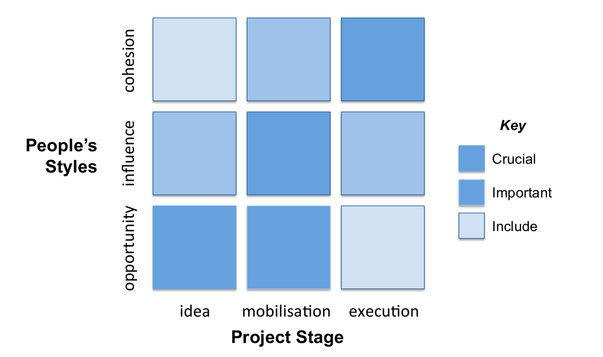

## Introduction & agenda

```{r packages, echo = FALSE, warning=FALSE, message=FALSE}
  library(readxl)
  library(dplyr)
  library(magrittr)
  library(igraph)
  library(networkD3)
  library(readxl)
  library(knitr)
```

```{r get_picks_make_ref, echo=FALSE}
picks <- read_excel("./picks_tbls/analysis_normalised_20151101_ver2.xlsx", 
                    sheet = "tot") %>% tbl_df

choice1 <- c("Cohesion", "Cohesion", "Cohesion", "Influence", "Influence", "Influence", "Opportunity", "Opportunity", "Opportunity")
choice2 <- rep(c("Cohesion", "Influence", "Opportunity"), 3)
type <- c("Broker", "Closer", "Free Agent", 
          "Defender", "Kingpin", "Orchestrator", 
          "Loyalist", "Bridger", "Itegrator")
ref <- cbind(choice1, choice2, type) %>% data.frame(stringsAsFactors = F) %>% tbl_df()
```

> __"It's not _what_ you know, but _who_ you know..."__

1. Approach
2. The Royal Albert Hall
3. Design
4. Implementation
5. Advocacy
6. Questions

# Introduction | Approach to picking and the Royal Albert Hall

## Approach to picking {.flexbox .vcenter}



* Network properties and scoring

* Sorting, resolving, and picking

## Royal Albert Hall {.flexbox .vcenter}

The _"Royal Albert Hall"_ network - a proxy for popularity. In-degree centrality defines __visibility points__. 

```{r albert_hall, echo = FALSE, message=FALSE, warning=FALSE, fig.align='center'}
albert_hall_links     <- read_excel("./data/BA_Anonymised.xlsx", sheet = "relation 3780")
people <- read_excel("./data/BA_Anonymised.xlsx", sheet = "Attributes")
groups <- read_excel("./data/BA_Anonymised.xlsx", sheet = "Overview") %>% .[1:12, 1:2]
albert_hall_links %<>% apply(2, as.numeric) %>% data.frame() %>% tbl_df()
people %<>% apply(2, as.numeric) %>% data.frame() %>% tbl_df()
groups %<>% apply(2, as.numeric) %>% data.frame() %>% tbl_df()

nodes <- people %>% 
          left_join(groups, by = c("group" = "group_id")) %>% 
          mutate(id = as.numeric(id))

# create a function for plotting the graph -------------------------------------
create_diagram <- function(links_data, nodes_data) {

# set up the graph data frame properly
  links_graph <- graph.data.frame(links_data) 
  V(links_graph)$name <- 1:57
  links <- as.data.frame(get.edgelist(links_graph))
  links$V1<-as.numeric(as.character(links$V1))
  links$V2<-as.numeric(as.character(links$V2))
  colnames(links)<-c("source","target")  
  link_list<-(links-1)
  
# make basic diagram 
  forceNetwork(Links = link_list, Nodes = nodes_data, Source = "source",
               Target = "target", NodeID = "id",
               Group = "group", opacity = .8, legend = FALSE, zoom = TRUE)
}

create_diagram(albert_hall_links, nodes_data = nodes)

```


# The picks | Design, Implementation, Advocacy

## Design

> "Pick a team to meet over two days to create the plan for graduation week"

<br>

* __Opportunity__, influence, creativity

<br>

* __Betweenness__, Eigenvector centrality, and closeness

## Design picks {.flexbox .vcenter}

```{r design_picks, echo=FALSE}
design_tbl <- picks %>% 
              filter(des_pick == 1) %>% 
              select(id, vp, des_score, style, option1) %>% 
              mutate(style = ifelse(style == 0, "Cohesion",
                             ifelse(style == 1, "Influence", "Opportunity")),
                     option1 = ifelse(option1 == 0, style,
                                ifelse(option1 == 1, "Cohesion",
                                ifelse(option1 == 2, "Influence", "Opportunity")))) %>% 
              mutate(des_score = round(as.numeric(des_score), 3))%>% 
              left_join(ref, by = c("style" = "choice1",
                                    "option1" = "choice2")) %>% 
              select(-style, - option1)
kable(design_tbl, align = c("c", "c", "c", "l"), 
      col.names = c("ID", "Visiblity Points", "Design Score", "Personality"))
```

<br>

__Score = 0.6 Betweenness + 0.3 Eigenvector centrality + 0.1 Closeness__


## Implementation

> "Pick a team to meet weekly to refine the details and implement the plan"

<br>

* __Cohesion__, influence

<br>

* __Closness__, Eigenvector centrality, betweenness


## Implementation Picks {.flexbox .vcenter}

```{r imp_picks, echo=FALSE}
imp_tbl <- picks %>% 
              filter(imp_pick == 1) %>% 
              select(id, vp, imp_score, style, option1) %>% 
              mutate(style = ifelse(style == 0, "Cohesion",
                             ifelse(style == 1, "Influence", "Opportunity")),
                     option1 = ifelse(option1 == 0, style,
                                ifelse(option1 == 1, "Cohesion",
                                ifelse(option1 == 2, "Influence", "Opportunity")))) %>%
              mutate(imp_score = round(as.numeric(imp_score), 3)) %>% 
              left_join(ref, by = c("style" = "choice1",
                                    "option1" = "choice2"))%>% 
              select(-style, - option1)

kable(imp_tbl, align = c("c", "c", "c", "l"), 
      col.names = c("ID", "Visiblity Points", "Implementation Score", "Personality"))
```

<br>

__Score = 0.1 Betweenness + 0.3 Eigenvector centrality + 0.6 Closeness__

## Advocacy

> "Pick a team to meet as needed to overcome roadblocks and resolve issues"

<br>

* __Influence__, opportunity, status

<br>

* __Eigenvector centrality__, betweenness, closeness

## Advocacy picks {.flexbox .vcenter}

```{r adv_picks, echo=FALSE}
adv_tbl <- picks %>% 
              filter(adv_pick == 1) %>% 
              select(id, vp, adv_score, style, option1) %>% 
              mutate(style = ifelse(style == 0, "Cohesion",
                             ifelse(style == 1, "Influence", "Opportunity")),
                     option1 = ifelse(option1 == 0, style,
                                ifelse(option1 == 1, "Cohesion",
                                ifelse(option1 == 2, "Influence", "Opportunity")))) %>% 
              mutate(adv_score = round(as.numeric(adv_score), 3)) %>% 
              left_join(ref, by = c("style" = "choice1",
                                    "option1" = "choice2"))%>% 
              select(-style, - option1)

kable(adv_tbl, align = c("c", "c", "c", "l"), 
      col.names = c("ID", "Visiblity Points", "Advocacy Score", "Personality"))
```

<br>

__Score = 0.4 Betweenness + 0.4 Eigenvector centrality + 0.2 Closeness__

# Questions
